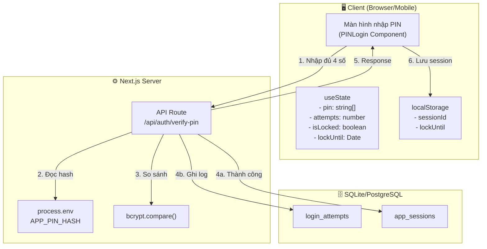
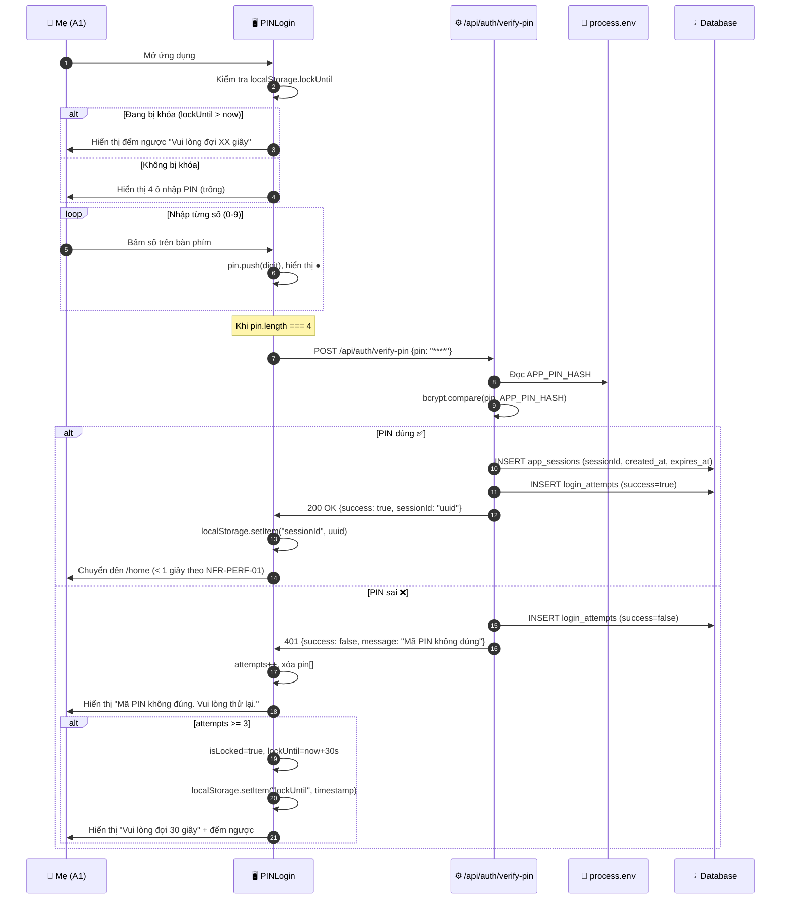
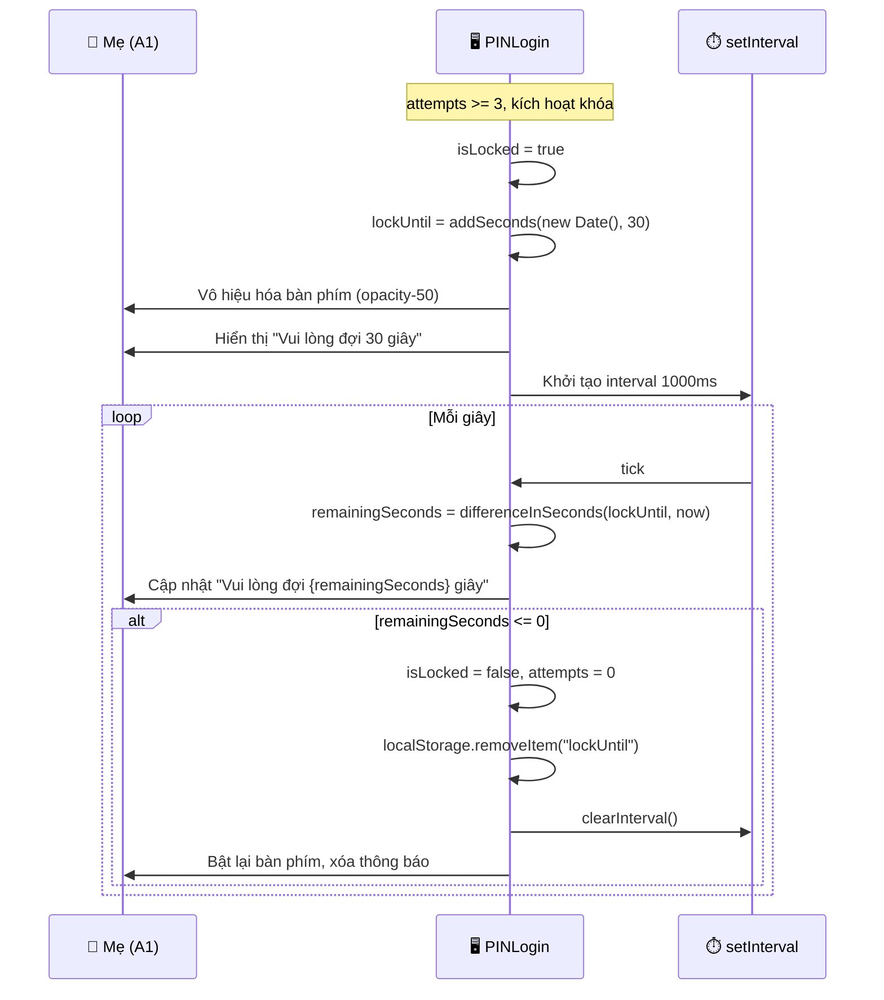

# Thiết kế Phương thức Hệ thống - UC-01 (システム方式設計書)

**Mã chức năng:** UC-01  
**Tên chức năng:** Đăng nhập bằng mã PIN  
**Phiên bản:** 1.0  
**Ngày tạo:** 25/02/2026

---

## 📥 Input (Tài liệu tham chiếu)

| Tài liệu | Nội dung trích xuất |
|----------|---------------------|
| `srs_function_requirements.md` | UC-01: Đăng nhập bằng mã PIN, luồng chính/thay thế, tiêu chí nghiệm thu |
| `srs_nonfunction_requirements.md` | NFR-SEC-01~04 (Bảo mật), NFR-TECH-01~04 (Công nghệ) |
| `srs_business_requirements.md` | BO-02: Bảo vệ dữ liệu cá nhân |

---

## 1. Tổng quan Kiến trúc (システムアーキテクチャ概要)

**Mô hình:** Client-Side Rendering với Next.js App Router



---

## 2. Cấu hình Phần mềm (ソフトウェア構成)

| Phân loại | Tên | Phiên bản | Mục đích | Tham chiếu NFR |
|-----------|-----|-----------|----------|----------------|
| Framework | Next.js | 14.x | App Router, API Routes | NFR-TECH-04 |
| Language | TypeScript | 5.x | Type-safe development | NFR-TECH-04 |
| Styling | TailwindCSS | 3.x | UI styling | NFR-TECH-03 |
| Date Library | date-fns | 3.x | Xử lý ngày tháng | NFR-TECH-01 |
| Hash Library | bcrypt | 5.x | Hash mã PIN | NFR-SEC-02 |
| Runtime | Node.js | 20.x | Server runtime | - |

> ⚠️ **CẤM** sử dụng `moment.js` theo NFR-TECH-02

---

## 3. Phương thức Xử lý Cốt lõi (主要処理方式)

### 3.1 Sequence Diagram - Luồng chính



### 3.2 Sequence Diagram - Luồng thay thế (AF-01.2: Khóa tạm)



---

## 4. Phương thức Xác thực (認証方式)

| Thuộc tính | Giá trị | Tham chiếu |
|------------|---------|------------|
| Loại xác thực | PIN-based (4 chữ số) | UC-01 |
| Lưu trữ PIN | Biến môi trường `APP_PIN_HASH` | NFR-SEC-01 |
| Thuật toán hash | bcrypt (cost factor 10) | NFR-SEC-02 |
| Số lần thử tối đa | 3 lần | NFR-SEC-03 |
| Thời gian khóa | 30 giây | NFR-SEC-03 |
| Che PIN nhập | Hiển thị ● thay vì số | NFR-SEC-04 |
| Session ID | UUID v4 | - |
| Session expiry | 24 giờ | - |

---

## 5. Biến môi trường (環境変数)

| Tên biến | Mô tả | Bắt buộc | Ví dụ |
|----------|-------|----------|-------|
| `APP_PIN_HASH` | Mã PIN đã hash bằng bcrypt | ✅ | `$2b$10$N9qo8uLOickgx2ZMRZoMy...` |

**Tạo hash cho PIN "1234":**
```bash
# Cài đặt bcrypt CLI
npm install -g bcrypt-cli

# Tạo hash
bcrypt hash 1234 --rounds 10
# Output: $2b$10$...
```

**File `.env.local`:**
```env
# ⚠️ KHÔNG commit file này lên Git
APP_PIN_HASH=$2b$10$N9qo8uLOickgx2ZMRZoMyeOq...
```

---

## 6. Chính sách Bảo mật (セキュリティ方式)

| Mục | Phương thức | Tham chiếu NFR |
|-----|-------------|----------------|
| Mã hóa PIN | bcrypt hash (một chiều) | NFR-SEC-02 |
| Lưu trữ PIN | `process.env` (KHÔNG hardcode) | NFR-SEC-01 |
| Che PIN nhập | Hiển thị ● | NFR-SEC-04 |
| Rate limiting | Khóa 30 giây sau 3 lần sai | NFR-SEC-03 |
| Session | UUID v4 trong localStorage | - |
| Logging | Ghi log attempts, **KHÔNG** ghi PIN | - |

---

## 7. Phương thức Xử lý Ngày/Giờ

> Theo NFR-TECH-01: **BẮT BUỘC** sử dụng `date-fns`

```typescript
import { addSeconds, differenceInSeconds, isBefore } from 'date-fns';

// Tính thời điểm hết khóa
const lockUntil = addSeconds(new Date(), 30);

// Tính số giây còn lại
const remaining = differenceInSeconds(lockUntil, new Date());

// Kiểm tra đã hết khóa chưa
const isStillLocked = isBefore(new Date(), lockUntil);
```
