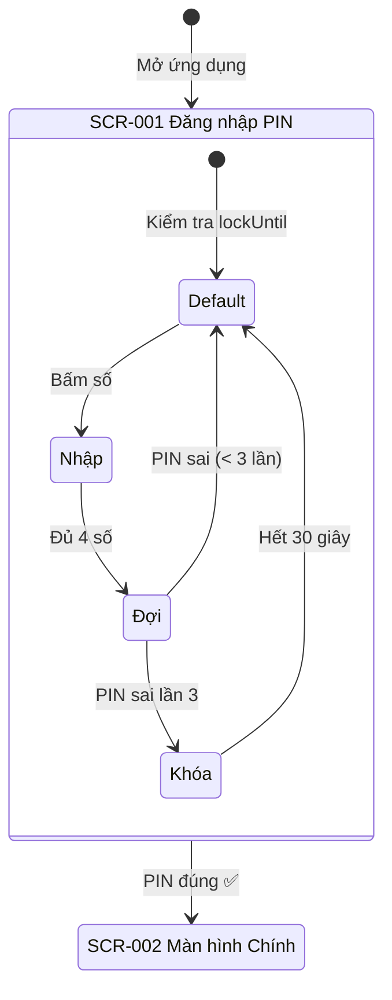

# Thiết kế Màn hình - UC-01 (画面設計書)

**Mã chức năng:** UC-01  
**Tên chức năng:** Đăng nhập bằng mã PIN  
**Phiên bản:** 1.0  
**Ngày tạo:** 25/02/2026

---

## 📥 Input (Tài liệu tham chiếu)

| Tài liệu | Nội dung trích xuất |
|----------|---------------------|
| `srs_function_requirements.md` | AC-01.1~AC-01.6 (Tiêu chí nghiệm thu) |
| `srs_nonfunction_requirements.md` | NFR-USE-01~04 (Khả dụng), NFR-L10N-01~06 (Bản địa hóa) |

---

## 1. Danh sách Màn hình (画面一覧)

| ID Màn hình | Tên màn hình | Đối tượng | Route | Tham chiếu AC |
|-------------|--------------|-----------|-------|---------------|
| SCR-001 | Màn hình Đăng nhập PIN | Mẹ (A1) | `/` | AC-01.1~AC-01.6 |

---

## 2. Sơ đồ Chuyển đổi Màn hình (画面遷移図)



---

## 3. Chi tiết Màn hình (画面詳細)

### [SCR-001] Màn hình Đăng nhập PIN

#### 3.1 Layout Màn hình (画面レイアウト)

```
┌─────────────────────────────────────────┐
│                                         │
│              🏠                          │
│     Quản lý Chi tiêu Gia đình           │  ← Tiêu đề (tiếng Việt - NFR-L10N-01)
│                                         │
│        ┌───┐ ┌───┐ ┌───┐ ┌───┐         │
│        │ ● │ │ ● │ │   │ │   │         │  ← 4 ô PIN (AC-01.1)
│        └───┘ └───┘ └───┘ └───┘         │    Hiển thị ● (NFR-SEC-04)
│                                         │
│     Vui lòng nhập mã PIN 4 số           │  ← Hướng dẫn (tiếng Việt)
│                                         │
│    ┌────┐  ┌────┐  ┌────┐               │
│    │  1 │  │  2 │  │  3 │               │
│    └────┘  └────┘  └────┘               │
│    ┌────┐  ┌────┐  ┌────┐               │  ← Bàn phím số
│    │  4 │  │  5 │  │  6 │               │    Min 48x48px (NFR-USE-03)
│    └────┘  └────┘  └────┘               │
│    ┌────┐  ┌────┐  ┌────┐               │
│    │  7 │  │  8 │  │  9 │               │
│    └────┘  └────┘  └────┘               │
│    ┌────┐  ┌────┐  ┌────┐               │
│    │    │  │  0 │  │  ⌫ │               │  ← Nút xóa
│    └────┘  └────┘  └────┘               │
│                                         │
│   ❌ Mã PIN không đúng. Vui lòng thử lại. │  ← Thông báo lỗi (AC-01.4)
│                                         │
└─────────────────────────────────────────┘
```

#### 3.2 Danh sách Các mục trên Màn hình (画面項目一覧)

| ID | Tên hiển thị | Loại | Bắt buộc | Kích thước | Quy tắc | Tham chiếu |
|----|--------------|------|----------|------------|---------|------------|
| ITM-01 | Icon 🏠 | Image | - | 48x48px | - | - |
| ITM-02 | "Quản lý Chi tiêu Gia đình" | Text | - | Font 20px | Tiếng Việt | NFR-L10N-01 |
| ITM-03 | Ô PIN 1 | Display | ✅ | 48x48px | Hiển thị ● hoặc trống | AC-01.1, NFR-SEC-04 |
| ITM-04 | Ô PIN 2 | Display | ✅ | 48x48px | Hiển thị ● hoặc trống | AC-01.1, NFR-SEC-04 |
| ITM-05 | Ô PIN 3 | Display | ✅ | 48x48px | Hiển thị ● hoặc trống | AC-01.1, NFR-SEC-04 |
| ITM-06 | Ô PIN 4 | Display | ✅ | 48x48px | Hiển thị ● hoặc trống | AC-01.1, NFR-SEC-04 |
| ITM-07 | "Vui lòng nhập mã PIN 4 số" | Text | - | Font 16px | Tiếng Việt | NFR-USE-02 |
| ITM-08 | Nút số 0-9 | Button | - | Min 48x48px | Chỉ số 0-9 | AC-01.2, NFR-USE-03 |
| ITM-09 | Nút xóa ⌫ | Button | - | Min 48x48px | Xóa số cuối | - |
| ITM-10 | Thông báo lỗi | Text | - | Font 14px | Màu đỏ, tiếng Việt | AC-01.4, NFR-L10N-01 |
| ITM-11 | Đếm ngược | Text | - | Font 16px | "Vui lòng đợi XX giây" | AC-01.5 |

#### 3.3 Quy tắc Validation (バリデーション)

| ID | Quy tắc | Thông báo lỗi (tiếng Việt) | Tham chiếu |
|----|---------|---------------------------|------------|
| VAL-01 | Chỉ chấp nhận số 0-9 | (Bàn phím số - không cần) | AC-01.2 |
| VAL-02 | Phải đủ 4 số | (Tự động gửi khi đủ) | - |
| VAL-03 | PIN không đúng | "Mã PIN không đúng. Vui lòng thử lại." | AC-01.4 |
| VAL-04 | Đã bị khóa | "Vui lòng đợi {X} giây" | AC-01.5 |

#### 3.4 Xử lý Thao tác / Sự kiện (アクション・イベント処理)

**EVT-01: Nhấn nút số (0-9)**

| Bước | Điều kiện | Xử lý |
|------|-----------|-------|
| 1 | `isLocked === true` | Không làm gì (bàn phím bị vô hiệu) |
| 2 | `pin.length >= 4` | Không làm gì |
| 3 | - | `pin.push(digit)` |
| 4 | - | Hiển thị ● vào ô `pin.length` |
| 5 | `pin.length === 4` | Gọi API `/api/auth/verify-pin` |

**EVT-02: Nhấn nút xóa (⌫)**

| Bước | Điều kiện | Xử lý |
|------|-----------|-------|
| 1 | `isLocked === true` | Không làm gì |
| 2 | `pin.length === 0` | Không làm gì |
| 3 | - | `pin.pop()` |
| 4 | - | Xóa ● ở ô cuối |

**EVT-03: API trả về thành công (200)**

| Bước | Xử lý | Tham chiếu |
|------|-------|------------|
| 1 | `localStorage.setItem("sessionId", response.sessionId)` | - |
| 2 | `router.push("/home")` | AC-01.3 (< 1 giây) |

**EVT-04: API trả về lỗi (401)**

| Bước | Xử lý | Tham chiếu |
|------|-------|------------|
| 1 | `attempts++` | - |
| 2 | `setPin([])` - xóa tất cả ô | - |
| 3 | `setErrorMessage("Mã PIN không đúng...")` | AC-01.4 |
| 4 | Nếu `attempts >= 3` → Kích hoạt EVT-05 | AC-01.5 |

**EVT-05: Kích hoạt khóa tạm**

| Bước | Xử lý | Tham chiếu |
|------|-------|------------|
| 1 | `setIsLocked(true)` | AC-01.5 |
| 2 | `lockUntil = addSeconds(new Date(), 30)` | NFR-TECH-01 (date-fns) |
| 3 | `localStorage.setItem("lockUntil", lockUntil.toISOString())` | - |
| 4 | Vô hiệu hóa bàn phím (`opacity-50`, `pointer-events-none`) | - |
| 5 | Khởi tạo `setInterval` đếm ngược mỗi 1 giây | - |
| 6 | Khi hết 30 giây: `setIsLocked(false)`, `setAttempts(0)` | - |

---

## 4. Trạng thái Màn hình (画面状態)

| Trạng thái | Điều kiện | Hiển thị | CSS Classes (TailwindCSS) |
|------------|-----------|----------|---------------------------|
| Mặc định | `pin.length === 0`, không khóa | Bàn phím bật, ô trống | - |
| Đang nhập | `1 <= pin.length <= 3` | Hiển thị ● tương ứng | - |
| Đợi phản hồi | Đang gọi API | Có thể hiển thị loading | `animate-pulse` |
| Lỗi | API trả về 401 | Thông báo lỗi màu đỏ | `text-red-500` |
| Bị khóa | `isLocked === true` | Bàn phím mờ, đếm ngược | `opacity-50 pointer-events-none` |

---

## 5. Responsive Design (NFR-COMP-03)

| Breakpoint | Min Width | Thay đổi |
|------------|-----------|----------|
| Mobile | 375px | Bàn phím chiếm 80% width, gap-3 |
| Tablet | 640px | Bàn phím max-width 320px, căn giữa |
| Desktop | 1024px | Giống Tablet |

**TailwindCSS Classes:**
```html
<div class="w-full max-w-xs mx-auto px-4 sm:px-0">
  <!-- Bàn phím -->
  <div class="grid grid-cols-3 gap-3">
    <button class="h-14 w-14 sm:h-12 sm:w-12 text-2xl font-medium 
                   bg-gray-100 rounded-full active:bg-gray-200">
      1
    </button>
  </div>
</div>
```

---

## 6. Accessibility (アクセシビリティ)

| Mục | Yêu cầu | Triển khai | Tham chiếu |
|-----|---------|------------|------------|
| Font size | Tối thiểu 16px | `text-base` hoặc lớn hơn | NFR-USE-02 |
| Touch target | Tối thiểu 48x48px | `h-12 w-12` (48px) | NFR-USE-03 |
| Contrast | Tỷ lệ 4.5:1 | Text đen trên nền trắng | - |
| Aria labels | Mô tả nút | `aria-label="Số 1"`, `aria-label="Xóa"` | - |
| Focus visible | Hiển thị focus | `focus:ring-2 focus:ring-blue-500` | - |

---

## 7. Màu sắc & Typography

| Element | Color | TailwindCSS |
|---------|-------|-------------|
| Background | Trắng | `bg-white` |
| Text chính | Đen | `text-gray-900` |
| Text phụ | Xám | `text-gray-500` |
| Lỗi | Đỏ | `text-red-500` |
| Nút số | Xám nhạt | `bg-gray-100` |
| Nút số (active) | Xám đậm | `active:bg-gray-200` |
| Ô PIN (có giá trị) | Đen | `bg-gray-900` (cho ●) |
| Ô PIN (trống) | Viền xám | `border-2 border-gray-300` |
