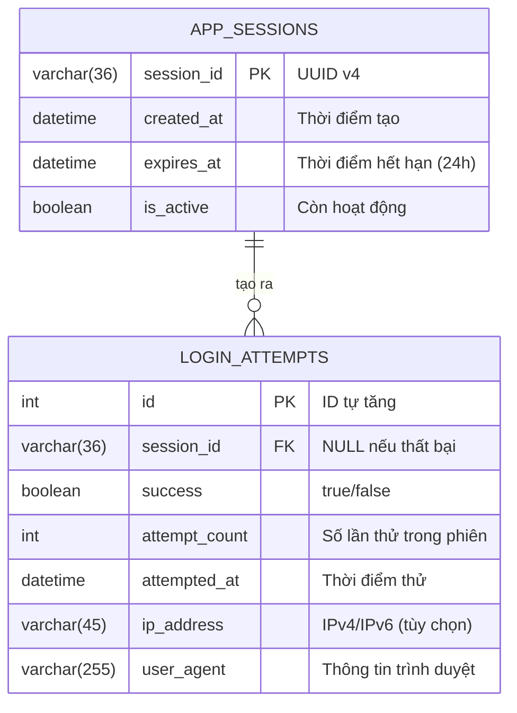

# Thiết kế Cơ sở dữ liệu - UC-01 (データベース設計書)

**Mã chức năng:** UC-01  
**Tên chức năng:** Đăng nhập bằng mã PIN  
**Phiên bản:** 1.0  
**Ngày tạo:** 25/02/2026

---

## 📥 Input (Tài liệu tham chiếu)

| Tài liệu | Nội dung trích xuất |
|----------|---------------------|
| `srs_function_requirements.md` | UC-01: Luồng chính, AF-01.1, AF-01.2 |
| `srs_nonfunction_requirements.md` | NFR-SEC-01~02 (Bảo mật PIN) |

---

## 1. Tổng quan

Chức năng UC-01 (Đăng nhập PIN) sử dụng:
- **Biến môi trường** (`APP_PIN_HASH`) để lưu mã PIN hash → Không cần bảng user
- **Database** để lưu lịch sử đăng nhập và quản lý session

> ⚠️ Theo NFR-SEC-01: Mã PIN **KHÔNG** được lưu trong Database hoặc hardcode

---

## 2. Sơ đồ ER (ER図)



---

## 3. Danh sách Bảng (テーブル一覧)

| Tên bảng vật lý | Tên bảng logic | Mô tả | Phân loại | Tham chiếu |
|-----------------|----------------|-------|-----------|------------|
| `app_sessions` | Phiên làm việc | Quản lý session sau đăng nhập thành công | Transaction | UC-01 Luồng chính |
| `login_attempts` | Lịch sử đăng nhập | Ghi log các lần thử đăng nhập | Transaction | AF-01.1, AF-01.2 |

---

## 4. Định nghĩa Bảng Chi tiết (テーブル定義)

### 4.1 Bảng: `app_sessions` (Phiên làm việc)

| Tên cột vật lý | Tên cột logic | Kiểu dữ liệu | PK | FK | Not Null | Default | Ghi chú |
|----------------|---------------|--------------|:--:|:--:|:--------:|---------|---------|
| `session_id` | Mã phiên | VARCHAR(36) | ✅ | | ✅ | - | UUID v4 |
| `created_at` | Thời điểm tạo | DATETIME | | | ✅ | CURRENT_TIMESTAMP | - |
| `expires_at` | Thời điểm hết hạn | DATETIME | | | ✅ | - | created_at + 24 giờ |
| `is_active` | Còn hoạt động | BOOLEAN | | | ✅ | TRUE | FALSE khi đăng xuất |

**Index:**
| Tên Index | Cột | Loại | Mục đích |
|-----------|-----|------|----------|
| `idx_sessions_expires` | `expires_at` | B-Tree | Tìm session hết hạn |
| `idx_sessions_active` | `is_active` | B-Tree | Lọc session active |

---

### 4.2 Bảng: `login_attempts` (Lịch sử đăng nhập)

| Tên cột vật lý | Tên cột logic | Kiểu dữ liệu | PK | FK | Not Null | Default | Ghi chú |
|----------------|---------------|--------------|:--:|:--:|:--------:|---------|---------|
| `id` | ID | INTEGER | ✅ | | ✅ | AUTO_INCREMENT | - |
| `session_id` | Mã phiên | VARCHAR(36) | | FK | | NULL | Liên kết khi thành công |
| `success` | Kết quả | BOOLEAN | | | ✅ | FALSE | true = đăng nhập OK |
| `attempt_count` | Số lần thử | INTEGER | | | ✅ | 1 | Đếm trong chuỗi thử |
| `attempted_at` | Thời điểm | DATETIME | | | ✅ | CURRENT_TIMESTAMP | - |
| `ip_address` | Địa chỉ IP | VARCHAR(45) | | | | NULL | IPv4 hoặc IPv6 |
| `user_agent` | Trình duyệt | VARCHAR(255) | | | | NULL | Thông tin device |

**Index:**
| Tên Index | Cột | Loại | Mục đích |
|-----------|-----|------|----------|
| `idx_attempts_time` | `attempted_at` | B-Tree | Truy vấn theo thời gian |
| `idx_attempts_session` | `session_id` | B-Tree | Liên kết với session |

**Foreign Key:**
| Cột | Tham chiếu | On Delete | On Update |
|-----|------------|-----------|-----------|
| `session_id` | `app_sessions(session_id)` | SET NULL | CASCADE |

---

## 5. Ma trận CRUD (CRUDマトリクス)

| Chức năng / Màn hình | `app_sessions` | `login_attempts` | Tham chiếu |
|---------------------|:--------------:|:----------------:|------------|
| SCR-001 Đăng nhập PIN (thành công) | **C** | **C** | UC-01 Luồng chính |
| SCR-001 Đăng nhập PIN (thất bại) | - | **C** | AF-01.1 |
| SCR-002 Màn hình chính | R | - | - |
| Đăng xuất | **U** | - | - |
| Batch xóa log cũ | **D** | **D** | Maintenance |

*(C: Create, R: Read, U: Update, D: Delete)*

---

## 6. SQL Scripts

### 6.1 DDL - Tạo bảng

```sql
-- =============================================
-- Database: family_expense
-- UC-01: Đăng nhập bằng mã PIN
-- =============================================

-- Bảng phiên làm việc
CREATE TABLE app_sessions (
    session_id VARCHAR(36) PRIMARY KEY,
    created_at DATETIME NOT NULL DEFAULT CURRENT_TIMESTAMP,
    expires_at DATETIME NOT NULL,
    is_active BOOLEAN NOT NULL DEFAULT TRUE,
    
    -- Index
    INDEX idx_sessions_expires (expires_at),
    INDEX idx_sessions_active (is_active)
);

-- Bảng lịch sử đăng nhập
CREATE TABLE login_attempts (
    id INTEGER PRIMARY KEY AUTO_INCREMENT,
    session_id VARCHAR(36),
    success BOOLEAN NOT NULL DEFAULT FALSE,
    attempt_count INTEGER NOT NULL DEFAULT 1,
    attempted_at DATETIME NOT NULL DEFAULT CURRENT_TIMESTAMP,
    ip_address VARCHAR(45),
    user_agent VARCHAR(255),
    
    -- Foreign Key
    FOREIGN KEY (session_id) REFERENCES app_sessions(session_id)
        ON DELETE SET NULL ON UPDATE CASCADE,
    
    -- Index
    INDEX idx_attempts_time (attempted_at),
    INDEX idx_attempts_session (session_id)
);
```

### 6.2 DML - Dữ liệu mẫu

```sql
-- Ví dụ 1: Đăng nhập thành công ngay lần đầu
INSERT INTO app_sessions (session_id, created_at, expires_at, is_active)
VALUES (
    '550e8400-e29b-41d4-a716-446655440000',
    '2026-02-25 08:00:00',
    '2026-02-26 08:00:00',  -- +24 giờ
    TRUE
);

INSERT INTO login_attempts (session_id, success, attempt_count, attempted_at, user_agent)
VALUES (
    '550e8400-e29b-41d4-a716-446655440000',
    TRUE,
    1,
    '2026-02-25 08:00:00',
    'Mozilla/5.0 (iPhone; CPU iPhone OS 17_0 like Mac OS X)'
);

-- Ví dụ 2: Đăng nhập thất bại 2 lần, thành công lần 3
INSERT INTO login_attempts (session_id, success, attempt_count, attempted_at)
VALUES (NULL, FALSE, 1, '2026-02-25 09:00:00');

INSERT INTO login_attempts (session_id, success, attempt_count, attempted_at)
VALUES (NULL, FALSE, 2, '2026-02-25 09:00:05');

INSERT INTO app_sessions (session_id, created_at, expires_at, is_active)
VALUES (
    '660e8400-e29b-41d4-a716-446655440001',
    '2026-02-25 09:00:10',
    '2026-02-26 09:00:10',
    TRUE
);

INSERT INTO login_attempts (session_id, success, attempt_count, attempted_at)
VALUES (
    '660e8400-e29b-41d4-a716-446655440001',
    TRUE,
    3,
    '2026-02-25 09:00:10'
);
```

### 6.3 Query mẫu

```sql
-- Kiểm tra session còn hiệu lực
SELECT * FROM app_sessions 
WHERE session_id = ? 
  AND is_active = TRUE 
  AND expires_at > NOW();

-- Đếm số lần thất bại trong 5 phút gần nhất (rate limiting)
SELECT COUNT(*) FROM login_attempts 
WHERE success = FALSE 
  AND attempted_at > DATE_SUB(NOW(), INTERVAL 5 MINUTE);

-- Xóa session và log cũ hơn 90 ngày (batch job)
DELETE FROM login_attempts WHERE attempted_at < DATE_SUB(NOW(), INTERVAL 90 DAY);
DELETE FROM app_sessions WHERE created_at < DATE_SUB(NOW(), INTERVAL 90 DAY);
```

---

## 7. Lưu ý Bảo mật

| Mục | Quy định | Tham chiếu NFR |
|-----|----------|----------------|
| Mã PIN | **KHÔNG** lưu trong Database | NFR-SEC-01 |
| Mã PIN | Chỉ lưu hash trong `process.env` | NFR-SEC-01 |
| Session ID | UUID v4 ngẫu nhiên, không đoán được | - |
| IP Address | Chỉ dùng debug, có thể ẩn theo GDPR | - |
| PIN trong log | **KHÔNG BAO GIỜ** ghi PIN vào log | NFR-SEC-01 |
| Log retention | Xóa log cũ hơn 90 ngày | - |
