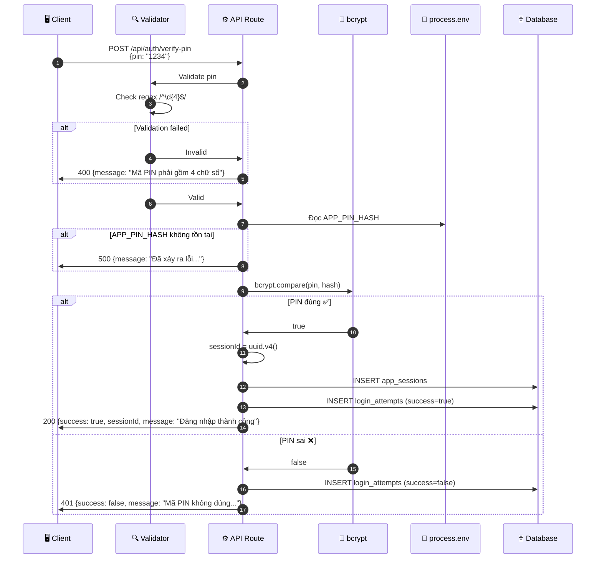

# Thiết kế Giao diện Kết nối - UC-01 (外部インターフェース設計書)

**Mã chức năng:** UC-01  
**Tên chức năng:** Đăng nhập bằng mã PIN  
**Phiên bản:** 1.0  
**Ngày tạo:** 25/02/2026

---

## 📥 Input (Tài liệu tham chiếu)

| Tài liệu | Nội dung trích xuất |
|----------|---------------------|
| `srs_function_requirements.md` | UC-01: Request/Response khi xác thực |
| `srs_nonfunction_requirements.md` | NFR-SEC-01~04, NFR-L10N-01 (thông báo tiếng Việt) |

---

## 1. Danh sách Interface (インターフェース一覧)

| ID IF | Tên IF | Hệ thống | Phương thức | Hướng | Thời điểm |
|-------|--------|----------|-------------|-------|-----------|
| IF-001 | Xác thực mã PIN | Internal API Route | REST (JSON) | Client → Server | Real-time |

---

## 2. Chi tiết Interface (インターフェース詳細)

### [IF-001] Xác thực mã PIN

#### 2.1 Thông tin Giao thức (通信プロトコル)

| Thuộc tính | Giá trị |
|------------|---------|
| **Endpoint** | `POST /api/auth/verify-pin` |
| **Method** | POST |
| **Content-Type** | `application/json` |
| **Authentication** | Không yêu cầu (public endpoint) |
| **Timeout** | 5000ms |
| **Rate Limit** | 10 requests/phút/IP |

#### 2.2 OpenAPI Specification (YAML)

```yaml
openapi: 3.0.3
info:
  title: Family Expense App - Auth API
  description: |
    API xác thực mã PIN cho ứng dụng Quản lý Chi tiêu Gia đình.
    
    **Tham chiếu yêu cầu:**
    - UC-01: Đăng nhập bằng mã PIN
    - NFR-SEC-01: Không hardcode PIN
    - NFR-SEC-02: Lưu PIN dạng hash (bcrypt)
    - NFR-L10N-01: Thông báo tiếng Việt
  version: 1.0.0
  contact:
    name: Developer

servers:
  - url: /api
    description: Next.js API Routes

paths:
  /auth/verify-pin:
    post:
      summary: Xác thực mã PIN
      description: |
        Kiểm tra mã PIN 4 số do người dùng nhập.
        
        **Luồng xử lý:**
        1. Validate input (4 chữ số)
        2. Đọc APP_PIN_HASH từ process.env
        3. So sánh bằng bcrypt.compare()
        4. Trả về sessionId nếu đúng
        
        **Tham chiếu:** UC-01, AC-01.1~AC-01.6
      operationId: verifyPin
      tags:
        - Authentication
      requestBody:
        required: true
        content:
          application/json:
            schema:
              $ref: '#/components/schemas/VerifyPinRequest'
            examples:
              valid:
                summary: PIN hợp lệ
                value:
                  pin: "1234"
              invalid:
                summary: PIN không hợp lệ (quá ngắn)
                value:
                  pin: "12"
      responses:
        '200':
          description: |
            Xác thực thành công.
            **Tham chiếu:** AC-01.3 (chuyển màn hình < 1 giây)
          content:
            application/json:
              schema:
                $ref: '#/components/schemas/SuccessResponse'
              example:
                success: true
                sessionId: "550e8400-e29b-41d4-a716-446655440000"
                message: "Đăng nhập thành công"
        '401':
          description: |
            Mã PIN không đúng.
            **Tham chiếu:** AC-01.4 (thông báo lỗi tiếng Việt)
          content:
            application/json:
              schema:
                $ref: '#/components/schemas/ErrorResponse'
              example:
                success: false
                message: "Mã PIN không đúng. Vui lòng thử lại."
        '400':
          description: Dữ liệu đầu vào không hợp lệ
          content:
            application/json:
              schema:
                $ref: '#/components/schemas/ValidationError'
              example:
                success: false
                message: "Mã PIN phải gồm 4 chữ số"
        '429':
          description: |
            Quá nhiều request (rate limited).
            **Tham chiếu:** AC-01.5 (khóa sau 3 lần sai)
          content:
            application/json:
              schema:
                $ref: '#/components/schemas/RateLimitError'
              example:
                success: false
                message: "Vui lòng đợi trước khi thử lại"
                retryAfter: 60
        '500':
          description: Lỗi server
          content:
            application/json:
              schema:
                $ref: '#/components/schemas/ServerError'
              example:
                success: false
                message: "Đã xảy ra lỗi. Vui lòng thử lại sau."

components:
  schemas:
    VerifyPinRequest:
      type: object
      required:
        - pin
      properties:
        pin:
          type: string
          pattern: '^\d{4}$'
          minLength: 4
          maxLength: 4
          description: |
            Mã PIN 4 chữ số (0-9).
            **Tham chiếu:** AC-01.2
          example: "1234"
          
    SuccessResponse:
      type: object
      required:
        - success
        - sessionId
        - message
      properties:
        success:
          type: boolean
          const: true
          example: true
        sessionId:
          type: string
          format: uuid
          description: UUID v4 của phiên làm việc
          example: "550e8400-e29b-41d4-a716-446655440000"
        message:
          type: string
          description: |
            Thông báo tiếng Việt.
            **Tham chiếu:** NFR-L10N-01
          example: "Đăng nhập thành công"
          
    ErrorResponse:
      type: object
      required:
        - success
        - message
      properties:
        success:
          type: boolean
          const: false
          example: false
        message:
          type: string
          description: |
            Thông báo lỗi tiếng Việt.
            **Tham chiếu:** AC-01.4, NFR-L10N-01
          example: "Mã PIN không đúng. Vui lòng thử lại."
          
    ValidationError:
      type: object
      properties:
        success:
          type: boolean
          const: false
        message:
          type: string
          example: "Mã PIN phải gồm 4 chữ số"
          
    RateLimitError:
      type: object
      properties:
        success:
          type: boolean
          const: false
        message:
          type: string
          example: "Vui lòng đợi trước khi thử lại"
        retryAfter:
          type: integer
          description: Số giây cần đợi
          example: 60
          
    ServerError:
      type: object
      properties:
        success:
          type: boolean
          const: false
        message:
          type: string
          example: "Đã xảy ra lỗi. Vui lòng thử lại sau."
```

---

## 3. Cấu trúc Dữ liệu Chi tiết

### 3.1 Request Body

| Tên trường | Kiểu | Bắt buộc | Ràng buộc | Mô tả | Tham chiếu |
|------------|------|:--------:|-----------|-------|------------|
| `pin` | string | ✅ | Regex: `^\d{4}$` | Mã PIN 4 chữ số | AC-01.2 |

### 3.2 Response - Thành công (200)

| Tên trường | Kiểu | Bắt buộc | Mô tả | Tham chiếu |
|------------|------|:--------:|-------|------------|
| `success` | boolean | ✅ | Luôn = `true` | - |
| `sessionId` | string (UUID) | ✅ | ID phiên làm việc | - |
| `message` | string | ✅ | "Đăng nhập thành công" | NFR-L10N-01 |

### 3.3 Response - Thất bại (401)

| Tên trường | Kiểu | Bắt buộc | Mô tả | Tham chiếu |
|------------|------|:--------:|-------|------------|
| `success` | boolean | ✅ | Luôn = `false` | - |
| `message` | string | ✅ | "Mã PIN không đúng..." | AC-01.4 |

---

## 4. Xử lý Ngoại lệ (例外処理)

| HTTP Status | Điều kiện | Xử lý Client | Tham chiếu |
|-------------|-----------|--------------|------------|
| 200 | PIN đúng | Lưu sessionId, `router.push("/home")` | AC-01.3 |
| 400 | PIN không đúng format | Hiển thị lỗi validation | - |
| 401 | PIN sai | `attempts++`, hiển thị lỗi | AC-01.4 |
| 429 | Rate limited | Hiển thị đếm ngược | AC-01.5 |
| 500 | Lỗi server | Hiển thị lỗi chung | - |
| Network Error | Mất kết nối | "Không có kết nối mạng" | - |

---

## 5. Sequence Diagram



---

## 6. Ví dụ Code

### 6.1 Client-side (TypeScript)

```typescript
// types/auth.ts
interface VerifyPinResponse {
  success: boolean;
  sessionId?: string;
  message: string;
}

// lib/api.ts
export async function verifyPin(pin: string): Promise<VerifyPinResponse> {
  const response = await fetch('/api/auth/verify-pin', {
    method: 'POST',
    headers: { 'Content-Type': 'application/json' },
    body: JSON.stringify({ pin }),
  });

  const data: VerifyPinResponse = await response.json();

  if (!response.ok) {
    throw new Error(data.message || 'Đã xảy ra lỗi');
  }

  return data;
}

// components/PINLogin.tsx - Sử dụng
const handlePinComplete = async (pin: string) => {
  try {
    const result = await verifyPin(pin);
    if (result.success && result.sessionId) {
      localStorage.setItem('sessionId', result.sessionId);
      router.push('/home');
    }
  } catch (error) {
    setAttempts(prev => prev + 1);
    setErrorMessage(error instanceof Error ? error.message : 'Đã xảy ra lỗi');
    setPin([]);
    
    if (attempts + 1 >= 3) {
      // Kích hoạt khóa 30 giây (AC-01.5)
      const lockUntil = addSeconds(new Date(), 30);
      setIsLocked(true);
      setLockUntil(lockUntil);
    }
  }
};
```

### 6.2 Server-side (Next.js API Route)

```typescript
// app/api/auth/verify-pin/route.ts
import { NextRequest, NextResponse } from 'next/server';
import bcrypt from 'bcrypt';
import { v4 as uuidv4 } from 'uuid';

export async function POST(request: NextRequest) {
  try {
    const { pin } = await request.json();
    
    // Validation (AC-01.2)
    if (!pin || !/^\d{4}$/.test(pin)) {
      return NextResponse.json(
        { success: false, message: 'Mã PIN phải gồm 4 chữ số' },
        { status: 400 }
      );
    }
    
    // Đọc hash từ env (NFR-SEC-01)
    const pinHash = process.env.APP_PIN_HASH;
    if (!pinHash) {
      console.error('APP_PIN_HASH không được cấu hình');
      return NextResponse.json(
        { success: false, message: 'Đã xảy ra lỗi. Vui lòng thử lại sau.' },
        { status: 500 }
      );
    }
    
    // So sánh hash (NFR-SEC-02)
    const isValid = await bcrypt.compare(pin, pinHash);
    
    if (isValid) {
      const sessionId = uuidv4();
      // TODO: Lưu vào database
      
      return NextResponse.json({
        success: true,
        sessionId,
        message: 'Đăng nhập thành công', // NFR-L10N-01
      });
    } else {
      // TODO: Ghi log thất bại (KHÔNG ghi PIN)
      
      return NextResponse.json(
        { success: false, message: 'Mã PIN không đúng. Vui lòng thử lại.' }, // AC-01.4
        { status: 401 }
      );
    }
  } catch (error) {
    console.error('Lỗi xác thực PIN:', error);
    return NextResponse.json(
      { success: false, message: 'Đã xảy ra lỗi. Vui lòng thử lại sau.' },
      { status: 500 }
    );
  }
}
```

---

## 7. Bảo mật API

| Mục | Biện pháp | Tham chiếu NFR |
|-----|-----------|----------------|
| Rate Limiting | 10 requests/phút/IP | - |
| Input Validation | Chỉ chấp nhận `/^\d{4}$/` | AC-01.2 |
| PIN Storage | Hash bcrypt trong env | NFR-SEC-01, NFR-SEC-02 |
| Response | Không tiết lộ PIN đúng/sai bao nhiêu số | - |
| Logging | Ghi attempts, **KHÔNG** ghi PIN | NFR-SEC-01 |
| Error Messages | Tiếng Việt, không lộ thông tin hệ thống | NFR-L10N-01 |
