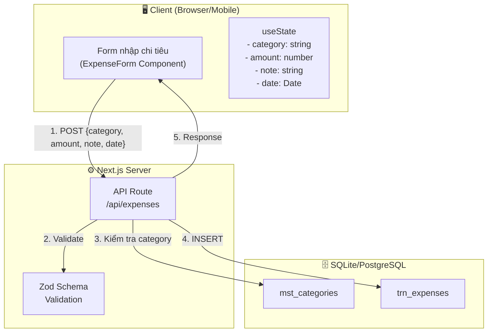
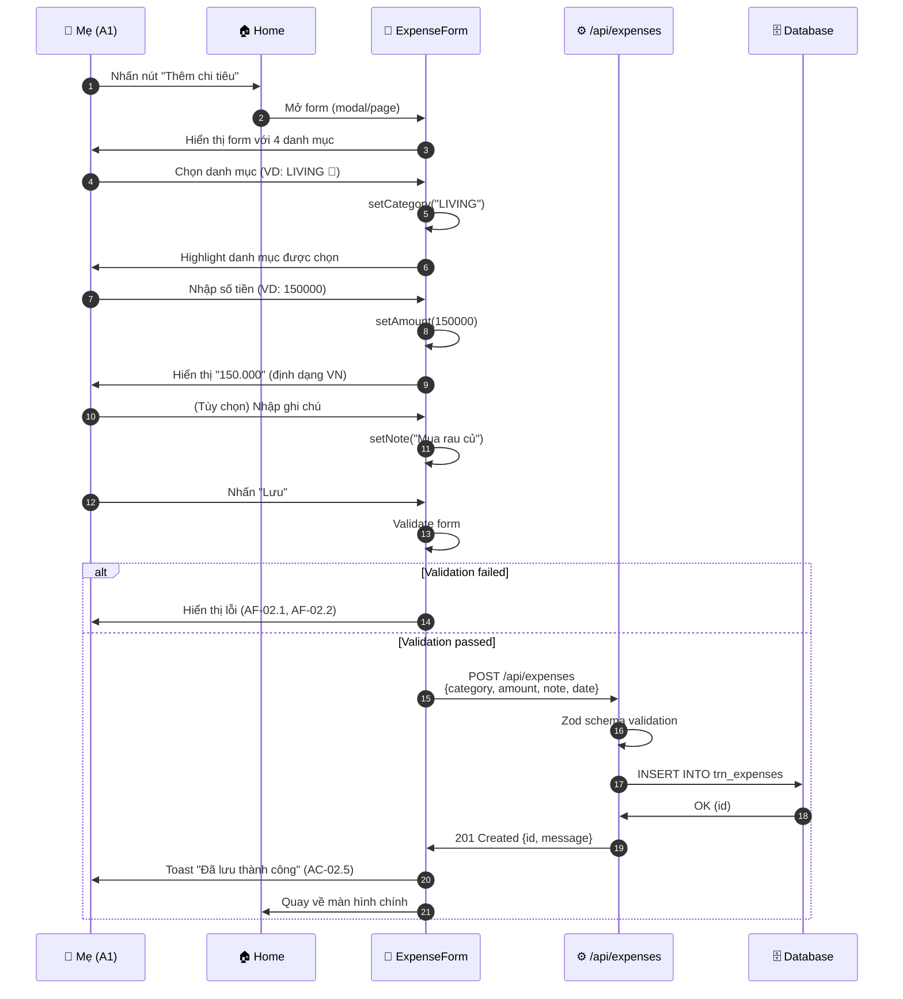
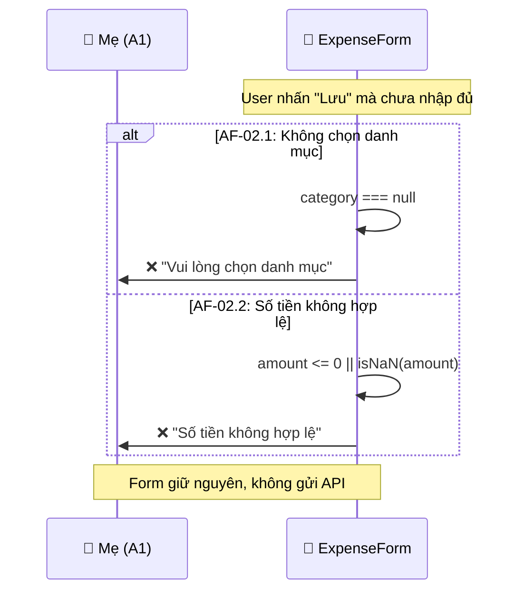
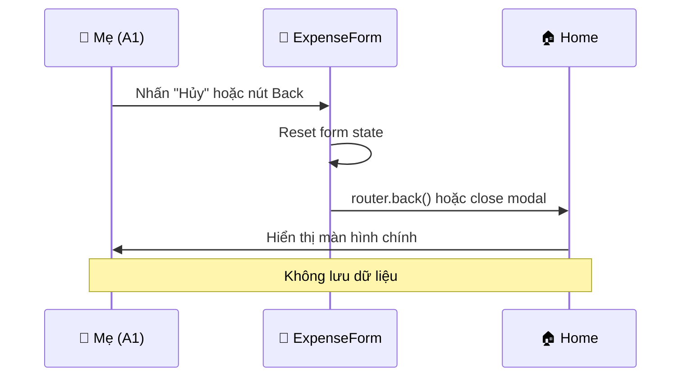

# Thiết kế Phương thức Hệ thống - UC-02 (システム方式設計書)

**Mã chức năng:** UC-02  
**Tên chức năng:** Nhập khoản chi tiêu  
**Phiên bản:** 1.0  
**Ngày tạo:** 25/02/2026

---

## 📥 Input (Tài liệu tham chiếu)

| Tài liệu | Nội dung trích xuất |
|----------|---------------------|
| `srs_function_requirements.md` | UC-02: Nhập khoản chi tiêu, luồng chính/thay thế, AC-02.1~AC-02.6 |
| `srs_nonfunction_requirements.md` | NFR-USE-04 (< 30 giây), NFR-PERF-02 (< 1 giây), NFR-L10N-05 (định dạng tiền VN) |
| `srs_business_requirements.md` | BO-01: Ghi nhận chi tiêu nhanh chóng, C1~C4 (4 danh mục) |

---

## 1. Tổng quan Kiến trúc (システムアーキテクチャ概要)

**Mô hình:** Client-Side Form với Next.js App Router



---

## 2. Cấu hình Phần mềm (ソフトウェア構成)

| Phân loại | Tên | Phiên bản | Mục đích | Tham chiếu NFR |
|-----------|-----|-----------|----------|----------------|
| Framework | Next.js | 14.x | App Router, API Routes | NFR-TECH-04 |
| Language | TypeScript | 5.x | Type-safe development | NFR-TECH-04 |
| Styling | TailwindCSS | 3.x | UI styling | NFR-TECH-03 |
| Date Library | date-fns | 3.x | Xử lý ngày tháng | NFR-TECH-01 |
| Validation | Zod | 3.x | Schema validation | - |
| Runtime | Node.js | 20.x | Server runtime | - |

> ⚠️ **CẤM** sử dụng `moment.js` theo NFR-TECH-02

---

## 3. Phương thức Xử lý Cốt lõi (主要処理方式)

### 3.1 Sequence Diagram - Luồng chính



### 3.2 Sequence Diagram - Luồng thay thế (AF-02.1, AF-02.2)



### 3.3 Sequence Diagram - Luồng thay thế (AF-02.3: Hủy)



---

## 4. Danh mục Chi tiêu (カテゴリ)

| Mã | Tên hiển thị | Icon | Màu sắc | Tham chiếu |
|----|--------------|------|---------|------------|
| `LIVING` | Sinh hoạt phí | 🛒 | `#10B981` (green) | C1 |
| `EDUCATION` | Giáo dục | 📚 | `#3B82F6` (blue) | C2 |
| `CEREMONY` | Hiếu hỉ | 💒 | `#F59E0B` (amber) | C3 |
| `FAMILY_GIFT` | Biếu tặng | 🎁 | `#EC4899` (pink) | C4 |

---

## 5. Định dạng Tiền Việt Nam (NFR-L10N-05)

```typescript
// lib/format.ts
export function formatCurrency(amount: number): string {
  return new Intl.NumberFormat('vi-VN').format(amount) + ' đ';
}

// Ví dụ:
formatCurrency(150000);    // "150.000 đ"
formatCurrency(1500000);   // "1.500.000 đ"
formatCurrency(15000000);  // "15.000.000 đ"
```

---

## 6. Xử lý Ngày/Giờ (NFR-TECH-01)

> **BẮT BUỘC** sử dụng `date-fns`

```typescript
import { format, startOfDay } from 'date-fns';
import { vi } from 'date-fns/locale';

// Ngày mặc định là ngày hiện tại (AC-02.4)
const defaultDate = startOfDay(new Date());

// Định dạng ngày Việt Nam (NFR-L10N-06)
format(new Date(), 'dd/MM/yyyy', { locale: vi }); // "25/02/2026"
```

---

## 7. Thời gian Xử lý (NFR-USE-04, NFR-PERF-02)

| Thao tác | Yêu cầu | Cách đạt được |
|----------|---------|---------------|
| Toàn bộ flow (mở app → lưu) | < 30 giây | Form đơn giản, ít bước |
| Lưu chi tiêu (nhấn Lưu → phản hồi) | < 1 giây | API tối ưu, DB index |
