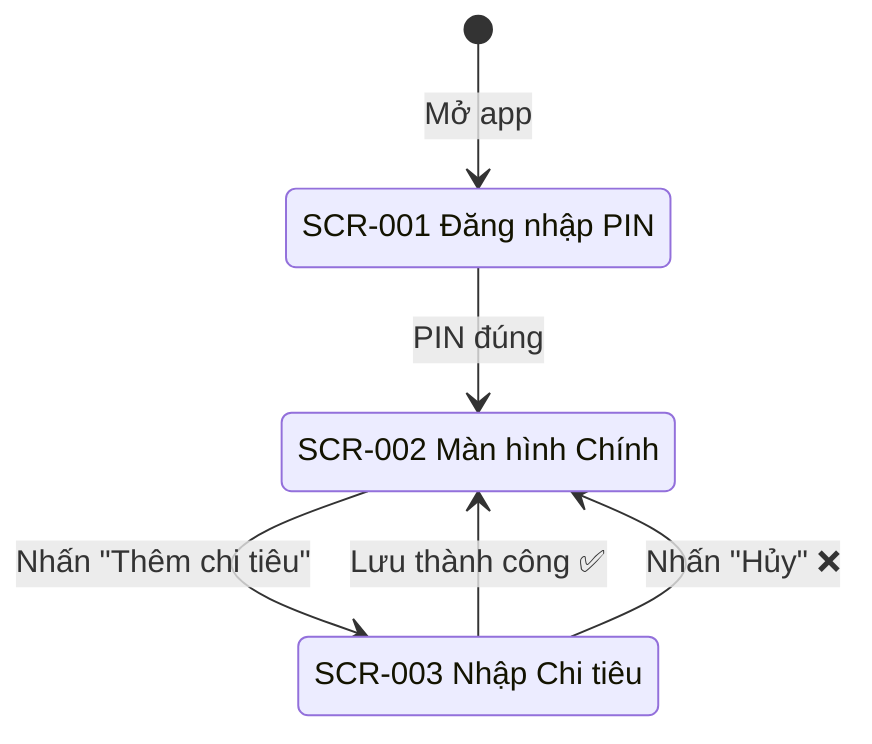

# Thiết kế Màn hình - UC-02 (画面設計書)

**Mã chức năng:** UC-02  
**Tên chức năng:** Nhập khoản chi tiêu  
**Phiên bản:** 1.0  
**Ngày tạo:** 25/02/2026

---

## 📥 Input (Tài liệu tham chiếu)

| Tài liệu | Nội dung trích xuất |
|----------|---------------------|
| `srs_function_requirements.md` | AC-02.1~AC-02.6 (Tiêu chí nghiệm thu) |
| `srs_nonfunction_requirements.md` | NFR-USE-01~04, NFR-L10N-01~06 |
| `srs_business_requirements.md` | C1~C4 (4 danh mục chi tiêu) |

---

## 1. Danh sách Màn hình (画面一覧)

| ID Màn hình | Tên màn hình | Đối tượng | Route | Tham chiếu AC |
|-------------|--------------|-----------|-------|---------------|
| SCR-002 | Màn hình Chính (Home) | Mẹ (A1) | `/home` | - |
| SCR-003 | Màn hình Nhập Chi tiêu | Mẹ (A1) | `/home/add` hoặc Modal | AC-02.1~AC-02.6 |

---

## 2. Sơ đồ Chuyển đổi Màn hình (画面遷移図)



---

## 3. Chi tiết Màn hình (画面詳細)

### [SCR-002] Màn hình Chính (Home) - Phần liên quan UC-02

#### 3.1 Layout - Nút Thêm chi tiêu

```
┌─────────────────────────────────────────┐
│  Quản lý Chi tiêu Gia đình    [≡]       │
├─────────────────────────────────────────┤
│                                         │
│   Tháng 02/2026                         │
│   Tổng chi tiêu: 5.250.000 đ            │
│                                         │
│   ┌─────────────────────────────────┐   │
│   │  📊 Biểu đồ (UC-03)             │   │
│   └─────────────────────────────────┘   │
│                                         │
│   Giao dịch gần đây:                    │
│   ┌─────────────────────────────────┐   │
│   │ 🛒 Sinh hoạt phí    -150.000 đ  │   │
│   │ 📚 Giáo dục         -500.000 đ  │   │
│   └─────────────────────────────────┘   │
│                                         │
│              ┌─────────┐                │
│              │    +    │  ← FAB Button  │
│              └─────────┘                │
│                                         │
├─────────────────────────────────────────┤
│   🏠        📊        ⚙️               │
│  Trang chủ  Thống kê  Cài đặt          │
└─────────────────────────────────────────┘
```

---

### [SCR-003] Màn hình Nhập Chi tiêu

#### 3.1 Layout Màn hình (画面レイアウト)

```
┌─────────────────────────────────────────┐
│  ← Quay lại        Thêm chi tiêu        │
├─────────────────────────────────────────┤
│                                         │
│  Chọn danh mục:                         │  ← AC-02.1
│  ┌─────────┐ ┌─────────┐                │
│  │   🛒    │ │   📚    │                │
│  │Sinh hoạt│ │Giáo dục │                │
│  │   phí   │ │         │                │
│  └─────────┘ └─────────┘                │
│  ┌─────────┐ ┌─────────┐                │
│  │   💒    │ │   🎁    │                │
│  │ Hiếu hỉ │ │Biếu tặng│                │
│  └─────────┘ └─────────┘                │
│                                         │
│  Số tiền: *                             │  ← AC-02.2, AC-02.3
│  ┌─────────────────────────────────┐    │
│  │                      150.000  đ │    │
│  └─────────────────────────────────┘    │
│                                         │
│  Ngày chi tiêu:                         │  ← AC-02.4
│  ┌─────────────────────────────────┐    │
│  │ 📅  25/02/2026                  │    │
│  └─────────────────────────────────┘    │
│                                         │
│  Ghi chú: (tùy chọn)                    │  ← AC-02.6
│  ┌─────────────────────────────────┐    │
│  │ Mua rau củ quả                  │    │
│  └─────────────────────────────────┘    │
│                                         │
│  ┌─────────┐         ┌─────────────┐    │
│  │   Hủy   │         │     Lưu     │    │
│  └─────────┘         └─────────────┘    │
│                                         │
│   ❌ Vui lòng chọn danh mục             │  ← Thông báo lỗi
│                                         │
└─────────────────────────────────────────┘
```

#### 3.2 Danh sách Các mục trên Màn hình (画面項目一覧)

| ID | Tên hiển thị | Loại | Bắt buộc | Ràng buộc | Tham chiếu |
|----|--------------|------|:--------:|-----------|------------|
| ITM-01 | Nút "Quay lại" | Button | - | - | AF-02.3 |
| ITM-02 | Tiêu đề "Thêm chi tiêu" | Text | - | Font 18px | - |
| ITM-03 | Label "Chọn danh mục" | Text | - | - | - |
| ITM-04 | Card "Sinh hoạt phí" 🛒 | SelectCard | ✅ | Chọn 1 trong 4 | AC-02.1, C1 |
| ITM-05 | Card "Giáo dục" 📚 | SelectCard | ✅ | Chọn 1 trong 4 | AC-02.1, C2 |
| ITM-06 | Card "Hiếu hỉ" 💒 | SelectCard | ✅ | Chọn 1 trong 4 | AC-02.1, C3 |
| ITM-07 | Card "Biếu tặng" 🎁 | SelectCard | ✅ | Chọn 1 trong 4 | AC-02.1, C4 |
| ITM-08 | Input "Số tiền" | NumberInput | ✅ | > 0, định dạng VN | AC-02.2, AC-02.3 |
| ITM-09 | DatePicker "Ngày chi tiêu" | DateInput | ✅ | Default: today | AC-02.4 |
| ITM-10 | Textarea "Ghi chú" | Textarea | | Max 200 ký tự | AC-02.6 |
| ITM-11 | Nút "Hủy" | Button | - | Secondary style | AF-02.3 |
| ITM-12 | Nút "Lưu" | Button | - | Primary style | AC-02.5 |
| ITM-13 | Thông báo lỗi | Text | - | Màu đỏ | AF-02.1, AF-02.2 |

#### 3.3 Quy tắc Validation (バリデーション)

| ID | Quy tắc | Thông báo lỗi (tiếng Việt) | Tham chiếu |
|----|---------|---------------------------|------------|
| VAL-01 | Phải chọn 1 danh mục | "Vui lòng chọn danh mục" | AF-02.1 |
| VAL-02 | Số tiền > 0 | "Số tiền không hợp lệ" | AF-02.2 |
| VAL-03 | Số tiền không rỗng | "Vui lòng nhập số tiền" | AF-02.2 |
| VAL-04 | Ngày không rỗng | "Vui lòng chọn ngày" | - |
| VAL-05 | Ghi chú max 200 ký tự | "Ghi chú tối đa 200 ký tự" | - |

#### 3.4 Xử lý Thao tác / Sự kiện (アクション・イベント処理)

**EVT-01: Chọn danh mục**

| Bước | Xử lý |
|------|-------|
| 1 | `setCategory(categoryCode)` |
| 2 | Highlight card được chọn (border + background) |
| 3 | Xóa highlight card cũ (nếu có) |

**EVT-02: Nhập số tiền**

| Bước | Xử lý |
|------|-------|
| 1 | Chỉ cho phép số (filter non-numeric) |
| 2 | `setAmount(parseFloat(value))` |
| 3 | Hiển thị định dạng VN: `formatCurrency(amount)` |

**EVT-03: Chọn ngày**

| Bước | Xử lý |
|------|-------|
| 1 | Mở DatePicker (native hoặc custom) |
| 2 | `setDate(selectedDate)` |
| 3 | Hiển thị: `format(date, 'dd/MM/yyyy')` |

**EVT-04: Nhấn "Lưu"**

| Bước | Điều kiện | Xử lý | Tham chiếu |
|------|-----------|-------|------------|
| 1 | - | Validate form | - |
| 2 | Có lỗi | Hiển thị thông báo lỗi, dừng | AF-02.1, AF-02.2 |
| 3 | OK | `setLoading(true)` | - |
| 4 | - | POST `/api/expenses` | - |
| 5 | Success | Toast "Đã lưu thành công" | AC-02.5 |
| 6 | - | `router.back()` | - |
| 7 | Error | Hiển thị lỗi server | - |

**EVT-05: Nhấn "Hủy"**

| Bước | Xử lý | Tham chiếu |
|------|-------|------------|
| 1 | Reset form state | AF-02.3 |
| 2 | `router.back()` | - |

---

## 4. Trạng thái Màn hình (画面状態)

| Trạng thái | Điều kiện | Hiển thị | CSS Classes |
|------------|-----------|----------|-------------|
| Mặc định | Vừa mở form | Không có danh mục chọn, số tiền trống | - |
| Đã chọn danh mục | `category !== null` | Card highlight | `ring-2 ring-primary bg-primary/10` |
| Đang nhập | Form có dữ liệu | Hiển thị preview | - |
| Đang gửi | API loading | Nút Lưu disabled, spinner | `opacity-50 cursor-not-allowed` |
| Lỗi | Validation failed | Thông báo đỏ | `text-red-500` |

---

## 5. Responsive Design (NFR-COMP-03)

| Breakpoint | Min Width | Thay đổi |
|------------|-----------|----------|
| Mobile | 375px | 2 danh mục/hàng, full-width inputs |
| Tablet | 640px | 4 danh mục/hàng, max-width 480px |
| Desktop | 1024px | Modal dialog, max-width 480px |

**Grid cho danh mục:**
```html
<div class="grid grid-cols-2 sm:grid-cols-4 gap-3">
  <!-- Category cards -->
</div>
```

---

## 6. Category Card Component

```
┌───────────────────┐
│                   │
│       🛒          │  ← Icon 32px
│                   │
│   Sinh hoạt phí   │  ← Text 14px, center
│                   │
└───────────────────┘

Selected state:
┌───────────────────┐
│ ╔═══════════════╗ │  ← Border 2px primary
│ ║      🛒       ║ │
│ ║               ║ │
│ ║ Sinh hoạt phí ║ │
│ ╚═══════════════╝ │
└───────────────────┘
```

**TailwindCSS:**
```html
<!-- Default -->
<button class="p-4 rounded-xl border-2 border-gray-200 bg-white 
               hover:border-gray-300 transition-colors">
  <span class="text-3xl">🛒</span>
  <p class="mt-2 text-sm font-medium">Sinh hoạt phí</p>
</button>

<!-- Selected -->
<button class="p-4 rounded-xl border-2 border-green-500 bg-green-50 
               ring-2 ring-green-500/20">
  <span class="text-3xl">🛒</span>
  <p class="mt-2 text-sm font-medium text-green-700">Sinh hoạt phí</p>
</button>
```

---

## 7. Màu sắc theo Danh mục

| Danh mục | Border/Ring | Background | Text | Tham chiếu |
|----------|-------------|------------|------|------------|
| LIVING 🛒 | `green-500` | `green-50` | `green-700` | C1 |
| EDUCATION 📚 | `blue-500` | `blue-50` | `blue-700` | C2 |
| CEREMONY 💒 | `amber-500` | `amber-50` | `amber-700` | C3 |
| FAMILY_GIFT 🎁 | `pink-500` | `pink-50` | `pink-700` | C4 |

---

## 8. Accessibility (アクセシビリティ)

| Mục | Yêu cầu | Triển khai | Tham chiếu |
|-----|---------|------------|------------|
| Font size | Tối thiểu 16px | `text-base` trở lên | NFR-USE-02 |
| Touch target | Tối thiểu 44x44px | Card min `h-20 w-20` | NFR-USE-03 |
| Labels | Input có label | `<label htmlFor>` | - |
| Error | Screen reader | `aria-invalid`, `aria-describedby` | - |
| Focus | Visible focus ring | `focus:ring-2` | - |
