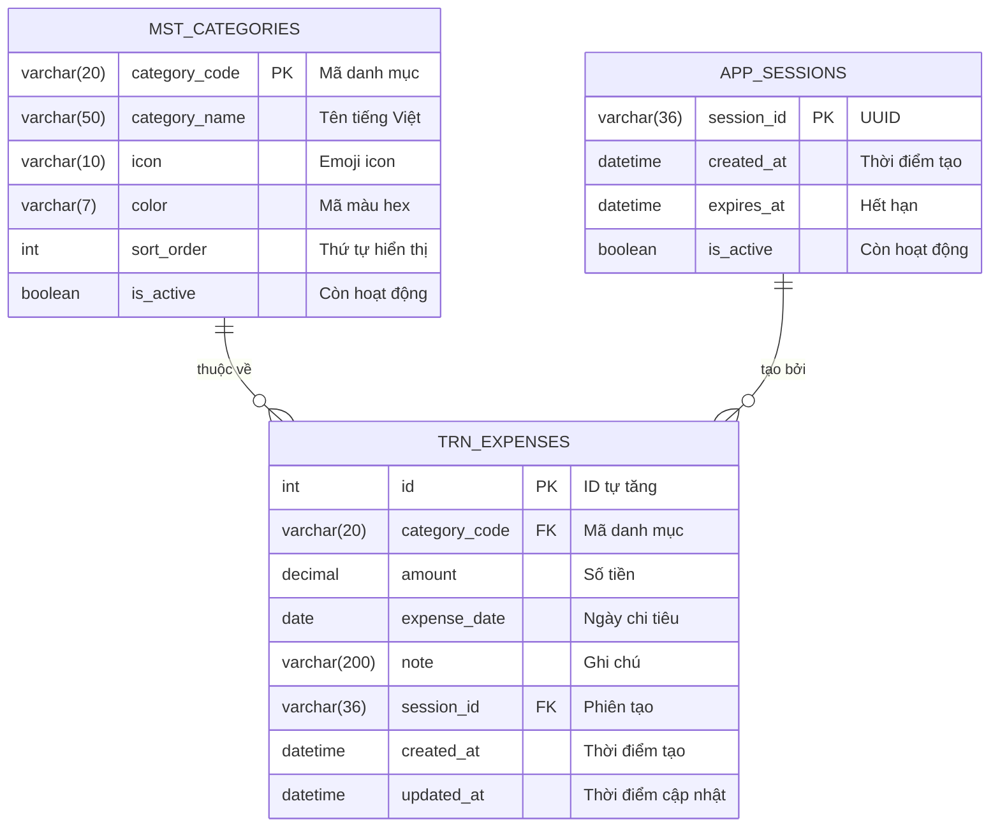

# Thiết kế Cơ sở dữ liệu - UC-02 (データベース設計書)

**Mã chức năng:** UC-02  
**Tên chức năng:** Nhập khoản chi tiêu  
**Phiên bản:** 1.0  
**Ngày tạo:** 25/02/2026

---

## 📥 Input (Tài liệu tham chiếu)

| Tài liệu | Nội dung trích xuất |
|----------|---------------------|
| `srs_function_requirements.md` | UC-02: Lưu chi tiêu vào Database |
| `srs_business_requirements.md` | C1~C4: 4 danh mục chi tiêu |
| `srs_nonfunction_requirements.md` | NFR-PERF-02: Lưu < 1 giây |

---

## 1. Sơ đồ ER (ER図)



---

## 2. Danh sách Bảng (テーブル一覧)

| Tên bảng vật lý | Tên bảng logic | Mô tả | Phân loại | Tham chiếu |
|-----------------|----------------|-------|-----------|------------|
| `mst_categories` | Danh mục chi tiêu | Lưu 4 danh mục cố định | Master | C1~C4 |
| `trn_expenses` | Giao dịch chi tiêu | Lưu các khoản chi | Transaction | UC-02 |

---

## 3. Định nghĩa Bảng Chi tiết (テーブル定義)

### 3.1 Bảng: `mst_categories` (Danh mục chi tiêu)

| Tên cột vật lý | Tên cột logic | Kiểu dữ liệu | PK | FK | Not Null | Default | Ghi chú |
|----------------|---------------|--------------|:--:|:--:|:--------:|---------|---------|
| `category_code` | Mã danh mục | VARCHAR(20) | ✅ | | ✅ | - | VD: "LIVING" |
| `category_name` | Tên danh mục | VARCHAR(50) | | | ✅ | - | Tiếng Việt |
| `icon` | Icon | VARCHAR(10) | | | ✅ | - | Emoji |
| `color` | Mã màu | VARCHAR(7) | | | ✅ | - | Hex: "#10B981" |
| `sort_order` | Thứ tự | INTEGER | | | ✅ | 0 | Sắp xếp hiển thị |
| `is_active` | Hoạt động | BOOLEAN | | | ✅ | TRUE | Soft delete |

**Dữ liệu khởi tạo (Seed Data):**

| category_code | category_name | icon | color | sort_order | Tham chiếu |
|---------------|---------------|------|-------|------------|------------|
| `LIVING` | Sinh hoạt phí | 🛒 | #10B981 | 1 | C1 |
| `EDUCATION` | Giáo dục | 📚 | #3B82F6 | 2 | C2 |
| `CEREMONY` | Hiếu hỉ | 💒 | #F59E0B | 3 | C3 |
| `FAMILY_GIFT` | Biếu tặng | 🎁 | #EC4899 | 4 | C4 |

---

### 3.2 Bảng: `trn_expenses` (Giao dịch chi tiêu)

| Tên cột vật lý | Tên cột logic | Kiểu dữ liệu | PK | FK | Not Null | Default | Ghi chú |
|----------------|---------------|--------------|:--:|:--:|:--------:|---------|---------|
| `id` | ID | INTEGER | ✅ | | ✅ | AUTO_INCREMENT | - |
| `category_code` | Mã danh mục | VARCHAR(20) | | FK | ✅ | - | Ref: mst_categories |
| `amount` | Số tiền | DECIMAL(15,0) | | | ✅ | - | VND, không lẻ |
| `expense_date` | Ngày chi tiêu | DATE | | | ✅ | - | AC-02.4 |
| `note` | Ghi chú | VARCHAR(200) | | | | NULL | AC-02.6 |
| `session_id` | Phiên tạo | VARCHAR(36) | | FK | | NULL | Ref: app_sessions |
| `created_at` | Thời điểm tạo | DATETIME | | | ✅ | CURRENT_TIMESTAMP | - |
| `updated_at` | Thời điểm sửa | DATETIME | | | ✅ | CURRENT_TIMESTAMP | ON UPDATE |

**Index:**

| Tên Index | Cột | Loại | Mục đích |
|-----------|-----|------|----------|
| `idx_expenses_date` | `expense_date` | B-Tree | Truy vấn theo ngày/tháng |
| `idx_expenses_category` | `category_code` | B-Tree | Thống kê theo danh mục |
| `idx_expenses_date_category` | `expense_date, category_code` | Composite | UC-03: Biểu đồ |

**Foreign Key:**

| Cột | Tham chiếu | On Delete | On Update |
|-----|------------|-----------|-----------|
| `category_code` | `mst_categories(category_code)` | RESTRICT | CASCADE |
| `session_id` | `app_sessions(session_id)` | SET NULL | CASCADE |

---

## 4. Ma trận CRUD (CRUDマトリクス)

| Chức năng / Màn hình | `mst_categories` | `trn_expenses` | Tham chiếu |
|---------------------|:----------------:|:--------------:|------------|
| SCR-003 Nhập chi tiêu | R | **C** | UC-02 |
| SCR-002 Màn hình chính | R | R | Danh sách gần đây |
| SCR-004 Thống kê | R | R | UC-03 |
| Sửa chi tiêu (tương lai) | R | **U** | - |
| Xóa chi tiêu (tương lai) | - | **D** | - |

*(C: Create, R: Read, U: Update, D: Delete)*

---

## 5. SQL Scripts

### 5.1 DDL - Tạo bảng

```sql
-- =============================================
-- Database: family_expense
-- UC-02: Nhập khoản chi tiêu
-- =============================================

-- Bảng danh mục (Master)
CREATE TABLE mst_categories (
    category_code VARCHAR(20) PRIMARY KEY,
    category_name VARCHAR(50) NOT NULL,
    icon VARCHAR(10) NOT NULL,
    color VARCHAR(7) NOT NULL,
    sort_order INTEGER NOT NULL DEFAULT 0,
    is_active BOOLEAN NOT NULL DEFAULT TRUE
);

-- Bảng chi tiêu (Transaction)
CREATE TABLE trn_expenses (
    id INTEGER PRIMARY KEY AUTO_INCREMENT,
    category_code VARCHAR(20) NOT NULL,
    amount DECIMAL(15,0) NOT NULL,
    expense_date DATE NOT NULL,
    note VARCHAR(200),
    session_id VARCHAR(36),
    created_at DATETIME NOT NULL DEFAULT CURRENT_TIMESTAMP,
    updated_at DATETIME NOT NULL DEFAULT CURRENT_TIMESTAMP ON UPDATE CURRENT_TIMESTAMP,
    
    -- Foreign Keys
    FOREIGN KEY (category_code) REFERENCES mst_categories(category_code)
        ON DELETE RESTRICT ON UPDATE CASCADE,
    FOREIGN KEY (session_id) REFERENCES app_sessions(session_id)
        ON DELETE SET NULL ON UPDATE CASCADE,
    
    -- Index
    INDEX idx_expenses_date (expense_date),
    INDEX idx_expenses_category (category_code),
    INDEX idx_expenses_date_category (expense_date, category_code)
);
```

### 5.2 DML - Seed Data (Danh mục)

```sql
-- Khởi tạo 4 danh mục theo SRS (C1~C4)
INSERT INTO mst_categories (category_code, category_name, icon, color, sort_order) VALUES
    ('LIVING', 'Sinh hoạt phí', '🛒', '#10B981', 1),
    ('EDUCATION', 'Giáo dục', '📚', '#3B82F6', 2),
    ('CEREMONY', 'Hiếu hỉ', '💒', '#F59E0B', 3),
    ('FAMILY_GIFT', 'Biếu tặng', '🎁', '#EC4899', 4);
```

### 5.3 DML - Dữ liệu mẫu (Expenses)

```sql
-- Ví dụ: Nhập chi tiêu tháng 02/2026
INSERT INTO trn_expenses (category_code, amount, expense_date, note, session_id) VALUES
    ('LIVING', 150000, '2026-02-25', 'Mua rau củ quả', '550e8400-e29b-41d4-a716-446655440000'),
    ('LIVING', 85000, '2026-02-25', 'Mua thịt', '550e8400-e29b-41d4-a716-446655440000'),
    ('EDUCATION', 500000, '2026-02-20', 'Học phí tháng 2 cho Bống', '550e8400-e29b-41d4-a716-446655440000'),
    ('CEREMONY', 1000000, '2026-02-15', 'Đám cưới anh Tuấn', '550e8400-e29b-41d4-a716-446655440000'),
    ('FAMILY_GIFT', 2000000, '2026-02-10', 'Biếu Tết ông bà nội', '550e8400-e29b-41d4-a716-446655440000');
```

### 5.4 Query mẫu

```sql
-- Lấy danh sách danh mục active (cho form)
SELECT category_code, category_name, icon, color
FROM mst_categories
WHERE is_active = TRUE
ORDER BY sort_order;

-- Lấy chi tiêu gần đây (cho trang chủ)
SELECT e.id, e.amount, e.expense_date, e.note,
       c.category_name, c.icon, c.color
FROM trn_expenses e
JOIN mst_categories c ON e.category_code = c.category_code
ORDER BY e.expense_date DESC, e.created_at DESC
LIMIT 10;

-- Tổng chi tiêu theo danh mục trong tháng (cho UC-03)
SELECT c.category_code, c.category_name, c.icon, c.color,
       COALESCE(SUM(e.amount), 0) as total
FROM mst_categories c
LEFT JOIN trn_expenses e ON c.category_code = e.category_code
    AND e.expense_date >= '2026-02-01'
    AND e.expense_date < '2026-03-01'
WHERE c.is_active = TRUE
GROUP BY c.category_code, c.category_name, c.icon, c.color
ORDER BY c.sort_order;
```

---

## 6. Ràng buộc Dữ liệu

| Ràng buộc | Mô tả | Tham chiếu |
|-----------|-------|------------|
| `amount > 0` | Số tiền phải dương | AC-02.2 |
| `category_code` NOT NULL | Phải chọn danh mục | AF-02.1 |
| `expense_date` NOT NULL | Phải có ngày | AC-02.4 |
| `note` NULL allowed | Ghi chú tùy chọn | AC-02.6 |
| FK `category_code` | Phải tồn tại trong mst_categories | - |

---

## 7. Hiệu năng (NFR-PERF-02)

| Yêu cầu | Giải pháp |
|---------|-----------|
| Lưu < 1 giây | Index trên FK, không có trigger phức tạp |
| Truy vấn tháng nhanh | Composite index `(expense_date, category_code)` |
| Pagination | Sử dụng `LIMIT/OFFSET` hoặc cursor-based |
