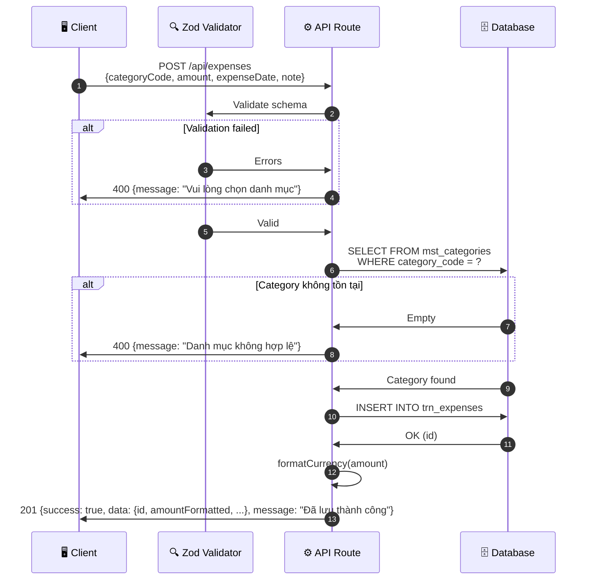

# Thiết kế Giao diện Kết nối - UC-02 (外部インターフェース設計書)

**Mã chức năng:** UC-02  
**Tên chức năng:** Nhập khoản chi tiêu  
**Phiên bản:** 1.0  
**Ngày tạo:** 25/02/2026

---

## 📥 Input (Tài liệu tham chiếu)

| Tài liệu | Nội dung trích xuất |
|----------|---------------------|
| `srs_function_requirements.md` | UC-02: Request/Response khi lưu chi tiêu |
| `srs_nonfunction_requirements.md` | NFR-PERF-02 (< 1 giây), NFR-L10N-05 (định dạng tiền) |

---

## 1. Danh sách Interface (インターフェース一覧)

| ID IF | Tên IF | Hệ thống | Phương thức | Hướng | Thời điểm |
|-------|--------|----------|-------------|-------|-----------|
| IF-002 | Lấy danh mục chi tiêu | Internal API | GET | Client → Server | Khi mở form |
| IF-003 | Tạo khoản chi tiêu | Internal API | POST | Client → Server | Khi nhấn Lưu |

---

## 2. Chi tiết Interface

### [IF-002] Lấy danh mục chi tiêu

#### 2.1 Thông tin Giao thức

| Thuộc tính | Giá trị |
|------------|---------|
| **Endpoint** | `GET /api/categories` |
| **Method** | GET |
| **Authentication** | Session required |
| **Cache** | 1 giờ (danh mục ít thay đổi) |

#### 2.2 OpenAPI Specification

```yaml
/categories:
  get:
    summary: Lấy danh sách danh mục chi tiêu
    description: |
      Trả về 4 danh mục chi tiêu đang hoạt động.
      **Tham chiếu:** AC-02.1, C1~C4
    operationId: getCategories
    tags:
      - Categories
    responses:
      '200':
        description: Danh sách danh mục
        content:
          application/json:
            schema:
              $ref: '#/components/schemas/CategoriesResponse'
            example:
              success: true
              data:
                - code: "LIVING"
                  name: "Sinh hoạt phí"
                  icon: "🛒"
                  color: "#10B981"
                - code: "EDUCATION"
                  name: "Giáo dục"
                  icon: "📚"
                  color: "#3B82F6"
                - code: "CEREMONY"
                  name: "Hiếu hỉ"
                  icon: "💒"
                  color: "#F59E0B"
                - code: "FAMILY_GIFT"
                  name: "Biếu tặng"
                  icon: "🎁"
                  color: "#EC4899"
      '401':
        description: Chưa đăng nhập
```

---

### [IF-003] Tạo khoản chi tiêu

#### 2.1 Thông tin Giao thức

| Thuộc tính | Giá trị |
|------------|---------|
| **Endpoint** | `POST /api/expenses` |
| **Method** | POST |
| **Content-Type** | `application/json` |
| **Authentication** | Session required |
| **Timeout** | 5000ms |

#### 2.2 OpenAPI Specification

```yaml
openapi: 3.0.3
info:
  title: Family Expense App - Expense API
  description: |
    API quản lý chi tiêu cho ứng dụng Quản lý Chi tiêu Gia đình.
    
    **Tham chiếu yêu cầu:**
    - UC-02: Nhập khoản chi tiêu
    - NFR-PERF-02: Lưu < 1 giây
    - NFR-L10N-05: Định dạng tiền Việt Nam
  version: 1.0.0

servers:
  - url: /api
    description: Next.js API Routes

paths:
  /expenses:
    post:
      summary: Tạo khoản chi tiêu mới
      description: |
        Lưu một khoản chi tiêu vào database.
        
        **Luồng xử lý:**
        1. Validate input (Zod schema)
        2. Kiểm tra category_code tồn tại
        3. INSERT vào trn_expenses
        4. Trả về expense đã tạo
        
        **Tham chiếu:** UC-02, AC-02.1~AC-02.6
      operationId: createExpense
      tags:
        - Expenses
      security:
        - sessionAuth: []
      requestBody:
        required: true
        content:
          application/json:
            schema:
              $ref: '#/components/schemas/CreateExpenseRequest'
            examples:
              full:
                summary: Đầy đủ thông tin
                value:
                  categoryCode: "LIVING"
                  amount: 150000
                  expenseDate: "2026-02-25"
                  note: "Mua rau củ quả"
              minimal:
                summary: Tối thiểu (không có ghi chú)
                value:
                  categoryCode: "EDUCATION"
                  amount: 500000
                  expenseDate: "2026-02-25"
      responses:
        '201':
          description: |
            Tạo thành công.
            **Tham chiếu:** AC-02.5 (Thông báo "Đã lưu thành công")
          content:
            application/json:
              schema:
                $ref: '#/components/schemas/CreateExpenseResponse'
              example:
                success: true
                data:
                  id: 1
                  categoryCode: "LIVING"
                  categoryName: "Sinh hoạt phí"
                  amount: 150000
                  amountFormatted: "150.000 đ"
                  expenseDate: "2026-02-25"
                  note: "Mua rau củ quả"
                  createdAt: "2026-02-25T08:30:00Z"
                message: "Đã lưu thành công"
        '400':
          description: |
            Dữ liệu không hợp lệ.
            **Tham chiếu:** AF-02.1, AF-02.2
          content:
            application/json:
              schema:
                $ref: '#/components/schemas/ValidationError'
              examples:
                noCategory:
                  summary: Không chọn danh mục (AF-02.1)
                  value:
                    success: false
                    message: "Vui lòng chọn danh mục"
                    errors:
                      - field: "categoryCode"
                        message: "Vui lòng chọn danh mục"
                invalidAmount:
                  summary: Số tiền không hợp lệ (AF-02.2)
                  value:
                    success: false
                    message: "Số tiền không hợp lệ"
                    errors:
                      - field: "amount"
                        message: "Số tiền không hợp lệ"
        '401':
          description: Chưa đăng nhập
        '500':
          description: Lỗi server

components:
  securitySchemes:
    sessionAuth:
      type: apiKey
      in: header
      name: X-Session-Id
      description: Session ID từ đăng nhập PIN
      
  schemas:
    CreateExpenseRequest:
      type: object
      required:
        - categoryCode
        - amount
        - expenseDate
      properties:
        categoryCode:
          type: string
          enum: [LIVING, EDUCATION, CEREMONY, FAMILY_GIFT]
          description: |
            Mã danh mục chi tiêu.
            **Tham chiếu:** AC-02.1, C1~C4
          example: "LIVING"
        amount:
          type: number
          minimum: 1
          description: |
            Số tiền (VND, số nguyên dương).
            **Tham chiếu:** AC-02.2
          example: 150000
        expenseDate:
          type: string
          format: date
          description: |
            Ngày chi tiêu (YYYY-MM-DD).
            **Tham chiếu:** AC-02.4
          example: "2026-02-25"
        note:
          type: string
          maxLength: 200
          description: |
            Ghi chú (tùy chọn).
            **Tham chiếu:** AC-02.6
          example: "Mua rau củ quả"
          
    CreateExpenseResponse:
      type: object
      properties:
        success:
          type: boolean
          const: true
        data:
          $ref: '#/components/schemas/Expense'
        message:
          type: string
          description: |
            Thông báo tiếng Việt.
            **Tham chiếu:** AC-02.5
          example: "Đã lưu thành công"
          
    Expense:
      type: object
      properties:
        id:
          type: integer
          example: 1
        categoryCode:
          type: string
          example: "LIVING"
        categoryName:
          type: string
          description: Tên tiếng Việt
          example: "Sinh hoạt phí"
        amount:
          type: number
          example: 150000
        amountFormatted:
          type: string
          description: |
            Định dạng tiền Việt Nam.
            **Tham chiếu:** NFR-L10N-05
          example: "150.000 đ"
        expenseDate:
          type: string
          format: date
          example: "2026-02-25"
        note:
          type: string
          nullable: true
          example: "Mua rau củ quả"
        createdAt:
          type: string
          format: date-time
          example: "2026-02-25T08:30:00Z"
          
    ValidationError:
      type: object
      properties:
        success:
          type: boolean
          const: false
        message:
          type: string
          description: Thông báo lỗi chính
        errors:
          type: array
          items:
            type: object
            properties:
              field:
                type: string
              message:
                type: string
                
    CategoriesResponse:
      type: object
      properties:
        success:
          type: boolean
        data:
          type: array
          items:
            $ref: '#/components/schemas/Category'
            
    Category:
      type: object
      properties:
        code:
          type: string
          example: "LIVING"
        name:
          type: string
          example: "Sinh hoạt phí"
        icon:
          type: string
          example: "🛒"
        color:
          type: string
          example: "#10B981"
```

---

## 3. Cấu trúc Dữ liệu Chi tiết

### 3.1 Request Body - POST /api/expenses

| Tên trường | Kiểu | Bắt buộc | Ràng buộc | Mô tả | Tham chiếu |
|------------|------|:--------:|-----------|-------|------------|
| `categoryCode` | string | ✅ | enum | Mã danh mục | AC-02.1 |
| `amount` | number | ✅ | > 0 | Số tiền VND | AC-02.2 |
| `expenseDate` | string | ✅ | YYYY-MM-DD | Ngày chi tiêu | AC-02.4 |
| `note` | string | | max 200 | Ghi chú | AC-02.6 |

### 3.2 Response - Thành công (201)

| Tên trường | Kiểu | Mô tả | Tham chiếu |
|------------|------|-------|------------|
| `success` | boolean | `true` | - |
| `data.id` | number | ID expense đã tạo | - |
| `data.amountFormatted` | string | "150.000 đ" | NFR-L10N-05 |
| `message` | string | "Đã lưu thành công" | AC-02.5 |

---

## 4. Xử lý Ngoại lệ (例外処理)

| HTTP Status | Điều kiện | Response | Tham chiếu |
|-------------|-----------|----------|------------|
| 201 | Tạo thành công | `{success: true, data, message}` | AC-02.5 |
| 400 | Không chọn danh mục | `{message: "Vui lòng chọn danh mục"}` | AF-02.1 |
| 400 | Số tiền <= 0 | `{message: "Số tiền không hợp lệ"}` | AF-02.2 |
| 400 | Category không tồn tại | `{message: "Danh mục không hợp lệ"}` | - |
| 401 | Chưa đăng nhập | `{message: "Vui lòng đăng nhập"}` | - |
| 500 | Lỗi DB | `{message: "Đã xảy ra lỗi..."}` | - |

---

## 5. Sequence Diagram



---

## 6. Ví dụ Code

### 6.1 Client-side (TypeScript)

```typescript
// types/expense.ts
interface CreateExpenseRequest {
  categoryCode: 'LIVING' | 'EDUCATION' | 'CEREMONY' | 'FAMILY_GIFT';
  amount: number;
  expenseDate: string; // YYYY-MM-DD
  note?: string;
}

interface Expense {
  id: number;
  categoryCode: string;
  categoryName: string;
  amount: number;
  amountFormatted: string;
  expenseDate: string;
  note: string | null;
  createdAt: string;
}

// lib/api.ts
export async function createExpense(data: CreateExpenseRequest): Promise<Expense> {
  const response = await fetch('/api/expenses', {
    method: 'POST',
    headers: {
      'Content-Type': 'application/json',
      'X-Session-Id': localStorage.getItem('sessionId') || '',
    },
    body: JSON.stringify(data),
  });

  const result = await response.json();

  if (!response.ok) {
    throw new Error(result.message || 'Đã xảy ra lỗi');
  }

  return result.data;
}

// components/ExpenseForm.tsx - Sử dụng
const handleSubmit = async () => {
  // Validate client-side
  if (!category) {
    setError('Vui lòng chọn danh mục'); // AF-02.1
    return;
  }
  if (!amount || amount <= 0) {
    setError('Số tiền không hợp lệ'); // AF-02.2
    return;
  }

  try {
    setLoading(true);
    await createExpense({
      categoryCode: category,
      amount,
      expenseDate: format(date, 'yyyy-MM-dd'), // date-fns
      note: note || undefined,
    });
    
    toast.success('Đã lưu thành công'); // AC-02.5
    router.back();
  } catch (error) {
    setError(error instanceof Error ? error.message : 'Đã xảy ra lỗi');
  } finally {
    setLoading(false);
  }
};
```

### 6.2 Server-side (Next.js API Route)

```typescript
// app/api/expenses/route.ts
import { NextRequest, NextResponse } from 'next/server';
import { z } from 'zod';
import { format } from 'date-fns';

// Zod schema cho validation
const createExpenseSchema = z.object({
  categoryCode: z.enum(['LIVING', 'EDUCATION', 'CEREMONY', 'FAMILY_GIFT'], {
    errorMap: () => ({ message: 'Vui lòng chọn danh mục' }), // AF-02.1
  }),
  amount: z.number().positive({ message: 'Số tiền không hợp lệ' }), // AF-02.2
  expenseDate: z.string().regex(/^\d{4}-\d{2}-\d{2}$/, 'Ngày không hợp lệ'),
  note: z.string().max(200, 'Ghi chú tối đa 200 ký tự').optional(),
});

// Hàm định dạng tiền (NFR-L10N-05)
function formatCurrency(amount: number): string {
  return new Intl.NumberFormat('vi-VN').format(amount) + ' đ';
}

export async function POST(request: NextRequest) {
  try {
    const body = await request.json();
    
    // Validate input
    const result = createExpenseSchema.safeParse(body);
    if (!result.success) {
      const firstError = result.error.errors[0];
      return NextResponse.json(
        { 
          success: false, 
          message: firstError.message,
          errors: result.error.errors.map(e => ({
            field: e.path.join('.'),
            message: e.message,
          })),
        },
        { status: 400 }
      );
    }
    
    const { categoryCode, amount, expenseDate, note } = result.data;
    
    // TODO: Kiểm tra category tồn tại
    // TODO: INSERT vào database
    
    const expense = {
      id: 1, // từ DB
      categoryCode,
      categoryName: 'Sinh hoạt phí', // từ mst_categories
      amount,
      amountFormatted: formatCurrency(amount), // NFR-L10N-05
      expenseDate,
      note: note || null,
      createdAt: new Date().toISOString(),
    };
    
    return NextResponse.json(
      {
        success: true,
        data: expense,
        message: 'Đã lưu thành công', // AC-02.5
      },
      { status: 201 }
    );
  } catch (error) {
    console.error('Lỗi tạo chi tiêu:', error);
    return NextResponse.json(
      { success: false, message: 'Đã xảy ra lỗi. Vui lòng thử lại sau.' },
      { status: 500 }
    );
  }
}
```

---

## 7. Hiệu năng (NFR-PERF-02)

| Mục | Yêu cầu | Giải pháp |
|-----|---------|-----------|
| Response time | < 1 giây | Single INSERT, không transaction phức tạp |
| Validation | Nhanh | Zod schema validation |
| DB | Tối ưu | Index trên FK `category_code` |
