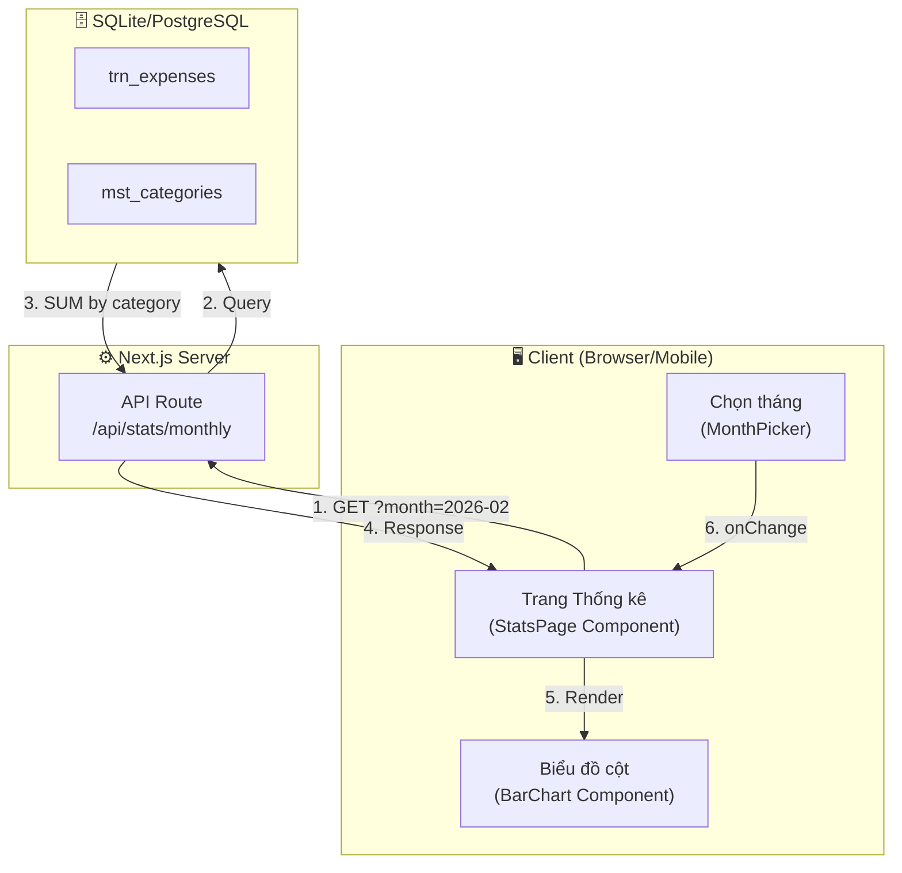
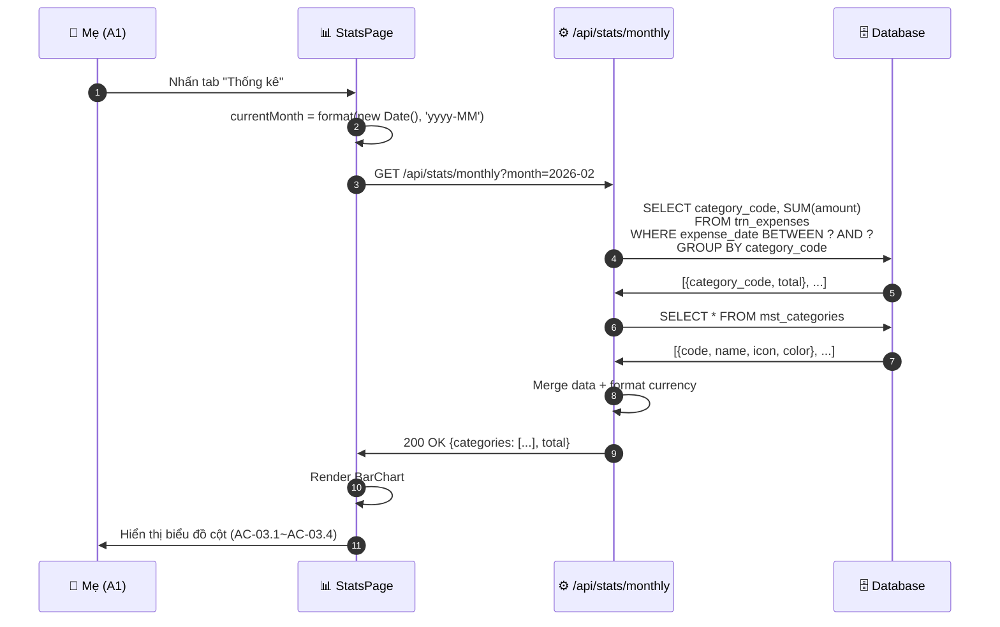
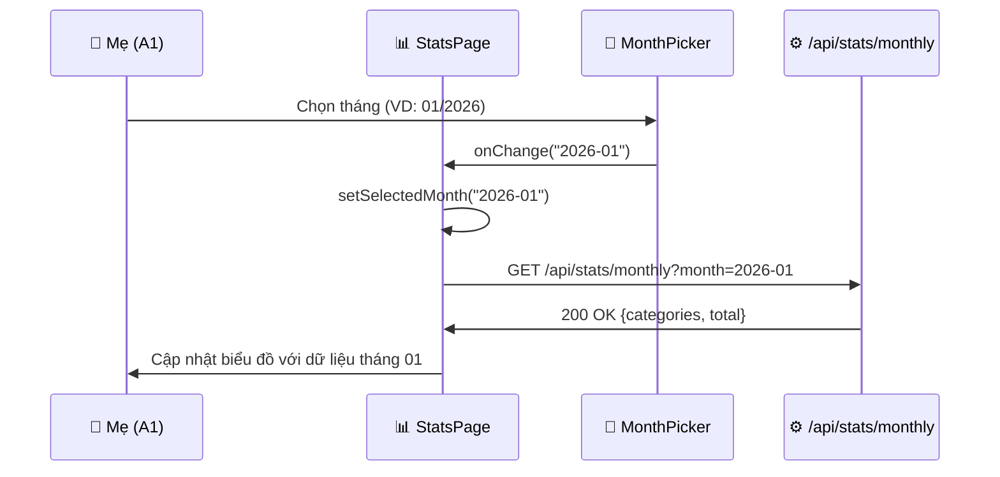
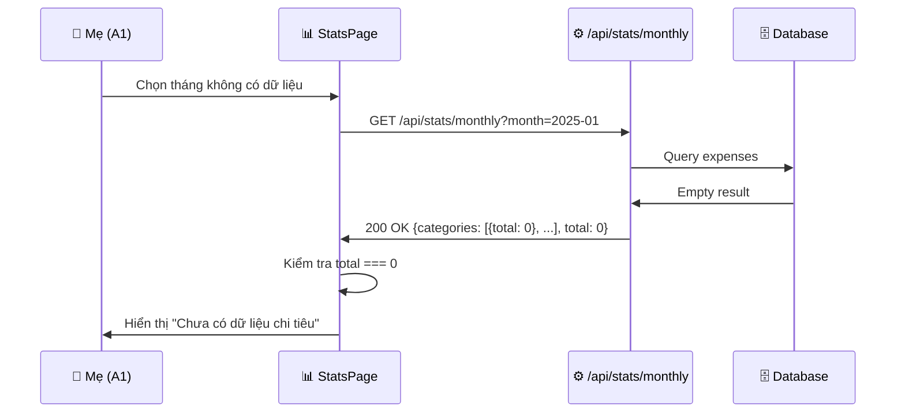

# Thiết kế Phương thức Hệ thống - UC-03 (システム方式設計書)

**Mã chức năng:** UC-03  
**Tên chức năng:** Xem biểu đồ thống kê  
**Phiên bản:** 1.0  
**Ngày tạo:** 25/02/2026

---

## 📥 Input (Tài liệu tham chiếu)

| Tài liệu | Nội dung trích xuất |
|----------|---------------------|
| `srs_function_requirements.md` | UC-03: Xem biểu đồ thống kê, AC-03.1~AC-03.6 |
| `srs_nonfunction_requirements.md` | NFR-PERF-03 (< 3 giây), NFR-TECH-01 (date-fns) |
| `srs_business_requirements.md` | BO-03: Hỗ trợ ra quyết định tài chính |

---

## 1. Tổng quan Kiến trúc (システムアーキテクチャ概要)

**Mô hình:** Server-Side Data Fetching với Client-Side Chart Rendering



---

## 2. Cấu hình Phần mềm (ソフトウェア構成)

| Phân loại | Tên | Phiên bản | Mục đích | Tham chiếu NFR |
|-----------|-----|-----------|----------|----------------|
| Framework | Next.js | 14.x | App Router, API Routes | NFR-TECH-04 |
| Language | TypeScript | 5.x | Type-safe development | NFR-TECH-04 |
| Styling | TailwindCSS | 3.x | UI styling | NFR-TECH-03 |
| Date Library | date-fns | 3.x | Xử lý ngày tháng | NFR-TECH-01 |
| Chart Library | Recharts | 2.x | Biểu đồ cột | - |
| Runtime | Node.js | 20.x | Server runtime | - |

> ⚠️ **CẤM** sử dụng `moment.js` theo NFR-TECH-02

---

## 3. Phương thức Xử lý Cốt lõi (主要処理方式)

### 3.1 Sequence Diagram - Luồng chính



### 3.2 Sequence Diagram - Chọn tháng khác (AC-03.5)



### 3.3 Sequence Diagram - Không có dữ liệu (AF-03.1)



---

## 4. Cấu trúc Dữ liệu Thống kê

### 4.1 Response từ API

```typescript
interface MonthlyStatsResponse {
  success: boolean;
  data: {
    month: string;           // "2026-02"
    monthDisplay: string;    // "Tháng 02/2026"
    categories: CategoryStat[];
    total: number;           // Tổng tất cả danh mục
    totalFormatted: string;  // "5.250.000 đ"
  };
}

interface CategoryStat {
  code: string;              // "LIVING"
  name: string;              // "Sinh hoạt phí"
  icon: string;              // "🛒"
  color: string;             // "#10B981"
  total: number;             // 1500000
  totalFormatted: string;    // "1.500.000 đ"
  percentage: number;        // 28.57 (%)
}
```

### 4.2 Dữ liệu cho Biểu đồ (Recharts)

```typescript
// Dữ liệu đầu vào cho BarChart
const chartData = [
  { name: 'Sinh hoạt phí', value: 1500000, fill: '#10B981' },
  { name: 'Giáo dục', value: 500000, fill: '#3B82F6' },
  { name: 'Hiếu hỉ', value: 1000000, fill: '#F59E0B' },
  { name: 'Biếu tặng', value: 2000000, fill: '#EC4899' },
];
```

---

## 5. Xử lý Ngày/Tháng (NFR-TECH-01)

> **BẮT BUỘC** sử dụng `date-fns`

```typescript
import { 
  format, 
  startOfMonth, 
  endOfMonth, 
  subMonths,
  parse 
} from 'date-fns';
import { vi } from 'date-fns/locale';

// Tháng hiện tại
const currentMonth = format(new Date(), 'yyyy-MM'); // "2026-02"

// Hiển thị tiếng Việt (NFR-L10N-06)
const monthDisplay = format(new Date(), "'Tháng' MM/yyyy", { locale: vi }); 
// "Tháng 02/2026"

// Tính khoảng ngày cho query
const monthDate = parse(month, 'yyyy-MM', new Date());
const startDate = startOfMonth(monthDate);  // 2026-02-01
const endDate = endOfMonth(monthDate);      // 2026-02-28

// Tháng trước (AC-03.5)
const previousMonth = format(subMonths(new Date(), 1), 'yyyy-MM');
// "2026-01"
```

---

## 6. Màu sắc Danh mục (AC-03.2)

| Danh mục | Mã màu | TailwindCSS | Tham chiếu |
|----------|--------|-------------|------------|
| LIVING 🛒 | `#10B981` | `emerald-500` | C1 |
| EDUCATION 📚 | `#3B82F6` | `blue-500` | C2 |
| CEREMONY 💒 | `#F59E0B` | `amber-500` | C3 |
| FAMILY_GIFT 🎁 | `#EC4899` | `pink-500` | C4 |

---

## 7. Hiệu năng (NFR-PERF-03)

| Yêu cầu | Chỉ số | Giải pháp |
|---------|--------|-----------|
| Render biểu đồ | < 3 giây | Lazy load chart component |
| Query DB | < 500ms | Index trên `expense_date` |
| Số lượng dữ liệu | 1 tháng | Giới hạn query range |

### 7.1 Tối ưu Query

```sql
-- Index được sử dụng (đã tạo trong UC-02)
CREATE INDEX idx_expenses_date_category 
ON trn_expenses(expense_date, category_code);

-- Query với index
SELECT category_code, SUM(amount) as total
FROM trn_expenses
WHERE expense_date >= '2026-02-01' 
  AND expense_date <= '2026-02-28'
GROUP BY category_code;
```

### 7.2 Lazy Loading Chart

```typescript
// Lazy load Recharts để giảm bundle size
const BarChart = dynamic(
  () => import('@/components/charts/ExpenseBarChart'),
  { 
    loading: () => <ChartSkeleton />,
    ssr: false 
  }
);
```

---

## 8. Hiển thị Số tiền trên Đỉnh Cột (AC-03.3)

```typescript
// Recharts custom label
<Bar dataKey="value" fill="#8884d8">
  <LabelList 
    dataKey="value" 
    position="top" 
    formatter={(value: number) => formatCurrency(value)}
    style={{ fontSize: '12px', fill: '#374151' }}
  />
</Bar>
```

**Output:**
```
      1.500.000 đ
       ┌─────┐
       │     │
       │     │
       │     │
       └─────┘
     Sinh hoạt
```
