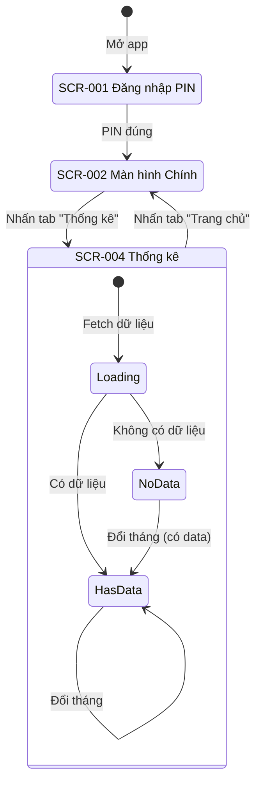

# Thiết kế Màn hình - UC-03 (画面設計書)

**Mã chức năng:** UC-03  
**Tên chức năng:** Xem biểu đồ thống kê  
**Phiên bản:** 1.0  
**Ngày tạo:** 25/02/2026

---

## 📥 Input (Tài liệu tham chiếu)

| Tài liệu | Nội dung trích xuất |
|----------|---------------------|
| `srs_function_requirements.md` | AC-03.1~AC-03.6 (Tiêu chí nghiệm thu) |
| `srs_nonfunction_requirements.md` | NFR-USE-01~02, NFR-L10N-05~06, NFR-PERF-03 |
| `srs_business_requirements.md` | BO-03: Hỗ trợ ra quyết định tài chính |

---

## 1. Danh sách Màn hình (画面一覧)

| ID Màn hình | Tên màn hình | Đối tượng | Route | Tham chiếu AC |
|-------------|--------------|-----------|-------|---------------|
| SCR-004 | Màn hình Thống kê | Mẹ (A1) | `/stats` | AC-03.1~AC-03.6 |

---

## 2. Sơ đồ Chuyển đổi Màn hình (画面遷移図)



---

## 3. Chi tiết Màn hình (画面詳細)

### [SCR-004] Màn hình Thống kê

#### 3.1 Layout Màn hình - Có dữ liệu (画面レイアウト)

```
┌─────────────────────────────────────────┐
│  Quản lý Chi tiêu Gia đình    [≡]       │
├─────────────────────────────────────────┤
│                                         │
│   ◀  Tháng 02/2026  ▶                   │  ← AC-03.5: Chọn tháng
│                                         │
│   ┌─────────────────────────────────┐   │
│   │                                 │   │
│   │   1.5tr   500k   1tr    2tr     │   │  ← AC-03.3: Số tiền trên đỉnh
│   │    ██     ██     ██     ██      │   │
│   │    ██     ██     ██     ██      │   │
│   │    ██     ██     ██     ██      │   │  ← AC-03.1, AC-03.2:
│   │    ██     ██     ██     ██      │   │    Biểu đồ cột, màu khác nhau
│   │    ██           ██     ██      │   │
│   │    ██           ██     ██      │   │
│   │   ────  ────  ────  ────       │   │
│   │    🛒    📚    💒    🎁         │   │
│   │  Sinh   Giáo  Hiếu  Biếu       │   │
│   │  hoạt   dục   hỉ    tặng       │   │
│   │                                 │   │
│   └─────────────────────────────────┘   │
│                                         │
│   ┌─────────────────────────────────┐   │
│   │  Tổng chi tiêu tháng này:       │   │  ← AC-03.4
│   │  5.000.000 đ                    │   │
│   └─────────────────────────────────┘   │
│                                         │
│   Chi tiết theo danh mục:               │
│   ┌─────────────────────────────────┐   │
│   │ 🛒 Sinh hoạt phí    1.500.000 đ │   │
│   │ 📚 Giáo dục           500.000 đ │   │
│   │ 💒 Hiếu hỉ          1.000.000 đ │   │
│   │ 🎁 Biếu tặng        2.000.000 đ │   │
│   └─────────────────────────────────┘   │
│                                         │
├─────────────────────────────────────────┤
│   🏠        📊        ⚙️               │
│  Trang chủ  Thống kê  Cài đặt          │
└─────────────────────────────────────────┘
```

#### 3.2 Layout Màn hình - Không có dữ liệu (AF-03.1)

```
┌─────────────────────────────────────────┐
│  Quản lý Chi tiêu Gia đình    [≡]       │
├─────────────────────────────────────────┤
│                                         │
│   ◀  Tháng 01/2026  ▶                   │
│                                         │
│   ┌─────────────────────────────────┐   │
│   │                                 │   │
│   │                                 │   │
│   │         📊                      │   │
│   │                                 │   │
│   │   Chưa có dữ liệu chi tiêu      │   │  ← AF-03.1
│   │                                 │   │
│   │   Hãy thêm chi tiêu đầu tiên    │   │
│   │   của tháng này!                │   │
│   │                                 │   │
│   │      [ + Thêm chi tiêu ]        │   │
│   │                                 │   │
│   └─────────────────────────────────┘   │
│                                         │
├─────────────────────────────────────────┤
│   🏠        📊        ⚙️               │
└─────────────────────────────────────────┘
```

#### 3.3 Danh sách Các mục trên Màn hình (画面項目一覧)

| ID | Tên hiển thị | Loại | Bắt buộc | Mô tả | Tham chiếu |
|----|--------------|------|:--------:|-------|------------|
| ITM-01 | Header "Quản lý Chi tiêu..." | Text | - | Font 18px | - |
| ITM-02 | Nút tháng trước "◀" | Button | - | Giảm 1 tháng | AC-03.5 |
| ITM-03 | Hiển thị tháng | Text | - | "Tháng MM/YYYY" | NFR-L10N-06 |
| ITM-04 | Nút tháng sau "▶" | Button | - | Tăng 1 tháng | AC-03.5 |
| ITM-05 | Biểu đồ cột | BarChart | - | 4 cột, 4 màu | AC-03.1, AC-03.2 |
| ITM-06 | Số tiền trên đỉnh cột | Label | - | Định dạng VND | AC-03.3 |
| ITM-07 | Tên danh mục dưới cột | Text | - | Icon + Tên | AC-03.1 |
| ITM-08 | Card tổng chi tiêu | Card | - | Highlight | AC-03.4 |
| ITM-09 | Danh sách chi tiết | List | - | 4 items | - |
| ITM-10 | Empty state | Component | - | Khi total = 0 | AF-03.1 |
| ITM-11 | Bottom Navigation | NavBar | - | 3 tabs | - |

#### 3.4 Quy tắc Hiển thị

| Quy tắc | Điều kiện | Hiển thị | Tham chiếu |
|---------|-----------|----------|------------|
| Biểu đồ có dữ liệu | `total > 0` | ITM-05~ITM-09 | AC-03.1 |
| Biểu đồ không có dữ liệu | `total === 0` | ITM-10 | AF-03.1 |
| Cột có giá trị 0 | `category.total === 0` | Vẫn hiển thị cột (height nhỏ) | AC-03.1 |
| Nút tháng sau | `month >= currentMonth` | Disabled (không cho chọn tương lai) | - |

#### 3.5 Xử lý Thao tác / Sự kiện (アクション・イベント処理)

**EVT-01: Nhấn nút tháng trước "◀"**

| Bước | Xử lý | Tham chiếu |
|------|-------|------------|
| 1 | `selectedMonth = subMonths(selectedMonth, 1)` | date-fns, AC-03.5 |
| 2 | `setSelectedMonth(format(newMonth, 'yyyy-MM'))` | - |
| 3 | Trigger fetch dữ liệu mới | - |

**EVT-02: Nhấn nút tháng sau "▶"**

| Bước | Điều kiện | Xử lý | Tham chiếu |
|------|-----------|-------|------------|
| 1 | `selectedMonth >= currentMonth` | Không làm gì (disabled) | - |
| 2 | Else | `selectedMonth = addMonths(selectedMonth, 1)` | date-fns, AC-03.5 |
| 3 | - | Trigger fetch dữ liệu mới | - |

**EVT-03: Load dữ liệu tháng**

| Bước | Xử lý | Tham chiếu |
|------|-------|------------|
| 1 | `setLoading(true)` | - |
| 2 | `GET /api/stats/monthly?month=${selectedMonth}` | - |
| 3 | Kiểm tra `total === 0` → Show empty state | AF-03.1 |
| 4 | Else → Render biểu đồ | AC-03.1~AC-03.4 |
| 5 | `setLoading(false)` | NFR-PERF-03 (< 3s) |

---

## 4. Trạng thái Màn hình (画面状態)

| Trạng thái | Điều kiện | Hiển thị | CSS Classes |
|------------|-----------|----------|-------------|
| Loading | Đang fetch API | Skeleton/Spinner | `animate-pulse` |
| Có dữ liệu | `total > 0` | Biểu đồ + Chi tiết | - |
| Không có dữ liệu | `total === 0` | Empty state | - |
| Lỗi | API error | Error message + Retry | `text-red-500` |

---

## 5. Biểu đồ Cột (BarChart Component)

### 5.1 Cấu hình Recharts

```typescript
import { BarChart, Bar, XAxis, YAxis, LabelList, ResponsiveContainer } from 'recharts';

<ResponsiveContainer width="100%" height={250}>
  <BarChart data={chartData} margin={{ top: 30, right: 20, left: 20, bottom: 5 }}>
    <XAxis 
      dataKey="name" 
      tick={{ fontSize: 12 }}
      tickLine={false}
    />
    <YAxis hide />
    <Bar 
      dataKey="value" 
      radius={[8, 8, 0, 0]}  // Bo góc trên
    >
      {chartData.map((entry, index) => (
        <Cell key={index} fill={entry.color} />
      ))}
      <LabelList 
        dataKey="value" 
        position="top" 
        formatter={formatCurrencyShort}  // "1.5tr"
        style={{ fontSize: '11px', fontWeight: 500 }}
      />
    </Bar>
  </BarChart>
</ResponsiveContainer>
```

### 5.2 Định dạng Số tiền Rút gọn

```typescript
// AC-03.3: Hiển thị số tiền trên đỉnh cột
function formatCurrencyShort(amount: number): string {
  if (amount >= 1000000) {
    return (amount / 1000000).toFixed(1).replace('.0', '') + 'tr';
  }
  if (amount >= 1000) {
    return (amount / 1000).toFixed(0) + 'k';
  }
  return amount.toString();
}

// Ví dụ:
formatCurrencyShort(1500000);  // "1.5tr"
formatCurrencyShort(500000);   // "500k"
formatCurrencyShort(50000);    // "50k"
```

### 5.3 Màu sắc Cột (AC-03.2)

| Danh mục | Màu | Hex |
|----------|-----|-----|
| 🛒 Sinh hoạt phí | Xanh lá | `#10B981` |
| 📚 Giáo dục | Xanh dương | `#3B82F6` |
| 💒 Hiếu hỉ | Vàng cam | `#F59E0B` |
| 🎁 Biếu tặng | Hồng | `#EC4899` |

---

## 6. Responsive Design (NFR-COMP-03)

| Breakpoint | Min Width | Thay đổi |
|------------|-----------|----------|
| Mobile | 375px | Chart height 200px, font nhỏ hơn |
| Tablet | 640px | Chart height 250px |
| Desktop | 1024px | Chart height 300px, max-width 600px |

```typescript
// Responsive chart height
const chartHeight = useMemo(() => {
  if (typeof window === 'undefined') return 250;
  if (window.innerWidth < 640) return 200;
  if (window.innerWidth < 1024) return 250;
  return 300;
}, []);
```

---

## 7. Month Picker Component

### 7.1 Layout

```
┌─────────────────────────────────┐
│   ◀   Tháng 02/2026   ▶        │
└─────────────────────────────────┘

Nút ◀: 44x44px (touch target)
Nút ▶: 44x44px (touch target)
```

### 7.2 Implementation

```typescript
// components/MonthPicker.tsx
interface MonthPickerProps {
  value: Date;
  onChange: (date: Date) => void;
  maxDate?: Date;  // Không cho chọn quá ngày này
}

function MonthPicker({ value, onChange, maxDate = new Date() }: MonthPickerProps) {
  const canGoNext = !isSameMonth(value, maxDate) && isBefore(value, maxDate);
  
  return (
    <div className="flex items-center justify-center gap-4">
      <button 
        onClick={() => onChange(subMonths(value, 1))}
        className="h-11 w-11 rounded-full bg-gray-100 flex items-center justify-center"
        aria-label="Tháng trước"
      >
        ◀
      </button>
      
      <span className="text-lg font-medium min-w-[160px] text-center">
        {format(value, "'Tháng' MM/yyyy", { locale: vi })}
      </span>
      
      <button 
        onClick={() => canGoNext && onChange(addMonths(value, 1))}
        disabled={!canGoNext}
        className={`h-11 w-11 rounded-full flex items-center justify-center
          ${canGoNext ? 'bg-gray-100' : 'bg-gray-50 text-gray-300'}`}
        aria-label="Tháng sau"
      >
        ▶
      </button>
    </div>
  );
}
```

---

## 8. Card Tổng Chi tiêu (AC-03.4)

```
┌──────────────────────────────────┐
│  Tổng chi tiêu tháng này:        │
│                                  │
│     5.000.000 đ                  │  ← Font 24px, bold
│                                  │
└──────────────────────────────────┘
```

```html
<div class="bg-gradient-to-r from-blue-500 to-blue-600 rounded-2xl p-6 text-white">
  <p class="text-sm opacity-90">Tổng chi tiêu tháng này:</p>
  <p class="text-2xl font-bold mt-1">{totalFormatted}</p>
</div>
```

---

## 9. Empty State (AF-03.1)

```typescript
function EmptyState({ onAddClick }: { onAddClick: () => void }) {
  return (
    <div className="flex flex-col items-center justify-center py-12 text-center">
      <span className="text-6xl mb-4">📊</span>
      <h3 className="text-lg font-medium text-gray-900">
        Chưa có dữ liệu chi tiêu
      </h3>
      <p className="text-gray-500 mt-1">
        Hãy thêm chi tiêu đầu tiên của tháng này!
      </p>
      <button
        onClick={onAddClick}
        className="mt-4 px-6 py-2 bg-blue-500 text-white rounded-full font-medium"
      >
        + Thêm chi tiêu
      </button>
    </div>
  );
}
```

---

## 10. Accessibility (アクセシビリティ)

| Mục | Yêu cầu | Triển khai | Tham chiếu |
|-----|---------|------------|------------|
| Font size | Tối thiểu 16px | `text-base` trở lên | NFR-USE-02 |
| Touch target | Tối thiểu 44x44px | Nút ◀ ▶ `h-11 w-11` | NFR-USE-03 |
| Aria labels | Mô tả nút | `aria-label="Tháng trước"` | - |
| Chart alt | Screen reader | `aria-label` cho chart | - |
| Color contrast | 4.5:1 | Text trên nền màu | - |
