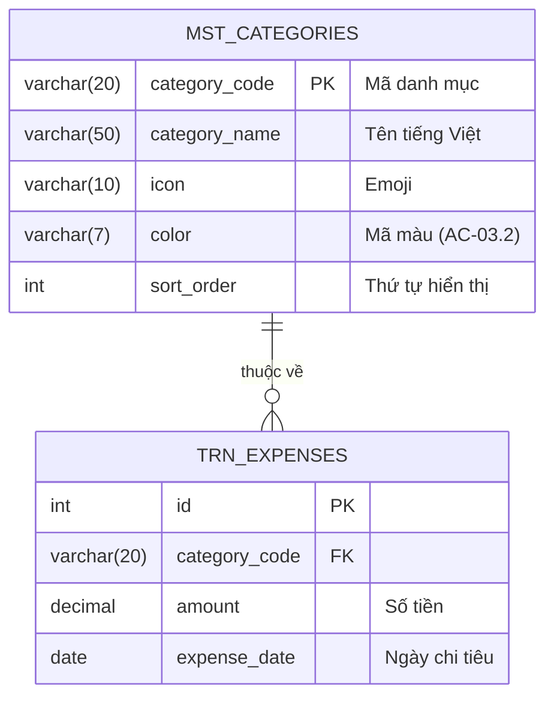

# Thiết kế Cơ sở dữ liệu - UC-03 (データベース設計書)

**Mã chức năng:** UC-03  
**Tên chức năng:** Xem biểu đồ thống kê  
**Phiên bản:** 1.0  
**Ngày tạo:** 25/02/2026

---

## 📥 Input (Tài liệu tham chiếu)

| Tài liệu | Nội dung trích xuất |
|----------|---------------------|
| `srs_function_requirements.md` | UC-03: Truy vấn dữ liệu theo tháng, GROUP BY danh mục |
| `srs_nonfunction_requirements.md` | NFR-PERF-03: Render biểu đồ < 3 giây |

---

## 1. Tổng quan

UC-03 **không tạo bảng mới**, chỉ **READ** dữ liệu từ các bảng đã có:
- `mst_categories`: Lấy danh sách danh mục + màu sắc
- `trn_expenses`: Tính SUM theo danh mục trong tháng

---

## 2. Sơ đồ ER - Liên quan UC-03 (ER図)



---

## 3. Ma trận CRUD - UC-03 (CRUDマトリクス)

| Chức năng | `mst_categories` | `trn_expenses` | Ghi chú |
|-----------|:----------------:|:--------------:|---------|
| SCR-004 Thống kê (load) | **R** | **R** | Chỉ đọc dữ liệu |

*(R: Read)*

---

## 4. Query Thống kê Tháng

### 4.1 Query Chính - Tổng hợp theo Danh mục

```sql
-- Query lấy thống kê chi tiêu tháng 02/2026
-- Tham chiếu: AC-03.1 (hiển thị tất cả danh mục, kể cả = 0)

SELECT 
    c.category_code,
    c.category_name,
    c.icon,
    c.color,
    c.sort_order,
    COALESCE(SUM(e.amount), 0) AS total
FROM mst_categories c
LEFT JOIN trn_expenses e 
    ON c.category_code = e.category_code
    AND e.expense_date >= '2026-02-01'    -- Đầu tháng
    AND e.expense_date <= '2026-02-28'    -- Cuối tháng
WHERE c.is_active = TRUE
GROUP BY 
    c.category_code, 
    c.category_name, 
    c.icon, 
    c.color, 
    c.sort_order
ORDER BY c.sort_order;
```

**Kết quả mẫu:**

| category_code | category_name | icon | color | total |
|---------------|---------------|------|-------|-------|
| LIVING | Sinh hoạt phí | 🛒 | #10B981 | 1500000 |
| EDUCATION | Giáo dục | 📚 | #3B82F6 | 500000 |
| CEREMONY | Hiếu hỉ | 💒 | #F59E0B | 1000000 |
| FAMILY_GIFT | Biếu tặng | 🎁 | #EC4899 | 2000000 |

### 4.2 Query Tổng Chi tiêu Tháng

```sql
-- Tổng chi tiêu tháng (AC-03.4)
SELECT COALESCE(SUM(amount), 0) AS total
FROM trn_expenses
WHERE expense_date >= '2026-02-01'
  AND expense_date <= '2026-02-28';
```

**Kết quả:** `5000000`

### 4.3 Query Kết hợp (Optimized)

```sql
-- Một query duy nhất lấy cả chi tiết và tổng
WITH monthly_stats AS (
    SELECT 
        category_code,
        SUM(amount) AS category_total
    FROM trn_expenses
    WHERE expense_date >= :start_date
      AND expense_date <= :end_date
    GROUP BY category_code
),
grand_total AS (
    SELECT COALESCE(SUM(amount), 0) AS total
    FROM trn_expenses
    WHERE expense_date >= :start_date
      AND expense_date <= :end_date
)
SELECT 
    c.category_code,
    c.category_name,
    c.icon,
    c.color,
    COALESCE(ms.category_total, 0) AS total,
    gt.total AS grand_total,
    CASE 
        WHEN gt.total > 0 
        THEN ROUND(COALESCE(ms.category_total, 0) * 100.0 / gt.total, 2)
        ELSE 0 
    END AS percentage
FROM mst_categories c
CROSS JOIN grand_total gt
LEFT JOIN monthly_stats ms ON c.category_code = ms.category_code
WHERE c.is_active = TRUE
ORDER BY c.sort_order;
```

**Kết quả mẫu:**

| category_code | category_name | total | grand_total | percentage |
|---------------|---------------|-------|-------------|------------|
| LIVING | Sinh hoạt phí | 1500000 | 5000000 | 30.00 |
| EDUCATION | Giáo dục | 500000 | 5000000 | 10.00 |
| CEREMONY | Hiếu hỉ | 1000000 | 5000000 | 20.00 |
| FAMILY_GIFT | Biếu tặng | 2000000 | 5000000 | 40.00 |

---

## 5. Index Optimization (NFR-PERF-03)

### 5.1 Index được sử dụng

```sql
-- Đã tạo trong UC-02
CREATE INDEX idx_expenses_date_category 
ON trn_expenses(expense_date, category_code);
```

### 5.2 Explain Plan

```sql
EXPLAIN SELECT category_code, SUM(amount)
FROM trn_expenses
WHERE expense_date >= '2026-02-01'
  AND expense_date <= '2026-02-28'
GROUP BY category_code;
```

**Expected:** 
- Index Scan trên `idx_expenses_date_category`
- Không Full Table Scan

### 5.3 Hiệu năng Mục tiêu

| Metric | Yêu cầu | Giải pháp |
|--------|---------|-----------|
| Query time | < 100ms | Composite index |
| Rows scanned | ~30-50/tháng | Index range scan |
| Total render | < 3 giây | Query + Transform + Chart render |

---

## 6. Tham số Query

### 6.1 Tính Khoảng Ngày với date-fns

```typescript
import { startOfMonth, endOfMonth, parse, format } from 'date-fns';

function getMonthRange(monthStr: string): { startDate: string; endDate: string } {
  // monthStr = "2026-02"
  const date = parse(monthStr, 'yyyy-MM', new Date());
  
  return {
    startDate: format(startOfMonth(date), 'yyyy-MM-dd'), // "2026-02-01"
    endDate: format(endOfMonth(date), 'yyyy-MM-dd'),     // "2026-02-28"
  };
}
```

### 6.2 Tháng không có dữ liệu (AF-03.1)

```sql
-- Nếu không có chi tiêu trong tháng
-- Query vẫn trả về 4 rows với total = 0

SELECT c.category_code, c.category_name, COALESCE(SUM(e.amount), 0) AS total
FROM mst_categories c
LEFT JOIN trn_expenses e ON ...
WHERE e.expense_date >= '2025-01-01' AND e.expense_date <= '2025-01-31'
GROUP BY c.category_code, c.category_name
ORDER BY c.sort_order;
```

**Kết quả:**

| category_code | category_name | total |
|---------------|---------------|-------|
| LIVING | Sinh hoạt phí | 0 |
| EDUCATION | Giáo dục | 0 |
| CEREMONY | Hiếu hỉ | 0 |
| FAMILY_GIFT | Biếu tặng | 0 |

> **Lưu ý:** `COALESCE(..., 0)` đảm bảo không có NULL

---

## 7. Transform Data cho Chart

```typescript
// Chuyển đổi từ DB result sang Recharts format
interface DBResult {
  category_code: string;
  category_name: string;
  icon: string;
  color: string;
  total: number;
}

interface ChartData {
  name: string;      // "🛒 Sinh hoạt"
  value: number;     // 1500000
  color: string;     // "#10B981"
}

function transformToChartData(dbResults: DBResult[]): ChartData[] {
  return dbResults.map(row => ({
    name: `${row.icon} ${row.category_name.split(' ')[0]}`, // Rút gọn tên
    value: row.total,
    color: row.color,
  }));
}

// Kết quả:
// [
//   { name: "🛒 Sinh", value: 1500000, color: "#10B981" },
//   { name: "📚 Giáo", value: 500000, color: "#3B82F6" },
//   ...
// ]
```

---

## 8. Không có Bảng Mới

UC-03 chỉ sử dụng các bảng đã có từ UC-01 và UC-02:

| Bảng | Tạo bởi | Sử dụng trong UC-03 |
|------|---------|---------------------|
| `app_sessions` | UC-01 | Kiểm tra authen |
| `login_attempts` | UC-01 | - |
| `mst_categories` | UC-02 | READ (icon, color) |
| `trn_expenses` | UC-02 | READ (SUM by month) |
