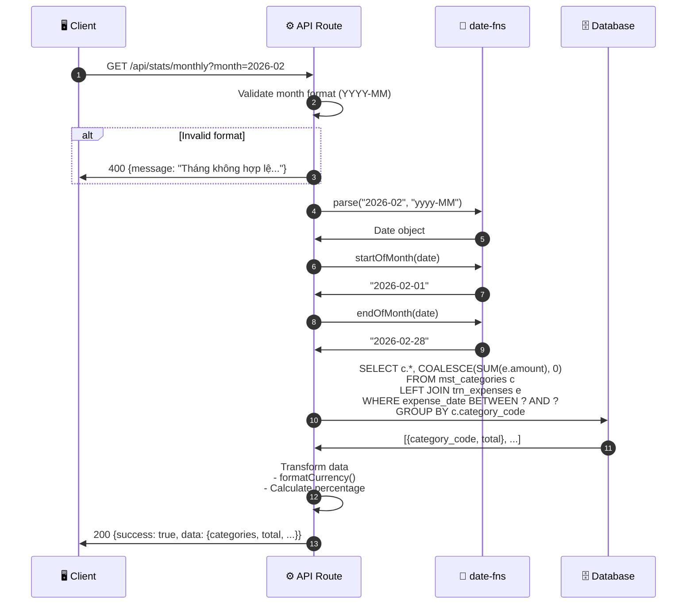

# Thiết kế Giao diện Kết nối - UC-03 (外部インターフェース設計書)

**Mã chức năng:** UC-03  
**Tên chức năng:** Xem biểu đồ thống kê  
**Phiên bản:** 1.0  
**Ngày tạo:** 25/02/2026

---

## 📥 Input (Tài liệu tham chiếu)

| Tài liệu | Nội dung trích xuất |
|----------|---------------------|
| `srs_function_requirements.md` | UC-03: Request/Response thống kê tháng |
| `srs_nonfunction_requirements.md` | NFR-PERF-03 (< 3 giây), NFR-L10N-05~06 |

---

## 1. Danh sách Interface (インターフェース一覧)

| ID IF | Tên IF | Hệ thống | Phương thức | Hướng | Thời điểm |
|-------|--------|----------|-------------|-------|-----------|
| IF-004 | Lấy thống kê chi tiêu tháng | Internal API | GET | Client → Server | Khi vào trang Thống kê |

---

## 2. Chi tiết Interface

### [IF-004] Lấy thống kê chi tiêu tháng

#### 2.1 Thông tin Giao thức

| Thuộc tính | Giá trị |
|------------|---------|
| **Endpoint** | `GET /api/stats/monthly` |
| **Method** | GET |
| **Query Params** | `month` (YYYY-MM) |
| **Authentication** | Session required |
| **Cache** | 5 phút (dữ liệu có thể thay đổi) |
| **Timeout** | 5000ms |

#### 2.2 OpenAPI Specification

```yaml
openapi: 3.0.3
info:
  title: Family Expense App - Stats API
  description: |
    API thống kê chi tiêu cho ứng dụng Quản lý Chi tiêu Gia đình.
    
    **Tham chiếu yêu cầu:**
    - UC-03: Xem biểu đồ thống kê
    - AC-03.1~AC-03.6: Tiêu chí nghiệm thu
    - NFR-PERF-03: Render < 3 giây
  version: 1.0.0

servers:
  - url: /api
    description: Next.js API Routes

paths:
  /stats/monthly:
    get:
      summary: Lấy thống kê chi tiêu theo tháng
      description: |
        Trả về tổng chi tiêu theo từng danh mục trong tháng được chỉ định.
        
        **Luồng xử lý:**
        1. Parse query param `month`
        2. Tính startDate/endDate của tháng (date-fns)
        3. Query SUM(amount) GROUP BY category
        4. Trả về dữ liệu đã format
        
        **Tham chiếu:** UC-03, AC-03.1~AC-03.6
      operationId: getMonthlyStats
      tags:
        - Statistics
      security:
        - sessionAuth: []
      parameters:
        - name: month
          in: query
          required: true
          description: |
            Tháng cần thống kê (YYYY-MM).
            **Tham chiếu:** AC-03.5
          schema:
            type: string
            pattern: '^\d{4}-\d{2}$'
          example: "2026-02"
      responses:
        '200':
          description: |
            Thống kê thành công.
            **Tham chiếu:** AC-03.1~AC-03.4
          content:
            application/json:
              schema:
                $ref: '#/components/schemas/MonthlyStatsResponse'
              examples:
                withData:
                  summary: Có dữ liệu
                  value:
                    success: true
                    data:
                      month: "2026-02"
                      monthDisplay: "Tháng 02/2026"
                      categories:
                        - code: "LIVING"
                          name: "Sinh hoạt phí"
                          icon: "🛒"
                          color: "#10B981"
                          total: 1500000
                          totalFormatted: "1.500.000 đ"
                          percentage: 30
                        - code: "EDUCATION"
                          name: "Giáo dục"
                          icon: "📚"
                          color: "#3B82F6"
                          total: 500000
                          totalFormatted: "500.000 đ"
                          percentage: 10
                        - code: "CEREMONY"
                          name: "Hiếu hỉ"
                          icon: "💒"
                          color: "#F59E0B"
                          total: 1000000
                          totalFormatted: "1.000.000 đ"
                          percentage: 20
                        - code: "FAMILY_GIFT"
                          name: "Biếu tặng"
                          icon: "🎁"
                          color: "#EC4899"
                          total: 2000000
                          totalFormatted: "2.000.000 đ"
                          percentage: 40
                      total: 5000000
                      totalFormatted: "5.000.000 đ"
                noData:
                  summary: Không có dữ liệu (AF-03.1)
                  value:
                    success: true
                    data:
                      month: "2025-01"
                      monthDisplay: "Tháng 01/2025"
                      categories:
                        - code: "LIVING"
                          name: "Sinh hoạt phí"
                          icon: "🛒"
                          color: "#10B981"
                          total: 0
                          totalFormatted: "0 đ"
                          percentage: 0
                        - code: "EDUCATION"
                          name: "Giáo dục"
                          icon: "📚"
                          color: "#3B82F6"
                          total: 0
                          totalFormatted: "0 đ"
                          percentage: 0
                        - code: "CEREMONY"
                          name: "Hiếu hỉ"
                          icon: "💒"
                          color: "#F59E0B"
                          total: 0
                          totalFormatted: "0 đ"
                          percentage: 0
                        - code: "FAMILY_GIFT"
                          name: "Biếu tặng"
                          icon: "🎁"
                          color: "#EC4899"
                          total: 0
                          totalFormatted: "0 đ"
                          percentage: 0
                      total: 0
                      totalFormatted: "0 đ"
        '400':
          description: Tham số không hợp lệ
          content:
            application/json:
              schema:
                $ref: '#/components/schemas/ErrorResponse'
              example:
                success: false
                message: "Tháng không hợp lệ. Vui lòng dùng định dạng YYYY-MM"
        '401':
          description: Chưa đăng nhập
        '500':
          description: Lỗi server

components:
  securitySchemes:
    sessionAuth:
      type: apiKey
      in: header
      name: X-Session-Id
      
  schemas:
    MonthlyStatsResponse:
      type: object
      properties:
        success:
          type: boolean
          const: true
        data:
          $ref: '#/components/schemas/MonthlyStats'
          
    MonthlyStats:
      type: object
      required:
        - month
        - monthDisplay
        - categories
        - total
        - totalFormatted
      properties:
        month:
          type: string
          pattern: '^\d{4}-\d{2}$'
          description: Tháng (YYYY-MM)
          example: "2026-02"
        monthDisplay:
          type: string
          description: |
            Tháng hiển thị tiếng Việt.
            **Tham chiếu:** NFR-L10N-06
          example: "Tháng 02/2026"
        categories:
          type: array
          description: |
            Danh sách 4 danh mục với tổng chi tiêu.
            **Tham chiếu:** AC-03.1 (hiển thị tất cả, kể cả = 0)
          items:
            $ref: '#/components/schemas/CategoryStat'
        total:
          type: number
          description: |
            Tổng chi tiêu tháng (số).
            **Tham chiếu:** AC-03.4
          example: 5000000
        totalFormatted:
          type: string
          description: |
            Tổng chi tiêu (đã format VND).
            **Tham chiếu:** NFR-L10N-05
          example: "5.000.000 đ"
          
    CategoryStat:
      type: object
      required:
        - code
        - name
        - icon
        - color
        - total
        - totalFormatted
        - percentage
      properties:
        code:
          type: string
          enum: [LIVING, EDUCATION, CEREMONY, FAMILY_GIFT]
          example: "LIVING"
        name:
          type: string
          description: Tên tiếng Việt
          example: "Sinh hoạt phí"
        icon:
          type: string
          description: Emoji icon
          example: "🛒"
        color:
          type: string
          description: |
            Mã màu hex cho biểu đồ.
            **Tham chiếu:** AC-03.2
          example: "#10B981"
        total:
          type: number
          description: Tổng chi tiêu danh mục (số)
          example: 1500000
        totalFormatted:
          type: string
          description: |
            Tổng chi tiêu (đã format).
            **Tham chiếu:** AC-03.3
          example: "1.500.000 đ"
        percentage:
          type: number
          description: Phần trăm so với tổng
          minimum: 0
          maximum: 100
          example: 30
          
    ErrorResponse:
      type: object
      properties:
        success:
          type: boolean
          const: false
        message:
          type: string
```

---

## 3. Cấu trúc Dữ liệu Chi tiết

### 3.1 Query Parameters

| Tên trường | Kiểu | Bắt buộc | Ràng buộc | Mô tả | Tham chiếu |
|------------|------|:--------:|-----------|-------|------------|
| `month` | string | ✅ | YYYY-MM | Tháng cần thống kê | AC-03.5 |

### 3.2 Response - Thành công (200)

| Tên trường | Kiểu | Mô tả | Tham chiếu |
|------------|------|-------|------------|
| `data.month` | string | "2026-02" | - |
| `data.monthDisplay` | string | "Tháng 02/2026" | NFR-L10N-06 |
| `data.categories` | array | 4 danh mục | AC-03.1, AC-03.2 |
| `data.categories[].color` | string | Màu cho biểu đồ | AC-03.2 |
| `data.categories[].totalFormatted` | string | Số trên đỉnh cột | AC-03.3 |
| `data.total` | number | Tổng tháng | AC-03.4 |
| `data.totalFormatted` | string | Tổng đã format | NFR-L10N-05 |

---

## 4. Xử lý Ngoại lệ (例外処理)

| HTTP Status | Điều kiện | Response | Tham chiếu |
|-------------|-----------|----------|------------|
| 200 | Success (có hoặc không có data) | `{success: true, data}` | - |
| 400 | month không đúng format | `{message: "Tháng không hợp lệ..."}` | - |
| 400 | month trong tương lai | `{message: "Không thể xem tháng tương lai"}` | - |
| 401 | Chưa đăng nhập | `{message: "Vui lòng đăng nhập"}` | - |
| 500 | Lỗi DB | `{message: "Đã xảy ra lỗi..."}` | - |

---

## 5. Sequence Diagram



---

## 6. Ví dụ Code

### 6.1 Client-side (TypeScript)

```typescript
// types/stats.ts
interface CategoryStat {
  code: string;
  name: string;
  icon: string;
  color: string;
  total: number;
  totalFormatted: string;
  percentage: number;
}

interface MonthlyStats {
  month: string;
  monthDisplay: string;
  categories: CategoryStat[];
  total: number;
  totalFormatted: string;
}

// lib/api.ts
export async function getMonthlyStats(month: string): Promise<MonthlyStats> {
  const response = await fetch(`/api/stats/monthly?month=${month}`, {
    headers: {
      'X-Session-Id': localStorage.getItem('sessionId') || '',
    },
  });

  const result = await response.json();

  if (!response.ok) {
    throw new Error(result.message || 'Đã xảy ra lỗi');
  }

  return result.data;
}

// pages/stats.tsx - Sử dụng
function StatsPage() {
  const [selectedMonth, setSelectedMonth] = useState(
    format(new Date(), 'yyyy-MM') // date-fns, NFR-TECH-01
  );
  const [stats, setStats] = useState<MonthlyStats | null>(null);
  const [loading, setLoading] = useState(true);

  useEffect(() => {
    async function fetchStats() {
      setLoading(true);
      try {
        const data = await getMonthlyStats(selectedMonth);
        setStats(data);
      } catch (error) {
        console.error(error);
      } finally {
        setLoading(false);
      }
    }
    fetchStats();
  }, [selectedMonth]);

  // Kiểm tra không có dữ liệu (AF-03.1)
  const hasData = stats && stats.total > 0;

  if (loading) return <ChartSkeleton />;
  if (!hasData) return <EmptyState />;

  // Chuyển đổi data cho Recharts
  const chartData = stats.categories.map(cat => ({
    name: cat.icon + ' ' + cat.name.split(' ')[0],
    value: cat.total,
    color: cat.color,
  }));

  return (
    <div>
      <MonthPicker 
        value={selectedMonth} 
        onChange={setSelectedMonth}  // AC-03.5
      />
      <ExpenseBarChart data={chartData} />  {/* AC-03.1~AC-03.3 */}
      <TotalCard amount={stats.totalFormatted} />  {/* AC-03.4 */}
    </div>
  );
}
```

### 6.2 Server-side (Next.js API Route)

```typescript
// app/api/stats/monthly/route.ts
import { NextRequest, NextResponse } from 'next/server';
import { parse, startOfMonth, endOfMonth, format, isAfter } from 'date-fns';
import { vi } from 'date-fns/locale';

// Hàm format tiền (NFR-L10N-05)
function formatCurrency(amount: number): string {
  return new Intl.NumberFormat('vi-VN').format(amount) + ' đ';
}

export async function GET(request: NextRequest) {
  try {
    const { searchParams } = new URL(request.url);
    const month = searchParams.get('month');

    // Validate month format
    if (!month || !/^\d{4}-\d{2}$/.test(month)) {
      return NextResponse.json(
        { success: false, message: 'Tháng không hợp lệ. Vui lòng dùng định dạng YYYY-MM' },
        { status: 400 }
      );
    }

    // Parse month (NFR-TECH-01: date-fns)
    const monthDate = parse(month, 'yyyy-MM', new Date());
    
    // Không cho xem tương lai
    if (isAfter(startOfMonth(monthDate), startOfMonth(new Date()))) {
      return NextResponse.json(
        { success: false, message: 'Không thể xem tháng tương lai' },
        { status: 400 }
      );
    }

    const startDate = format(startOfMonth(monthDate), 'yyyy-MM-dd');
    const endDate = format(endOfMonth(monthDate), 'yyyy-MM-dd');

    // TODO: Query database
    // const results = await db.query(...)

    // Mock data
    const categories = [
      { code: 'LIVING', name: 'Sinh hoạt phí', icon: '🛒', color: '#10B981', total: 1500000 },
      { code: 'EDUCATION', name: 'Giáo dục', icon: '📚', color: '#3B82F6', total: 500000 },
      { code: 'CEREMONY', name: 'Hiếu hỉ', icon: '💒', color: '#F59E0B', total: 1000000 },
      { code: 'FAMILY_GIFT', name: 'Biếu tặng', icon: '🎁', color: '#EC4899', total: 2000000 },
    ];

    const grandTotal = categories.reduce((sum, cat) => sum + cat.total, 0);

    // Transform data
    const transformedCategories = categories.map(cat => ({
      ...cat,
      totalFormatted: formatCurrency(cat.total),  // AC-03.3
      percentage: grandTotal > 0 ? Math.round((cat.total / grandTotal) * 100) : 0,
    }));

    return NextResponse.json({
      success: true,
      data: {
        month,
        monthDisplay: format(monthDate, "'Tháng' MM/yyyy", { locale: vi }),  // NFR-L10N-06
        categories: transformedCategories,  // AC-03.1, AC-03.2
        total: grandTotal,
        totalFormatted: formatCurrency(grandTotal),  // AC-03.4
      },
    });
  } catch (error) {
    console.error('Lỗi lấy thống kê:', error);
    return NextResponse.json(
      { success: false, message: 'Đã xảy ra lỗi. Vui lòng thử lại sau.' },
      { status: 500 }
    );
  }
}
```

---

## 7. Hiệu năng (NFR-PERF-03)

| Mục | Yêu cầu | Giải pháp |
|-----|---------|-----------|
| API response | < 500ms | Optimized query với index |
| Total render | < 3 giây | Lazy load chart, skeleton |
| Cache | 5 phút | `Cache-Control` header |

```typescript
// Thêm cache header
return NextResponse.json(data, {
  headers: {
    'Cache-Control': 'private, max-age=300', // 5 phút
  },
});
```
