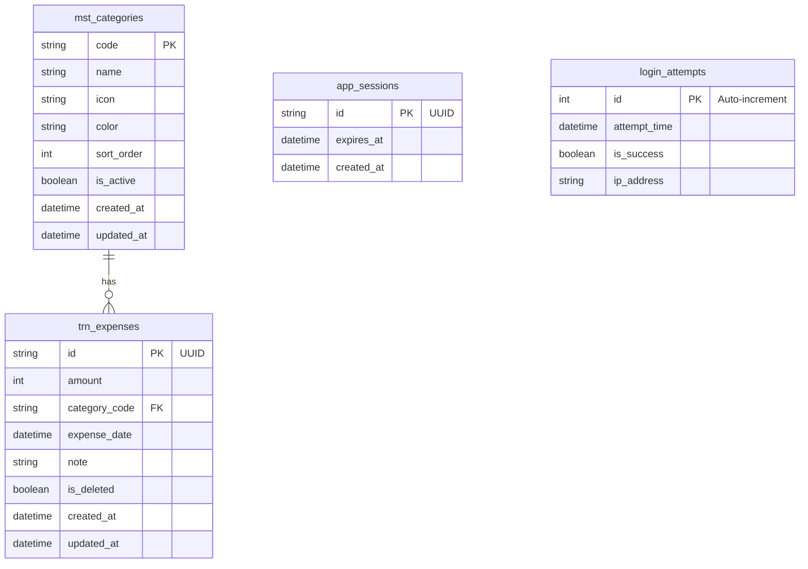

# Tài liệu Thiết kế Cơ sở dữ liệu Vật lý (物理データベース設計書)

**Phiên bản:** 1.0  
**Ngày tạo:** 25/02/2026  
**Công nghệ:** Prisma ORM + SQLite

---

## 📥 Input (Tài liệu tham chiếu)

| Tài liệu | Nội dung trích xuất |
|----------|---------------------|
| `02-external-design/Database_Design.md` | ERD, Logical schema |
| `01-requirements/SRS.md` | NFR-TECH-05: Prisma ORM |

---

## 1. Tổng quan Database

| Thuộc tính | Giá trị |
|------------|---------|
| **Database Engine** | SQLite 3.x |
| **ORM** | Prisma 5.x |
| **File Location** | `app-project/prisma/dev.db` |
| **Migration Tool** | Prisma Migrate |

---

## 2. Prisma Schema

**File:** `app-project/prisma/schema.prisma`

```prisma
// ============================================================
// Prisma Schema - Family Expense Management App
// Version: 1.0
// ============================================================

generator client {
  provider = "prisma-client-js"
}

datasource db {
  provider = "sqlite"
  url      = env("DATABASE_URL")
}

// ============================================================
// TABLE: app_sessions
// Session management cho đăng nhập PIN
// ============================================================
model app_sessions {
  id         String    @id @default(uuid())
  expiresAt  DateTime  @map("expires_at")
  createdAt  DateTime  @default(now()) @map("created_at")
  
  @@map("app_sessions")
}

// ============================================================
// TABLE: login_attempts  
// Tracking failed login attempts for lockout
// ============================================================
model login_attempts {
  id            Int       @id @default(autoincrement())
  attemptTime   DateTime  @default(now()) @map("attempt_time")
  isSuccess     Boolean   @default(false) @map("is_success")
  ipAddress     String?   @map("ip_address")
  
  @@index([attemptTime])
  @@map("login_attempts")
}

// ============================================================
// TABLE: mst_categories
// Master data - Danh mục chi tiêu
// ============================================================
model mst_categories {
  code        String    @id
  name        String
  icon        String
  color       String
  sortOrder   Int       @default(0) @map("sort_order")
  isActive    Boolean   @default(true) @map("is_active")
  createdAt   DateTime  @default(now()) @map("created_at")
  updatedAt   DateTime  @updatedAt @map("updated_at")
  
  // Relations
  expenses    trn_expenses[]
  
  @@index([isActive])
  @@index([sortOrder])
  @@map("mst_categories")
}

// ============================================================
// TABLE: trn_expenses
// Transaction - Chi tiêu
// ============================================================
model trn_expenses {
  id            String    @id @default(uuid())
  amount        Int                           // VND, no decimals
  categoryCode  String    @map("category_code")
  expenseDate   DateTime  @map("expense_date")
  note          String?                       // Optional note
  isDeleted     Boolean   @default(false) @map("is_deleted")
  createdAt     DateTime  @default(now()) @map("created_at")
  updatedAt     DateTime  @updatedAt @map("updated_at")
  
  // Relations
  category      mst_categories @relation(fields: [categoryCode], references: [code])
  
  @@index([expenseDate])
  @@index([categoryCode])
  @@index([isDeleted])
  @@index([expenseDate, isDeleted])
  @@map("trn_expenses")
}
```

---

## 3. Chi tiết Bảng (テーブル詳細)

### 3.1 Table: `app_sessions`

**Mục đích:** Lưu session đăng nhập sau khi nhập PIN thành công

| Column | Type | Constraints | Default | Description |
|--------|------|-------------|---------|-------------|
| `id` | VARCHAR(36) | PK | UUID v4 | Session ID |
| `expires_at` | DATETIME | NOT NULL | - | Thời điểm hết hạn |
| `created_at` | DATETIME | NOT NULL | NOW() | Thời điểm tạo |

**Indexes:** PRIMARY KEY (`id`)

---

### 3.2 Table: `login_attempts`

**Mục đích:** Track số lần nhập sai PIN để khóa tạm thời

| Column | Type | Constraints | Default | Description |
|--------|------|-------------|---------|-------------|
| `id` | INTEGER | PK, AI | - | Auto-increment ID |
| `attempt_time` | DATETIME | NOT NULL | NOW() | Thời điểm thử |
| `is_success` | BOOLEAN | NOT NULL | FALSE | Thành công? |
| `ip_address` | VARCHAR(45) | NULL | - | IP address |

**Indexes:**
- PRIMARY KEY (`id`)
- INDEX `idx_login_attempts_time` (`attempt_time`)

---

### 3.3 Table: `mst_categories`

**Mục đích:** Master data danh mục chi tiêu

| Column | Type | Constraints | Default | Description |
|--------|------|-------------|---------|-------------|
| `code` | VARCHAR(20) | PK | - | Mã danh mục |
| `name` | VARCHAR(50) | NOT NULL | - | Tên hiển thị |
| `icon` | VARCHAR(10) | NOT NULL | - | Emoji icon |
| `color` | VARCHAR(7) | NOT NULL | - | Hex color |
| `sort_order` | INTEGER | NOT NULL | 0 | Thứ tự sắp xếp |
| `is_active` | BOOLEAN | NOT NULL | TRUE | Đang hoạt động |
| `created_at` | DATETIME | NOT NULL | NOW() | Thời điểm tạo |
| `updated_at` | DATETIME | NOT NULL | NOW() | Cập nhật lần cuối |

**Indexes:**
- PRIMARY KEY (`code`)
- INDEX `idx_categories_active` (`is_active`)
- INDEX `idx_categories_sort` (`sort_order`)

**Seed Data:**

| code | name | icon | color | sort_order |
|------|------|------|-------|------------|
| `LIVING` | Sinh hoạt phí | 🛒 | #10B981 | 1 |
| `EDUCATION` | Giáo dục | 📚 | #3B82F6 | 2 |
| `CEREMONY` | Hiếu hỉ | 💒 | #F59E0B | 3 |
| `FAMILY_GIFT` | Biếu tặng gia đình | 🎁 | #EC4899 | 4 |

---

### 3.4 Table: `trn_expenses`

**Mục đích:** Lưu thông tin chi tiêu

| Column | Type | Constraints | Default | Description |
|--------|------|-------------|---------|-------------|
| `id` | VARCHAR(36) | PK | UUID v4 | Expense ID |
| `amount` | INTEGER | NOT NULL | - | Số tiền (VND) |
| `category_code` | VARCHAR(20) | FK, NOT NULL | - | Mã danh mục |
| `expense_date` | DATETIME | NOT NULL | - | Ngày chi tiêu |
| `note` | TEXT | NULL | - | Ghi chú |
| `is_deleted` | BOOLEAN | NOT NULL | FALSE | Soft delete |
| `created_at` | DATETIME | NOT NULL | NOW() | Thời điểm tạo |
| `updated_at` | DATETIME | NOT NULL | NOW() | Cập nhật lần cuối |

**Foreign Keys:**
- `category_code` → `mst_categories(code)`

**Indexes:**
- PRIMARY KEY (`id`)
- INDEX `idx_expenses_date` (`expense_date`)
- INDEX `idx_expenses_category` (`category_code`)
- INDEX `idx_expenses_deleted` (`is_deleted`)
- COMPOSITE INDEX `idx_expenses_date_deleted` (`expense_date`, `is_deleted`)

---

## 4. Entity Relationship Diagram (ERD)



---

## 5. Seed Script

**File:** `app-project/prisma/seed.ts`

```typescript
import { PrismaClient } from '@prisma/client';

const prisma = new PrismaClient();

async function main() {
  console.log('🌱 Seeding database...');

  // Seed master categories
  const categories = [
    { code: 'LIVING', name: 'Sinh hoạt phí', icon: '🛒', color: '#10B981', sortOrder: 1 },
    { code: 'EDUCATION', name: 'Giáo dục', icon: '📚', color: '#3B82F6', sortOrder: 2 },
    { code: 'CEREMONY', name: 'Hiếu hỉ', icon: '💒', color: '#F59E0B', sortOrder: 3 },
    { code: 'FAMILY_GIFT', name: 'Biếu tặng gia đình', icon: '🎁', color: '#EC4899', sortOrder: 4 },
  ];

  for (const cat of categories) {
    await prisma.mst_categories.upsert({
      where: { code: cat.code },
      update: {},
      create: cat,
    });
  }

  console.log('✅ Seeded categories:', categories.length);
  console.log('🏁 Seeding completed!');
}

main()
  .catch((e) => {
    console.error('❌ Seeding error:', e);
    process.exit(1);
  })
  .finally(async () => {
    await prisma.$disconnect();
  });
```

---

## 6. Migration Commands

```bash
# Initialize Prisma
npx prisma init

# Generate migration (first time)
npx prisma migrate dev --name init

# Apply migration
npx prisma migrate deploy

# Reset database (dev only)
npx prisma migrate reset

# Generate Prisma Client
npx prisma generate

# Run seed
npx prisma db seed

# Open Prisma Studio (GUI)
npx prisma studio
```

---

## 7. Environment Configuration

**File:** `app-project/.env`

```env
# Database
DATABASE_URL="file:./prisma/dev.db"

# Security (PIN hash - NEVER hardcode actual PIN)
# PIN_HASH should be bcrypt hash of the actual 4-digit PIN
PIN_HASH="$2b$10$..."

# Session
SESSION_EXPIRY_HOURS=24
```

**File:** `app-project/.env.example`

```env
DATABASE_URL="file:./prisma/dev.db"
PIN_HASH="your_bcrypt_hash_here"
SESSION_EXPIRY_HOURS=24
```

---

## 8. Prisma Client Usage

### 8.1 Setup

**File:** `app-project/src/lib/prisma.ts`

```typescript
import { PrismaClient } from '@prisma/client';

const globalForPrisma = globalThis as unknown as {
  prisma: PrismaClient | undefined;
};

export const prisma = globalForPrisma.prisma ?? new PrismaClient({
  log: process.env.NODE_ENV === 'development' 
    ? ['query', 'error', 'warn'] 
    : ['error'],
});

if (process.env.NODE_ENV !== 'production') {
  globalForPrisma.prisma = prisma;
}

export default prisma;
```

### 8.2 Common Queries

```typescript
// Create expense
await prisma.trn_expenses.create({
  data: {
    amount: 150000,
    categoryCode: 'LIVING',
    expenseDate: new Date(),
    note: 'Mua rau',
  },
});

// Get expenses for a month
await prisma.trn_expenses.findMany({
  where: {
    expenseDate: {
      gte: startOfMonth,
      lte: endOfMonth,
    },
    isDeleted: false,
  },
  include: { category: true },
  orderBy: { expenseDate: 'desc' },
});

// Get stats grouped by category
await prisma.trn_expenses.groupBy({
  by: ['categoryCode'],
  _sum: { amount: true },
  where: {
    expenseDate: { gte: startOfMonth, lte: endOfMonth },
    isDeleted: false,
  },
});
```

---

## 9. Data Integrity Rules

| Rule | Implementation |
|------|----------------|
| FK Constraint | Prisma `@relation` |
| Soft Delete | `is_deleted` flag, không xóa vật lý |
| UUID Generation | Prisma `@default(uuid())` |
| Timestamps | `created_at` + `updated_at` tự động |
| Amount Validation | Zod schema (≥ 1000 VND) |

---

## 10. Performance Considerations

| Concern | Solution |
|---------|----------|
| Query N+1 | Sử dụng `include` trong Prisma |
| Index Coverage | Composite index cho date range + deleted |
| Connection Pool | Prisma singleton pattern |
| SQLite Locking | Single connection per request |
