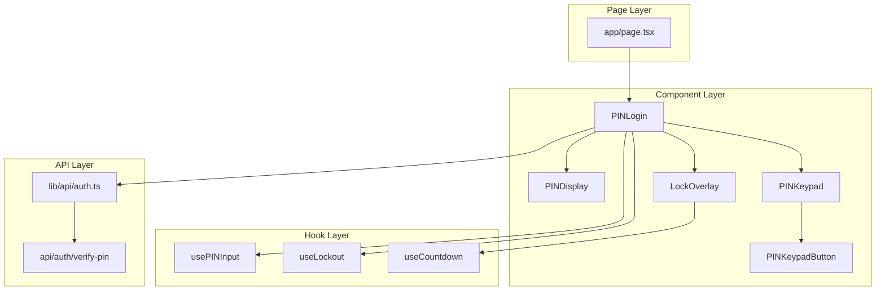

# Tài liệu Thiết kế Lớp / Chương trình - UC-01 (クラス設計書)

**Mã chức năng:** UC-01  
**Tên chức năng:** Đăng nhập bằng mã PIN  
**Phiên bản:** 1.0  
**Ngày tạo:** 25/02/2026

---

## 📥 Input (Tài liệu tham chiếu)

| Tài liệu | Nội dung trích xuất |
|----------|---------------------|
| `02-external-design/UC-01/01_System_Houshiki.md` | Kiến trúc hệ thống, Sequence diagrams |
| `02-external-design/UC-01/02_Gamen_Sekkei.md` | Layout màn hình, Events |
| `02-external-design/UC-01/04_IF_Sekkei.md` | API specification |

---

## 1. Cấu trúc Thư mục Mã nguồn (ソースコード構成)

```
app-project/
├── app/
│   ├── layout.tsx                    # Root layout
│   ├── page.tsx                      # Route: / (PIN login page)
│   ├── home/
│   │   └── page.tsx                  # Route: /home (sau login)
│   └── api/
│       └── auth/
│           └── verify-pin/
│               └── route.ts          # API: POST /api/auth/verify-pin
├── src/
│   ├── components/
│   │   └── PINLogin/
│   │       ├── index.ts              # Re-export
│   │       ├── PINLogin.tsx          # Container component
│   │       ├── PINDisplay.tsx        # 4 ô hiển thị ●
│   │       ├── PINKeypad.tsx         # Bàn phím số 0-9
│   │       ├── PINKeypadButton.tsx   # Nút số đơn lẻ
│   │       └── LockOverlay.tsx       # Overlay khóa 30s
│   ├── hooks/
│   │   ├── usePINInput.ts            # Hook quản lý PIN state
│   │   ├── useLockout.ts             # Hook khóa tạm 30s
│   │   └── useCountdown.ts           # Hook đếm ngược
│   ├── lib/
│   │   ├── api/
│   │   │   └── auth.ts               # API client cho auth
│   │   ├── validations/
│   │   │   └── pin.ts                # Zod schema cho PIN
│   │   └── utils/
│   │       └── storage.ts            # localStorage helpers
│   ├── types/
│   │   └── auth.ts                   # TypeScript types
│   └── constants/
│       └── auth.ts                   # Hằng số auth
└── prisma/
    └── schema.prisma                 # Database schema
```

---

## 2. Danh sách Lớp / Module (クラス一覧)

### 2.1 React Components

| ID Lớp | Tên Component | File Path | Mô tả |
|--------|---------------|-----------|-------|
| CMP-001 | `PINLogin` | `src/components/PINLogin/PINLogin.tsx` | Container chính, quản lý state |
| CMP-002 | `PINDisplay` | `src/components/PINLogin/PINDisplay.tsx` | Hiển thị 4 ô PIN (●/trống) |
| CMP-003 | `PINKeypad` | `src/components/PINLogin/PINKeypad.tsx` | Grid bàn phím 3x4 |
| CMP-004 | `PINKeypadButton` | `src/components/PINLogin/PINKeypadButton.tsx` | Nút số đơn lẻ |
| CMP-005 | `LockOverlay` | `src/components/PINLogin/LockOverlay.tsx` | Overlay đếm ngược 30s |

### 2.2 Custom Hooks

| ID Lớp | Tên Hook | File Path | Mô tả |
|--------|----------|-----------|-------|
| HK-001 | `usePINInput` | `src/hooks/usePINInput.ts` | Quản lý mảng PIN 4 số |
| HK-002 | `useLockout` | `src/hooks/useLockout.ts` | Quản lý trạng thái khóa tạm |
| HK-003 | `useCountdown` | `src/hooks/useCountdown.ts` | Đếm ngược từ targetDate |

### 2.3 API & Utilities

| ID Lớp | Tên Module | File Path | Mô tả |
|--------|------------|-----------|-------|
| API-001 | `verifyPinRoute` | `app/api/auth/verify-pin/route.ts` | Next.js API Route handler |
| LIB-001 | `authApi` | `src/lib/api/auth.ts` | Client-side API caller |
| LIB-002 | `pinValidation` | `src/lib/validations/pin.ts` | Zod schema validation |
| LIB-003 | `storageUtils` | `src/lib/utils/storage.ts` | localStorage wrapper |

---

## 3. Chi tiết Lớp (クラス詳細)

### [CMP-001] Component: `PINLogin`

**File:** `src/components/PINLogin/PINLogin.tsx`

#### 3.1 Props (入力プロパティ)

| Tên Prop | Kiểu dữ liệu | Bắt buộc | Default | Mô tả |
|----------|--------------|:--------:|---------|-------|
| `onSuccess` | `(sessionId: string) => void` | ❌ | - | Callback khi login thành công |
| `maxAttempts` | `number` | ❌ | `3` | Số lần thử tối đa |
| `lockDurationSeconds` | `number` | ❌ | `30` | Thời gian khóa (giây) |

#### 3.2 State (内部状態)

| Tên State | Kiểu dữ liệu | Initial Value | Mô tả |
|-----------|--------------|---------------|-------|
| `pin` | `string[]` | `[]` | Mảng chữ số đã nhập |
| `attempts` | `number` | `0` | Số lần thử sai |
| `isLocked` | `boolean` | `false` | Đang bị khóa? |
| `lockUntil` | `Date \| null` | `null` | Thời điểm hết khóa |
| `errorMessage` | `string` | `''` | Thông báo lỗi |
| `isLoading` | `boolean` | `false` | Đang gọi API? |

#### 3.3 Methods (メソッド)

| Phạm vi | Tên Method | Tham số | Kiểu trả về | Mô tả |
|---------|------------|---------|-------------|-------|
| private | `handleDigitPress` | `digit: string` | `void` | Xử lý nhấn số |
| private | `handleDelete` | - | `void` | Xóa số cuối |
| private | `handleSubmit` | - | `Promise<void>` | Gọi API verify |
| private | `handleLockActivate` | - | `void` | Kích hoạt khóa |
| private | `handleLockDeactivate` | - | `void` | Hủy khóa |

---

### [HK-001] Hook: `usePINInput`

**File:** `src/hooks/usePINInput.ts`

#### 3.4 Parameters

| Tên | Kiểu | Default | Mô tả |
|-----|------|---------|-------|
| `maxLength` | `number` | `4` | Độ dài PIN tối đa |
| `onComplete` | `(pin: string) => void` | - | Callback khi đủ số |

#### 3.5 Return Value

| Tên | Kiểu | Mô tả |
|-----|------|-------|
| `pin` | `string[]` | Mảng số đã nhập |
| `pinString` | `string` | PIN dạng chuỗi |
| `addDigit` | `(digit: string) => void` | Thêm số |
| `removeDigit` | `() => void` | Xóa số cuối |
| `clearPin` | `() => void` | Xóa tất cả |
| `isFull` | `boolean` | Đã đủ 4 số? |

---

### [HK-002] Hook: `useLockout`

**File:** `src/hooks/useLockout.ts`

#### 3.6 Parameters

| Tên | Kiểu | Default | Mô tả |
|-----|------|---------|-------|
| `storageKey` | `string` | `'pin_lockout'` | Key trong localStorage |

#### 3.7 Return Value

| Tên | Kiểu | Mô tả |
|-----|------|-------|
| `isLocked` | `boolean` | Đang khóa? |
| `lockUntil` | `Date \| null` | Thời điểm hết khóa |
| `remainingSeconds` | `number` | Số giây còn lại |
| `activate` | `(seconds: number) => void` | Kích hoạt khóa |
| `deactivate` | `() => void` | Hủy khóa |

---

### [API-001] API Route: `POST /api/auth/verify-pin`

**File:** `app/api/auth/verify-pin/route.ts`

#### 3.8 Handler Function

| Function | Method | Input | Output | Mô tả |
|----------|--------|-------|--------|-------|
| `POST` | POST | `{ pin: string }` | `VerifyPinResponse` | Xác thực PIN |

#### 3.9 Dependencies

| Module | Import | Mục đích |
|--------|--------|----------|
| `bcrypt` | `bcrypt` | So sánh hash |
| `uuid` | `{ v4 as uuidv4 }` | Tạo session ID |
| `zod` | `{ z }` | Validation schema |
| `date-fns` | `{ addHours }` | Tính expires_at |

---

## 4. Định nghĩa Hằng số (定数定義)

**File:** `src/constants/auth.ts`

| Tên hằng số | Giá trị | Kiểu | Mô tả | Tham chiếu |
|-------------|---------|------|-------|------------|
| `PIN_LENGTH` | `4` | `number` | Độ dài PIN | AC-01.1 |
| `MAX_ATTEMPTS` | `3` | `number` | Số lần thử tối đa | NFR-SEC-03 |
| `LOCK_DURATION_SECONDS` | `30` | `number` | Thời gian khóa | NFR-SEC-03 |
| `SESSION_EXPIRY_HOURS` | `24` | `number` | Session hết hạn | - |
| `STORAGE_KEY_SESSION` | `'sessionId'` | `string` | Key localStorage | - |
| `STORAGE_KEY_LOCKOUT` | `'pin_lockout_until'` | `string` | Key localStorage | - |

---

## 5. Định nghĩa Types (型定義)

**File:** `src/types/auth.ts`

```typescript
// Request/Response types
export interface VerifyPinRequest {
  pin: string;
}

export interface VerifyPinResponse {
  success: boolean;
  sessionId?: string;
  message: string;
}

// Component props
export interface PINLoginProps {
  onSuccess?: (sessionId: string) => void;
  maxAttempts?: number;
  lockDurationSeconds?: number;
}

export interface PINDisplayProps {
  pin: string[];
  maxLength?: number;
  masked?: boolean;
}

export interface PINKeypadProps {
  onDigitPress: (digit: string) => void;
  onDelete: () => void;
  disabled?: boolean;
}

export interface PINKeypadButtonProps {
  value: string;
  onClick: () => void;
  disabled?: boolean;
  variant?: 'number' | 'delete' | 'empty';
}

export interface LockOverlayProps {
  lockUntil: Date;
  onUnlock: () => void;
}
```

---

## 6. Sơ đồ Quan hệ Component (コンポーネント関係図)



---

## 7. Validation Schema (Zod)

**File:** `src/lib/validations/pin.ts`

```typescript
import { z } from 'zod';

export const VerifyPinSchema = z.object({
  pin: z
    .string({ required_error: 'Vui lòng nhập mã PIN' })
    .length(4, 'Mã PIN phải gồm 4 chữ số')
    .regex(/^\d{4}$/, 'Mã PIN chỉ được chứa số'),
});

export type VerifyPinInput = z.infer<typeof VerifyPinSchema>;
```
