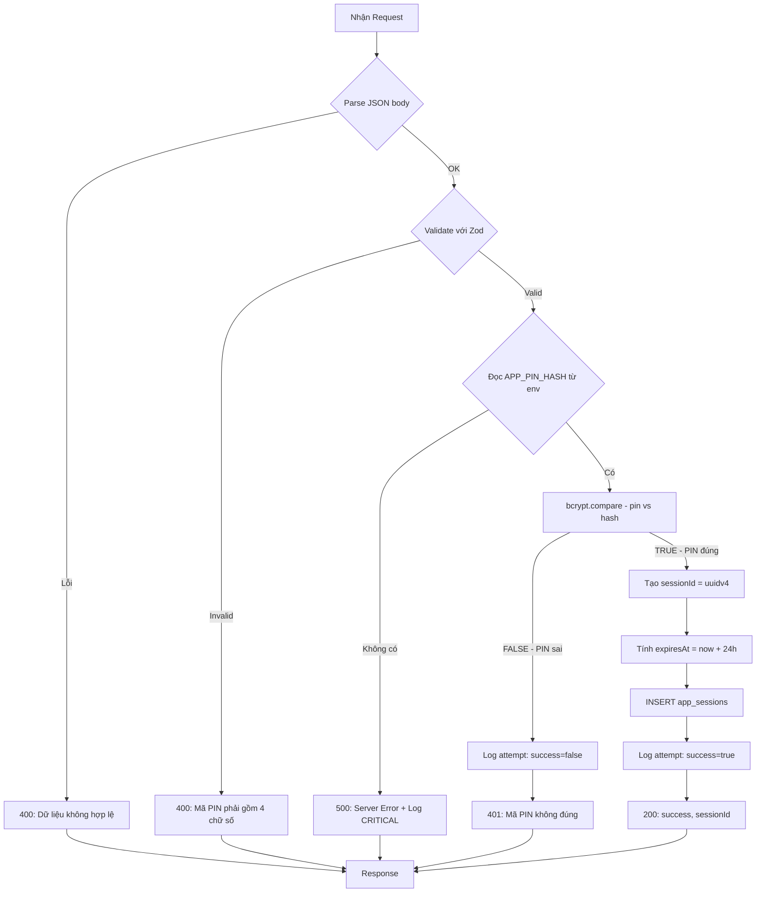
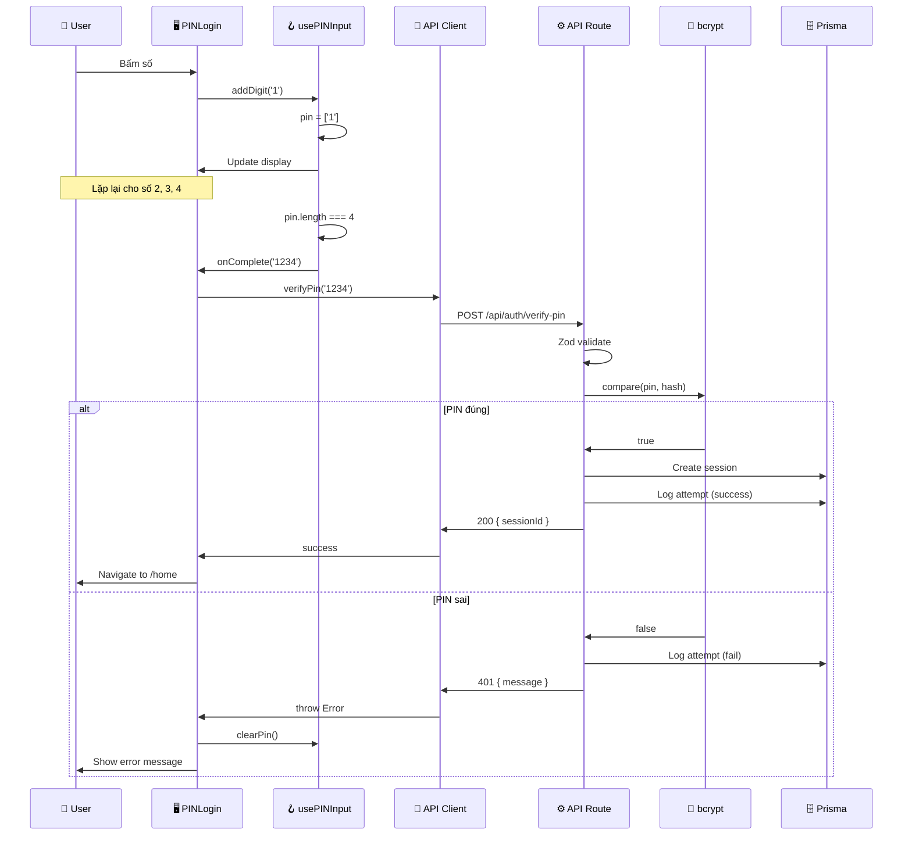

# Tài liệu Thiết kế Logic Xử lý - UC-01 (処理ロジック設計書)

**Mã chức năng:** UC-01  
**Tên chức năng:** Đăng nhập bằng mã PIN  
**Phiên bản:** 1.0  
**Ngày tạo:** 25/02/2026

---

## 📥 Input (Tài liệu tham chiếu)

| Tài liệu | Nội dung trích xuất |
|----------|---------------------|
| `02-external-design/UC-01/01_System_Houshiki.md` | Sequence diagrams |
| `02-external-design/UC-01/02_Gamen_Sekkei.md` | Events EVT-01~05 |
| `03-internal-design/UC-01/01_Program_Sekkei.md` | Class/Method definitions |

---

## 1. Danh sách Logic Xử lý (処理ロジック一覧)

| ID | Tên Logic | Nằm trong | Mô tả | Tham chiếu |
|----|-----------|-----------|-------|------------|
| LGC-001 | `usePINInput.addDigit` | Hook | Thêm số vào PIN | EVT-01 |
| LGC-002 | `usePINInput.removeDigit` | Hook | Xóa số cuối | EVT-02 |
| LGC-003 | `PINLogin.handleSubmit` | Component | Gọi API verify | - |
| LGC-004 | `useLockout.activate` | Hook | Kích hoạt khóa 30s | EVT-05 |
| LGC-005 | `useCountdown` | Hook | Đếm ngược | AF-01.2 |
| LGC-006 | `POST /api/auth/verify-pin` | API Route | Xác thực PIN server-side | IF-001 |

---

## 2. Chi tiết Logic Xử lý (処理ロジック詳細)

### [LGC-001] `usePINInput.addDigit`

**Mô tả:** Thêm một chữ số vào mảng PIN, trigger callback khi đủ 4 số.

**Được gọi từ:** `PINLogin.handleDigitPress` → `PINKeypadButton.onClick`

#### Pseudocode:

```
FUNCTION addDigit(digit: STRING)
    // Bước 1: Kiểm tra đã đủ số chưa
    IF pin.length >= maxLength THEN
        RETURN  // Không làm gì
    END IF
    
    // Bước 2: Kiểm tra input hợp lệ (chỉ số 0-9)
    IF NOT regex.test(/^\d$/, digit) THEN
        RETURN  // Không chấp nhận ký tự không phải số
    END IF
    
    // Bước 3: Thêm số vào mảng
    newPin = [...pin, digit]
    setPin(newPin)
    
    // Bước 4: Kiểm tra đã đủ số và trigger callback
    IF newPin.length === maxLength THEN
        IF onComplete IS NOT NULL THEN
            CALL onComplete(newPin.join(''))
        END IF
    END IF
END FUNCTION
```

---

### [LGC-002] `usePINInput.removeDigit`

**Mô tả:** Xóa chữ số cuối cùng khỏi mảng PIN.

**Được gọi từ:** `PINLogin.handleDelete` → `PINKeypadButton(delete).onClick`

#### Pseudocode:

```
FUNCTION removeDigit()
    // Bước 1: Kiểm tra mảng có rỗng không
    IF pin.length === 0 THEN
        RETURN  // Không có gì để xóa
    END IF
    
    // Bước 2: Xóa phần tử cuối
    newPin = pin.slice(0, -1)  // Lấy từ đầu đến phần tử áp cuối
    setPin(newPin)
END FUNCTION
```

---

### [LGC-003] `PINLogin.handleSubmit`

**Mô tả:** Xử lý logic chính khi người dùng nhập đủ 4 số PIN.

**Được gọi từ:** `usePINInput.onComplete` callback

#### Pseudocode:

```
ASYNC FUNCTION handleSubmit()
    // Bước 1: Kiểm tra có đang khóa không
    IF isLocked === TRUE THEN
        RETURN  // Không cho phép submit
    END IF
    
    // Bước 2: Bật trạng thái loading
    setIsLoading(TRUE)
    setErrorMessage('')
    
    TRY
        // Bước 3: Gọi API xác thực PIN
        pinString = pin.join('')
        response = AWAIT verifyPin(pinString)
        
        // Bước 4: Xử lý kết quả thành công
        IF response.success === TRUE THEN
            // 4a. Lưu sessionId vào localStorage
            localStorage.setItem(STORAGE_KEY_SESSION, response.sessionId)
            
            // 4b. Reset state
            setAttempts(0)
            clearPin()
            
            // 4c. Callback hoặc navigate
            IF onSuccess IS NOT NULL THEN
                CALL onSuccess(response.sessionId)
            ELSE
                router.push('/home')
            END IF
        END IF
        
    CATCH error
        // Bước 5: Xử lý lỗi
        
        // 5a. Tăng số lần thử
        newAttempts = attempts + 1
        setAttempts(newAttempts)
        
        // 5b. Xóa PIN đã nhập
        clearPin()
        
        // 5c. Hiển thị thông báo lỗi
        IF error.message IS NOT EMPTY THEN
            setErrorMessage(error.message)
        ELSE
            setErrorMessage('Mã PIN không đúng. Vui lòng thử lại.')
        END IF
        
        // 5d. Kiểm tra có cần khóa không
        IF newAttempts >= maxAttempts THEN
            CALL handleLockActivate()
        END IF
        
    FINALLY
        // Bước 6: Tắt loading
        setIsLoading(FALSE)
    END TRY
END FUNCTION
```

---

### [LGC-004] `useLockout.activate`

**Mô tả:** Kích hoạt chế độ khóa tạm thời sau khi nhập sai quá số lần cho phép.

**Được gọi từ:** `PINLogin.handleLockActivate`

#### Pseudocode:

```
FUNCTION activate(seconds: NUMBER)
    // Bước 1: Tính thời điểm hết khóa
    // [date-fns] - NFR-TECH-01
    lockUntil = addSeconds(new Date(), seconds)
    
    // Bước 2: Cập nhật state
    setLockUntil(lockUntil)
    setIsLocked(TRUE)
    
    // Bước 3: Lưu vào localStorage để persist qua refresh
    localStorage.setItem(
        storageKey, 
        lockUntil.toISOString()
    )
    
    // Bước 4: Log cho debug (không ghi PIN)
    console.log('[Lockout] Activated until:', lockUntil)
END FUNCTION
```

---

### [LGC-005] `useCountdown`

**Mô tả:** Hook đếm ngược từ một thời điểm target, gọi callback khi countdown kết thúc.

**Được gọi từ:** `LockOverlay` component

#### Pseudocode:

```
FUNCTION useCountdown(targetDate: DATE | NULL, onComplete: FUNCTION)
    // State
    remainingSeconds = useState(0)
    
    // Effect - Chạy khi targetDate thay đổi
    useEffect(() => {
        // Bước 1: Kiểm tra targetDate
        IF targetDate IS NULL THEN
            setRemainingSeconds(0)
            RETURN
        END IF
        
        // Bước 2: Tính remaining ban đầu
        // [date-fns] - NFR-TECH-01
        initial = Math.max(0, differenceInSeconds(targetDate, new Date()))
        setRemainingSeconds(initial)
        
        // Bước 3: Nếu đã hết thời gian
        IF initial <= 0 THEN
            IF onComplete IS NOT NULL THEN
                CALL onComplete()
            END IF
            RETURN
        END IF
        
        // Bước 4: Tạo interval đếm ngược mỗi 1 giây
        interval = setInterval(() => {
            remaining = Math.max(0, differenceInSeconds(targetDate, new Date()))
            setRemainingSeconds(remaining)
            
            // Kiểm tra đã hết chưa
            IF remaining <= 0 THEN
                clearInterval(interval)
                IF onComplete IS NOT NULL THEN
                    CALL onComplete()
                END IF
            END IF
        }, 1000)
        
        // Bước 5: Cleanup khi unmount
        RETURN () => clearInterval(interval)
        
    }, [targetDate, onComplete])
    
    // Return
    RETURN {
        remainingSeconds,
        isActive: remainingSeconds > 0
    }
END FUNCTION
```

---

### [LGC-006] `POST /api/auth/verify-pin`

**Mô tả:** API Route xử lý xác thực mã PIN phía server.

**Endpoint:** `POST /api/auth/verify-pin`

#### Flowchart:



#### Pseudocode:

```
ASYNC FUNCTION POST(request: NextRequest)
    TRY
        // ================================================
        // BƯỚC 1: Parse request body
        // ================================================
        TRY
            body = AWAIT request.json()
        CATCH parseError
            RETURN Response(400, {
                success: false,
                message: 'Dữ liệu không hợp lệ'
            })
        END TRY
        
        // ================================================
        // BƯỚC 2: Validate input với Zod schema
        // ================================================
        validation = VerifyPinSchema.safeParse(body)
        
        IF validation.success === FALSE THEN
            errorMessage = validation.error.errors[0]?.message 
                           OR 'Mã PIN phải gồm 4 chữ số'
            RETURN Response(400, {
                success: false,
                message: errorMessage
            })
        END IF
        
        pin = validation.data.pin
        
        // ================================================
        // BƯỚC 3: Đọc PIN hash từ environment variable
        // [NFR-SEC-01] Không hardcode PIN
        // ================================================
        pinHash = process.env.APP_PIN_HASH
        
        IF pinHash IS NULL OR pinHash IS EMPTY THEN
            // Log lỗi nghiêm trọng (KHÔNG log PIN)
            console.error('[CRITICAL] APP_PIN_HASH chưa được cấu hình')
            
            RETURN Response(500, {
                success: false,
                message: 'Đã xảy ra lỗi. Vui lòng thử lại sau.'
            })
        END IF
        
        // ================================================
        // BƯỚC 4: So sánh PIN với hash
        // [NFR-SEC-02] Sử dụng bcrypt
        // ================================================
        isValid = AWAIT bcrypt.compare(pin, pinHash)
        
        // ================================================
        // BƯỚC 5: Xử lý kết quả
        // ================================================
        IF isValid === TRUE THEN
            // 5a. PIN ĐÚNG - Tạo session
            
            // Tạo session ID (UUID v4)
            sessionId = uuidv4()
            
            // Tính thời điểm hết hạn [date-fns]
            createdAt = new Date()
            expiresAt = addHours(createdAt, SESSION_EXPIRY_HOURS)
            
            // Lưu session vào database
            AWAIT prisma.appSession.create({
                data: {
                    sessionId: sessionId,
                    createdAt: createdAt,
                    expiresAt: expiresAt,
                    isActive: TRUE
                }
            })
            
            // Ghi log thành công (KHÔNG ghi PIN)
            AWAIT prisma.loginAttempt.create({
                data: {
                    sessionId: sessionId,
                    success: TRUE,
                    attemptCount: 1,
                    attemptedAt: createdAt,
                    ipAddress: getClientIP(request),
                    userAgent: request.headers.get('user-agent')
                }
            })
            
            // Trả về thành công
            RETURN Response(200, {
                success: true,
                sessionId: sessionId,
                message: 'Đăng nhập thành công'  // NFR-L10N-01
            })
            
        ELSE
            // 5b. PIN SAI - Ghi log và trả lỗi
            
            // Ghi log thất bại (KHÔNG ghi PIN)
            AWAIT prisma.loginAttempt.create({
                data: {
                    sessionId: NULL,
                    success: FALSE,
                    attemptCount: 1,
                    attemptedAt: new Date(),
                    ipAddress: getClientIP(request),
                    userAgent: request.headers.get('user-agent')
                }
            })
            
            // Trả về lỗi 401
            RETURN Response(401, {
                success: false,
                message: 'Mã PIN không đúng. Vui lòng thử lại.'  // AC-01.4
            })
        END IF
        
    CATCH error
        // ================================================
        // BƯỚC 6: Xử lý lỗi không mong đợi
        // ================================================
        console.error('[ERROR] verify-pin:', error.message)
        
        RETURN Response(500, {
            success: false,
            message: 'Đã xảy ra lỗi. Vui lòng thử lại sau.'
        })
    END TRY
END FUNCTION

// Helper function lấy IP
FUNCTION getClientIP(request: NextRequest): STRING | NULL
    RETURN request.headers.get('x-forwarded-for')
           OR request.headers.get('x-real-ip')
           OR NULL
END FUNCTION
```

---

## 3. Ma trận Xử lý Ngoại lệ (例外処理マトリクス)

| Logic ID | Exception | HTTP Code | Message (VI) | Action |
|----------|-----------|-----------|--------------|--------|
| LGC-006 | JSON parse error | 400 | Dữ liệu không hợp lệ | Return error |
| LGC-006 | Zod validation fail | 400 | Mã PIN phải gồm 4 chữ số | Return error |
| LGC-006 | PIN sai | 401 | Mã PIN không đúng... | Log + Return error |
| LGC-006 | APP_PIN_HASH missing | 500 | Đã xảy ra lỗi... | Log CRITICAL + Return error |
| LGC-006 | DB connection error | 500 | Đã xảy ra lỗi... | Log + Return error |
| LGC-006 | bcrypt error | 500 | Đã xảy ra lỗi... | Log + Return error |
| LGC-003 | Network error | - | Không có kết nối mạng | Show error toast |
| LGC-003 | API timeout | - | Đã xảy ra lỗi... | Show error toast |

---

## 4. Luồng Dữ liệu (データフロー)



---

## 5. Bảo mật Logic (セキュリティロジック)

| # | Mục | Logic Implementation | Tham chiếu |
|---|-----|---------------------|------------|
| 1 | Không hardcode PIN | Đọc từ `process.env.APP_PIN_HASH` | NFR-SEC-01 |
| 2 | Hash PIN | `bcrypt.compare()` với cost 10 | NFR-SEC-02 |
| 3 | Rate limiting client | `useLockout` hook sau 3 lần sai | NFR-SEC-03 |
| 4 | Che PIN | Hiển thị `●` trong `PINDisplay` | NFR-SEC-04 |
| 5 | Không log PIN | Log chỉ ghi success/fail, IP, UA | NFR-SEC-01 |
| 6 | Session ngẫu nhiên | `uuidv4()` | - |
