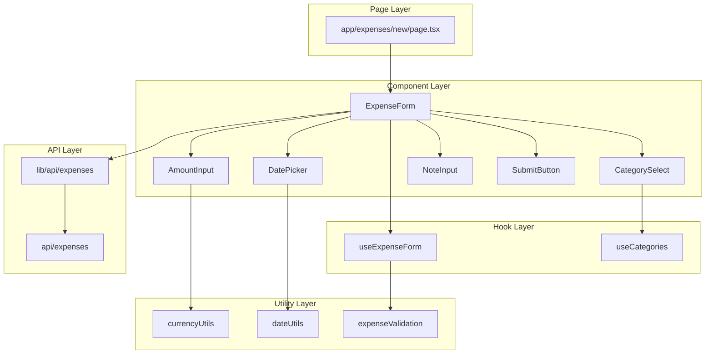

# Tài liệu Thiết kế Lớp / Chương trình - UC-02 (クラス設計書)

**Mã chức năng:** UC-02  
**Tên chức năng:** Thêm chi tiêu mới  
**Phiên bản:** 1.0  
**Ngày tạo:** 25/02/2026

---

## 📥 Input (Tài liệu tham chiếu)

| Tài liệu | Nội dung trích xuất |
|----------|---------------------|
| `02-external-design/UC-02/01_System_Houshiki.md` | Kiến trúc, Sequence diagrams |
| `02-external-design/UC-02/02_Gamen_Sekkei.md` | Form layout, Validation rules |
| `02-external-design/UC-02/04_IF_Sekkei.md` | API POST /api/expenses |

---

## 1. Cấu trúc Thư mục Mã nguồn (ソースコード構成)

```
app-project/
├── app/
│   ├── home/
│   │   └── page.tsx                  # Route: /home (màn hình chính)
│   ├── expenses/
│   │   └── new/
│   │       └── page.tsx              # Route: /expenses/new (form thêm)
│   └── api/
│       └── expenses/
│           └── route.ts              # API: POST /api/expenses
├── src/
│   ├── components/
│   │   └── ExpenseForm/
│   │       ├── index.ts              # Re-export
│   │       ├── ExpenseForm.tsx       # Container form
│   │       ├── AmountInput.tsx       # Input số tiền
│   │       ├── CategorySelect.tsx    # Chọn danh mục
│   │       ├── DatePicker.tsx        # Chọn ngày
│   │       ├── NoteInput.tsx         # Ghi chú (optional)
│   │       └── SubmitButton.tsx      # Nút lưu
│   ├── hooks/
│   │   ├── useExpenseForm.ts         # Form state management
│   │   └── useCategories.ts          # Fetch danh mục
│   ├── lib/
│   │   ├── api/
│   │   │   └── expenses.ts           # API client expenses
│   │   ├── validations/
│   │   │   └── expense.ts            # Zod schema expense
│   │   └── utils/
│   │       ├── currency.ts           # Format tiền VND
│   │       └── date.ts               # date-fns helpers
│   ├── types/
│   │   └── expense.ts                # TypeScript types
│   └── constants/
│       └── categories.ts             # Danh mục chi tiêu
```

---

## 2. Danh sách Lớp / Module (クラス一覧)

### 2.1 React Components

| ID Lớp | Tên Component | File Path | Mô tả |
|--------|---------------|-----------|-------|
| CMP-010 | `ExpenseForm` | `src/components/ExpenseForm/ExpenseForm.tsx` | Container form chính |
| CMP-011 | `AmountInput` | `src/components/ExpenseForm/AmountInput.tsx` | Input số tiền + format |
| CMP-012 | `CategorySelect` | `src/components/ExpenseForm/CategorySelect.tsx` | Grid 4 danh mục |
| CMP-013 | `DatePicker` | `src/components/ExpenseForm/DatePicker.tsx` | Chọn ngày chi tiêu |
| CMP-014 | `NoteInput` | `src/components/ExpenseForm/NoteInput.tsx` | Textarea ghi chú |
| CMP-015 | `SubmitButton` | `src/components/ExpenseForm/SubmitButton.tsx` | Nút lưu + loading |

### 2.2 Custom Hooks

| ID Lớp | Tên Hook | File Path | Mô tả |
|--------|----------|-----------|-------|
| HK-010 | `useExpenseForm` | `src/hooks/useExpenseForm.ts` | Quản lý form state |
| HK-011 | `useCategories` | `src/hooks/useCategories.ts` | Danh sách danh mục |

### 2.3 API & Utilities

| ID Lớp | Tên Module | File Path | Mô tả |
|--------|------------|-----------|-------|
| API-002 | `expensesRoute` | `app/api/expenses/route.ts` | POST handler |
| LIB-010 | `expensesApi` | `src/lib/api/expenses.ts` | Client-side API |
| LIB-011 | `expenseValidation` | `src/lib/validations/expense.ts` | Zod schema |
| LIB-012 | `currencyUtils` | `src/lib/utils/currency.ts` | Format VND |
| LIB-013 | `dateUtils` | `src/lib/utils/date.ts` | date-fns helpers |

---

## 3. Chi tiết Lớp (クラス詳細)

### [CMP-010] Component: `ExpenseForm`

**File:** `src/components/ExpenseForm/ExpenseForm.tsx`

#### 3.1 Props (入力プロパティ)

| Tên Prop | Kiểu dữ liệu | Bắt buộc | Default | Mô tả |
|----------|--------------|:--------:|---------|-------|
| `onSuccess` | `(expense: Expense) => void` | ❌ | - | Callback khi lưu thành công |
| `onCancel` | `() => void` | ❌ | - | Callback khi bấm Hủy |
| `initialDate` | `Date` | ❌ | `new Date()` | Ngày mặc định |

#### 3.2 Form State (フォーム状態)

| Tên Field | Kiểu dữ liệu | Validation | Default | Tham chiếu |
|-----------|--------------|------------|---------|------------|
| `amount` | `number` | > 0, ≤ 999,999,999 | `0` | AC-02.1 |
| `categoryCode` | `string` | Một trong 4 mã | `''` | AC-02.2 |
| `expenseDate` | `Date` | Không tương lai | `new Date()` | AC-02.3 |
| `note` | `string` | Max 200 ký tự | `''` | - |

#### 3.3 Nội bộ State

| Tên State | Kiểu | Initial | Mô tả |
|-----------|------|---------|-------|
| `isSubmitting` | `boolean` | `false` | Đang gửi form |
| `errors` | `Record<string, string>` | `{}` | Lỗi validation |
| `touched` | `Record<string, boolean>` | `{}` | Field đã interact |

---

### [CMP-011] Component: `AmountInput`

**File:** `src/components/ExpenseForm/AmountInput.tsx`

#### 3.4 Props

| Tên Prop | Kiểu | Bắt buộc | Mô tả |
|----------|------|:--------:|-------|
| `value` | `number` | ✅ | Giá trị số |
| `onChange` | `(value: number) => void` | ✅ | Callback thay đổi |
| `error` | `string` | ❌ | Message lỗi |
| `disabled` | `boolean` | ❌ | Vô hiệu hóa |

#### 3.5 Behavior

- Hiển thị định dạng VND (1.500.000)
- Chỉ chấp nhận số
- Auto-format khi blur
- Placeholder: "Nhập số tiền"

---

### [CMP-012] Component: `CategorySelect`

**File:** `src/components/ExpenseForm/CategorySelect.tsx`

#### 3.6 Props

| Tên Prop | Kiểu | Bắt buộc | Mô tả |
|----------|------|:--------:|-------|
| `value` | `string` | ✅ | Mã danh mục đã chọn |
| `onChange` | `(code: string) => void` | ✅ | Callback chọn |
| `options` | `Category[]` | ✅ | Danh sách danh mục |
| `error` | `string` | ❌ | Message lỗi |

#### 3.7 Layout Grid

```
┌──────────────┬──────────────┐
│ 🛒 Sinh hoạt │ 📚 Giáo dục  │
├──────────────┼──────────────┤
│ 💒 Hiếu hỉ   │ 🎁 Biếu tặng │
└──────────────┴──────────────┘
```

---

### [CMP-013] Component: `DatePicker`

**File:** `src/components/ExpenseForm/DatePicker.tsx`

#### 3.8 Props

| Tên Prop | Kiểu | Bắt buộc | Mô tả |
|----------|------|:--------:|-------|
| `value` | `Date` | ✅ | Ngày đã chọn |
| `onChange` | `(date: Date) => void` | ✅ | Callback chọn ngày |
| `maxDate` | `Date` | ❌ | Ngày tối đa (default: today) |
| `error` | `string` | ❌ | Message lỗi |

#### 3.9 Behavior

- Sử dụng `date-fns` (NFR-TECH-01)
- Format hiển thị: "dd/MM/yyyy"
- Không cho chọn ngày tương lai
- Quick buttons: "Hôm nay", "Hôm qua"

---

### [HK-010] Hook: `useExpenseForm`

**File:** `src/hooks/useExpenseForm.ts`

#### 3.10 Parameters

| Tên | Kiểu | Default | Mô tả |
|-----|------|---------|-------|
| `initialValues` | `Partial<ExpenseFormData>` | `{}` | Giá trị khởi tạo |
| `onSubmit` | `(data: ExpenseFormData) => Promise<void>` | - | Submit handler |

#### 3.11 Return Value

| Tên | Kiểu | Mô tả |
|-----|------|-------|
| `values` | `ExpenseFormData` | Form values |
| `errors` | `FormErrors` | Validation errors |
| `touched` | `TouchedFields` | Touched state |
| `isSubmitting` | `boolean` | Loading state |
| `isValid` | `boolean` | Form hợp lệ? |
| `setValue` | `(field, value) => void` | Set single field |
| `setTouched` | `(field) => void` | Mark as touched |
| `handleSubmit` | `() => Promise<void>` | Submit form |
| `resetForm` | `() => void` | Reset về initial |

---

### [API-002] API Route: `POST /api/expenses`

**File:** `app/api/expenses/route.ts`

#### 3.12 Handler Function

| Function | Method | Input | Output | Mô tả |
|----------|--------|-------|--------|-------|
| `POST` | POST | `CreateExpenseRequest` | `ExpenseResponse` | Tạo chi tiêu mới |

#### 3.13 Dependencies

| Module | Import | Mục đích |
|--------|--------|----------|
| `zod` | `{ z }` | Validation |
| `date-fns` | `{ parseISO, isAfter, startOfDay }` | Xử lý ngày |
| `prisma` | `@/lib/prisma` | Database access |

---

## 4. Định nghĩa Hằng số (定数定義)

**File:** `src/constants/categories.ts`

| Tên hằng số | Giá trị | Mô tả | Tham chiếu |
|-------------|---------|-------|------------|
| `CATEGORY_LIVING` | `'LIVING'` | Sinh hoạt phí | C1 |
| `CATEGORY_EDUCATION` | `'EDUCATION'` | Giáo dục | C2 |
| `CATEGORY_CEREMONY` | `'CEREMONY'` | Hiếu hỉ | C3 |
| `CATEGORY_FAMILY_GIFT` | `'FAMILY_GIFT'` | Biếu tặng gia đình | C4 |

```typescript
export const CATEGORIES = [
  { code: 'LIVING', name: 'Sinh hoạt phí', icon: '🛒', color: '#10B981' },
  { code: 'EDUCATION', name: 'Giáo dục', icon: '📚', color: '#3B82F6' },
  { code: 'CEREMONY', name: 'Hiếu hỉ', icon: '💒', color: '#F59E0B' },
  { code: 'FAMILY_GIFT', name: 'Biếu tặng', icon: '🎁', color: '#EC4899' },
] as const;

export const CATEGORY_CODES = CATEGORIES.map(c => c.code);
```

**File:** `src/constants/expense.ts`

| Tên hằng số | Giá trị | Mô tả |
|-------------|---------|-------|
| `MAX_AMOUNT` | `999999999` | Số tiền tối đa |
| `MIN_AMOUNT` | `1` | Số tiền tối thiểu |
| `MAX_NOTE_LENGTH` | `200` | Độ dài ghi chú tối đa |

---

## 5. Định nghĩa Types (型定義)

**File:** `src/types/expense.ts`

```typescript
// Category
export interface Category {
  code: string;
  name: string;
  icon: string;
  color: string;
}

// Form data
export interface ExpenseFormData {
  amount: number;
  categoryCode: string;
  expenseDate: Date;
  note: string;
}

// API Request
export interface CreateExpenseRequest {
  amount: number;
  categoryCode: string;
  expenseDate: string;  // ISO string
  note?: string;
}

// API Response
export interface ExpenseResponse {
  success: boolean;
  data?: Expense;
  message: string;
}

// Expense entity
export interface Expense {
  id: number;
  amount: number;
  categoryCode: string;
  categoryName: string;
  categoryIcon: string;
  expenseDate: string;
  note: string | null;
  createdAt: string;
}

// Form errors
export type FormErrors = Partial<Record<keyof ExpenseFormData, string>>;
export type TouchedFields = Partial<Record<keyof ExpenseFormData, boolean>>;
```

---

## 6. Sơ đồ Quan hệ Component (コンポーネント関係図)



---

## 7. Validation Schema (Zod)

**File:** `src/lib/validations/expense.ts`

```typescript
import { z } from 'zod';
import { startOfDay, isAfter } from 'date-fns';
import { CATEGORY_CODES, MAX_AMOUNT, MIN_AMOUNT, MAX_NOTE_LENGTH } from '@/constants';

export const CreateExpenseSchema = z.object({
  amount: z
    .number({ required_error: 'Vui lòng nhập số tiền' })
    .min(MIN_AMOUNT, 'Số tiền phải lớn hơn 0')
    .max(MAX_AMOUNT, `Số tiền không được vượt quá ${MAX_AMOUNT.toLocaleString('vi-VN')} đ`),
    
  categoryCode: z
    .string({ required_error: 'Vui lòng chọn danh mục' })
    .refine(val => CATEGORY_CODES.includes(val), 'Danh mục không hợp lệ'),
    
  expenseDate: z
    .string({ required_error: 'Vui lòng chọn ngày' })
    .datetime()
    .refine(
      val => !isAfter(startOfDay(new Date(val)), startOfDay(new Date())),
      'Ngày chi tiêu không được trong tương lai'
    ),
    
  note: z
    .string()
    .max(MAX_NOTE_LENGTH, `Ghi chú không được vượt quá ${MAX_NOTE_LENGTH} ký tự`)
    .optional(),
});

export type CreateExpenseInput = z.infer<typeof CreateExpenseSchema>;
```

---

## 8. Utility Functions

**File:** `src/lib/utils/currency.ts`

```typescript
/**
 * Format số thành chuỗi tiền VND
 * @example formatCurrency(1500000) => "1.500.000 đ"
 */
export function formatCurrency(amount: number): string {
  return new Intl.NumberFormat('vi-VN').format(amount) + ' đ';
}

/**
 * Parse chuỗi tiền thành số
 * @example parseCurrency("1.500.000") => 1500000
 */
export function parseCurrency(value: string): number {
  return parseInt(value.replace(/\D/g, ''), 10) || 0;
}
```

**File:** `src/lib/utils/date.ts`

```typescript
import { format, parseISO, isAfter, startOfDay } from 'date-fns';
import { vi } from 'date-fns/locale';

/**
 * Format Date sang chuỗi hiển thị
 * @example formatDate(new Date()) => "25/02/2026"
 */
export function formatDate(date: Date): string {
  return format(date, 'dd/MM/yyyy', { locale: vi });
}

/**
 * Format Date sang ISO string (cho API)
 * @example toISODateString(new Date()) => "2026-02-25"
 */
export function toISODateString(date: Date): string {
  return format(date, 'yyyy-MM-dd');
}

/**
 * Kiểm tra ngày có trong tương lai không
 */
export function isFutureDate(date: Date): boolean {
  return isAfter(startOfDay(date), startOfDay(new Date()));
}
```
