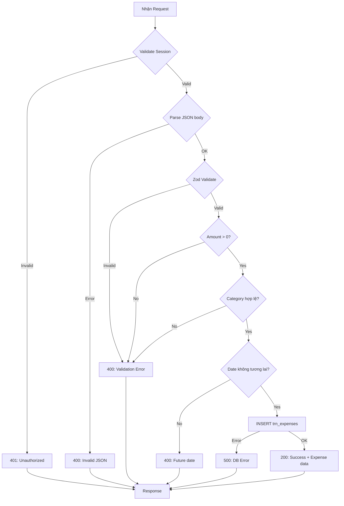
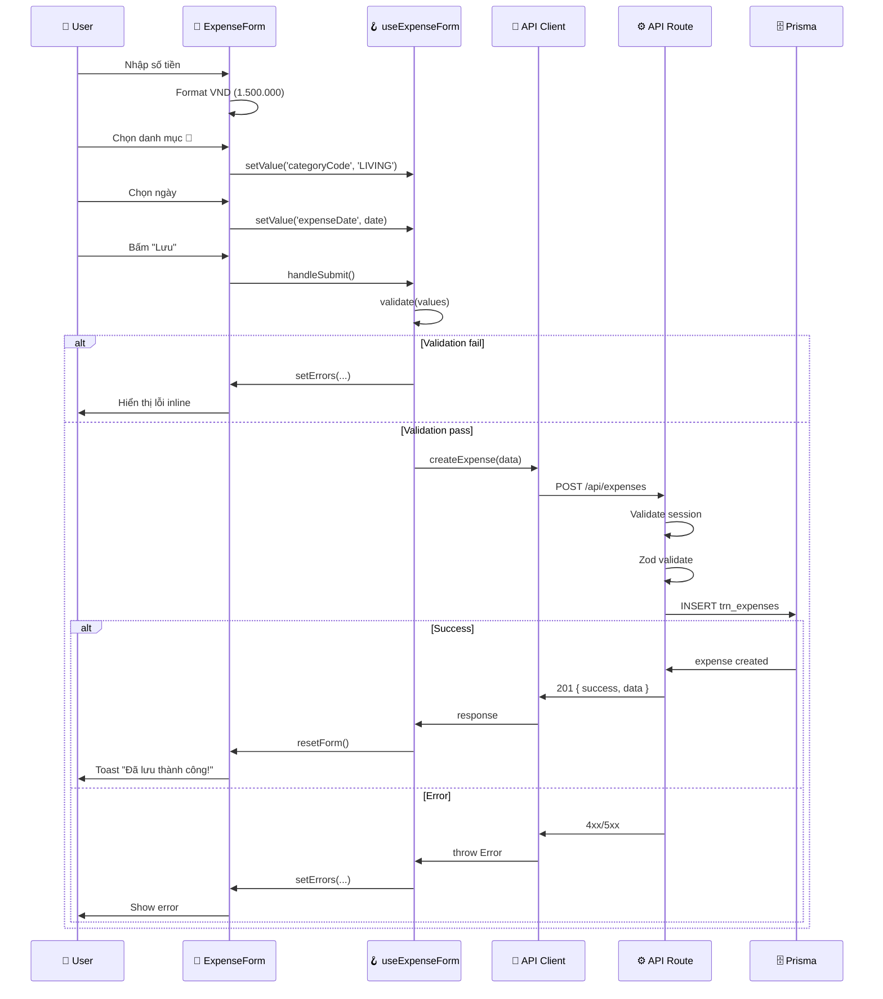

# Tài liệu Thiết kế Logic Xử lý - UC-02 (処理ロジック設計書)

**Mã chức năng:** UC-02  
**Tên chức năng:** Thêm chi tiêu mới  
**Phiên bản:** 1.0  
**Ngày tạo:** 25/02/2026

---

## 📥 Input (Tài liệu tham chiếu)

| Tài liệu | Nội dung trích xuất |
|----------|---------------------|
| `02-external-design/UC-02/01_System_Houshiki.md` | Sequence diagrams |
| `02-external-design/UC-02/02_Gamen_Sekkei.md` | Form events, validation |
| `03-internal-design/UC-02/01_Program_Sekkei.md` | Class definitions |

---

## 1. Danh sách Logic Xử lý (処理ロジック一覧)

| ID | Tên Logic | Nằm trong | Mô tả | Tham chiếu |
|----|-----------|-----------|-------|------------|
| LGC-010 | `AmountInput.handleChange` | Component | Format số tiền | - |
| LGC-011 | `CategorySelect.handleSelect` | Component | Chọn danh mục | AC-02.2 |
| LGC-012 | `DatePicker.handleDateChange` | Component | Chọn ngày | AC-02.3 |
| LGC-013 | `useExpenseForm.validate` | Hook | Validate form | - |
| LGC-014 | `useExpenseForm.handleSubmit` | Hook | Submit form | - |
| LGC-015 | `POST /api/expenses` | API Route | Lưu chi tiêu | IF-002 |

---

## 2. Chi tiết Logic Xử lý (処理ロジック詳細)

### [LGC-010] `AmountInput.handleChange`

**Mô tả:** Xử lý nhập số tiền, chỉ cho phép số và tự động format theo VND.

**Được gọi từ:** `AmountInput` component khi user nhập

#### Pseudocode:

```
FUNCTION handleChange(inputValue: STRING)
    // Bước 1: Loại bỏ tất cả ký tự không phải số
    numericOnly = inputValue.replace(/\D/g, '')
    
    // Bước 2: Chuyển thành số
    numericValue = parseInt(numericOnly, 10)
    
    // Bước 3: Kiểm tra NaN
    IF isNaN(numericValue) THEN
        numericValue = 0
    END IF
    
    // Bước 4: Giới hạn giá trị tối đa
    IF numericValue > MAX_AMOUNT THEN
        numericValue = MAX_AMOUNT
    END IF
    
    // Bước 5: Gọi callback onChange với giá trị số
    CALL onChange(numericValue)
END FUNCTION

FUNCTION formatDisplayValue(value: NUMBER): STRING
    // Format số để hiển thị
    // [Intl.NumberFormat] - NFR-L10N-05
    IF value === 0 THEN
        RETURN ''
    END IF
    
    RETURN new Intl.NumberFormat('vi-VN').format(value)
END FUNCTION
```

---

### [LGC-011] `CategorySelect.handleSelect`

**Mô tả:** Xử lý chọn danh mục chi tiêu từ grid 4 buttons.

**Được gọi từ:** `CategorySelect` component khi user bấm danh mục

#### Pseudocode:

```
FUNCTION handleSelect(categoryCode: STRING)
    // Bước 1: Kiểm tra danh mục hợp lệ
    IF NOT CATEGORY_CODES.includes(categoryCode) THEN
        console.warn('Invalid category code:', categoryCode)
        RETURN
    END IF
    
    // Bước 2: Gọi callback onChange
    CALL onChange(categoryCode)
    
    // Bước 3: Clear error nếu có
    IF error IS NOT EMPTY THEN
        CALL clearError('categoryCode')
    END IF
END FUNCTION
```

---

### [LGC-012] `DatePicker.handleDateChange`

**Mô tả:** Xử lý chọn ngày chi tiêu, validate không cho chọn ngày tương lai.

**Được gọi từ:** `DatePicker` component

#### Pseudocode:

```
FUNCTION handleDateChange(selectedDate: DATE)
    // [date-fns] - NFR-TECH-01
    
    // Bước 1: Kiểm tra ngày tương lai
    today = startOfDay(new Date())
    selected = startOfDay(selectedDate)
    
    IF isAfter(selected, today) THEN
        // Hiển thị lỗi hoặc không cho phép chọn
        CALL setError('expenseDate', 'Ngày chi tiêu không được trong tương lai')
        RETURN
    END IF
    
    // Bước 2: Gọi callback onChange
    CALL onChange(selectedDate)
    
    // Bước 3: Clear error
    CALL clearError('expenseDate')
END FUNCTION

// Quick button handlers
FUNCTION handleTodayClick()
    CALL handleDateChange(new Date())
END FUNCTION

FUNCTION handleYesterdayClick()
    yesterday = subDays(new Date(), 1)  // [date-fns]
    CALL handleDateChange(yesterday)
END FUNCTION
```

---

### [LGC-013] `useExpenseForm.validate`

**Mô tả:** Validate toàn bộ form trước khi submit.

**Được gọi từ:** `useExpenseForm.handleSubmit` trước khi gọi API

#### Pseudocode:

```
FUNCTION validate(values: ExpenseFormData): FormErrors
    errors = {}
    
    // ================================================
    // Rule 1: Số tiền (AC-02.1)
    // ================================================
    IF values.amount <= 0 THEN
        errors.amount = 'Vui lòng nhập số tiền'
    ELSE IF values.amount > MAX_AMOUNT THEN
        errors.amount = 'Số tiền không được vượt quá 999.999.999 đ'
    END IF
    
    // ================================================
    // Rule 2: Danh mục (AC-02.2)
    // ================================================
    IF values.categoryCode IS EMPTY THEN
        errors.categoryCode = 'Vui lòng chọn danh mục'
    ELSE IF NOT CATEGORY_CODES.includes(values.categoryCode) THEN
        errors.categoryCode = 'Danh mục không hợp lệ'
    END IF
    
    // ================================================
    // Rule 3: Ngày chi tiêu (AC-02.3)
    // ================================================
    IF values.expenseDate IS NULL THEN
        errors.expenseDate = 'Vui lòng chọn ngày'
    ELSE
        // [date-fns] - NFR-TECH-01
        today = startOfDay(new Date())
        selected = startOfDay(values.expenseDate)
        
        IF isAfter(selected, today) THEN
            errors.expenseDate = 'Ngày chi tiêu không được trong tương lai'
        END IF
    END IF
    
    // ================================================
    // Rule 4: Ghi chú (Optional)
    // ================================================
    IF values.note.length > MAX_NOTE_LENGTH THEN
        errors.note = 'Ghi chú không được vượt quá 200 ký tự'
    END IF
    
    RETURN errors
END FUNCTION
```

---

### [LGC-014] `useExpenseForm.handleSubmit`

**Mô tả:** Xử lý submit form, validate và gọi API.

**Được gọi từ:** Form onSubmit hoặc nút Lưu

#### Pseudocode:

```
ASYNC FUNCTION handleSubmit()
    // Bước 1: Validate form
    validationErrors = validate(values)
    setErrors(validationErrors)
    
    // Bước 2: Kiểm tra có lỗi không
    IF Object.keys(validationErrors).length > 0 THEN
        // Mark all fields as touched để hiển thị lỗi
        FOR EACH field IN Object.keys(validationErrors)
            setTouched(field, TRUE)
        END FOR
        RETURN
    END IF
    
    // Bước 3: Bật loading
    setIsSubmitting(TRUE)
    
    TRY
        // Bước 4: Chuẩn bị request body
        // [date-fns] - NFR-TECH-01
        requestBody = {
            amount: values.amount,
            categoryCode: values.categoryCode,
            expenseDate: format(values.expenseDate, "yyyy-MM-dd'T'HH:mm:ss.SSS'Z'"),
            note: values.note.trim() OR NULL
        }
        
        // Bước 5: Gọi API
        response = AWAIT createExpense(requestBody)
        
        // Bước 6: Xử lý thành công
        IF response.success === TRUE THEN
            // 6a. Hiển thị thông báo
            toast.success('Đã lưu chi tiêu thành công!')
            
            // 6b. Reset form
            resetForm()
            
            // 6c. Callback
            IF onSuccess IS NOT NULL THEN
                CALL onSuccess(response.data)
            END IF
        END IF
        
    CATCH error
        // Bước 7: Xử lý lỗi
        IF error.statusCode === 400 THEN
            // Lỗi validation từ server
            setErrors({ general: error.message })
        ELSE IF error.statusCode === 401 THEN
            // Session hết hạn
            toast.error('Phiên đăng nhập đã hết hạn. Vui lòng đăng nhập lại.')
            router.push('/')
        ELSE
            // Lỗi không xác định
            toast.error('Đã xảy ra lỗi. Vui lòng thử lại sau.')
        END IF
        
    FINALLY
        // Bước 8: Tắt loading
        setIsSubmitting(FALSE)
    END TRY
END FUNCTION
```

---

### [LGC-015] `POST /api/expenses`

**Mô tả:** API Route xử lý tạo chi tiêu mới phía server.

**Endpoint:** `POST /api/expenses`

#### Flowchart:



#### Pseudocode:

```
ASYNC FUNCTION POST(request: NextRequest)
    TRY
        // ================================================
        // BƯỚC 1: Kiểm tra Session (Authentication)
        // ================================================
        sessionId = request.headers.get('X-Session-Id')
        
        IF sessionId IS NULL OR sessionId IS EMPTY THEN
            RETURN Response(401, {
                success: false,
                message: 'Vui lòng đăng nhập để tiếp tục'
            })
        END IF
        
        // Validate session trong DB
        session = AWAIT prisma.appSession.findUnique({
            where: { 
                sessionId: sessionId,
                isActive: TRUE,
                expiresAt: { gt: new Date() }
            }
        })
        
        IF session IS NULL THEN
            RETURN Response(401, {
                success: false,
                message: 'Phiên đăng nhập đã hết hạn'
            })
        END IF
        
        // ================================================
        // BƯỚC 2: Parse request body
        // ================================================
        TRY
            body = AWAIT request.json()
        CATCH parseError
            RETURN Response(400, {
                success: false,
                message: 'Dữ liệu không hợp lệ'
            })
        END TRY
        
        // ================================================
        // BƯỚC 3: Validate với Zod
        // ================================================
        validation = CreateExpenseSchema.safeParse(body)
        
        IF validation.success === FALSE THEN
            firstError = validation.error.errors[0]
            RETURN Response(400, {
                success: false,
                message: firstError?.message OR 'Dữ liệu không hợp lệ'
            })
        END IF
        
        data = validation.data
        
        // ================================================
        // BƯỚC 4: Business validation bổ sung
        // ================================================
        
        // 4a. Kiểm tra category tồn tại trong DB
        category = AWAIT prisma.mstCategory.findUnique({
            where: { categoryCode: data.categoryCode, isActive: TRUE }
        })
        
        IF category IS NULL THEN
            RETURN Response(400, {
                success: false,
                message: 'Danh mục không tồn tại hoặc đã bị vô hiệu'
            })
        END IF
        
        // 4b. Kiểm tra ngày không trong tương lai (double-check)
        // [date-fns] - NFR-TECH-01
        expenseDate = parseISO(data.expenseDate)
        today = startOfDay(new Date())
        
        IF isAfter(startOfDay(expenseDate), today) THEN
            RETURN Response(400, {
                success: false,
                message: 'Ngày chi tiêu không được trong tương lai'
            })
        END IF
        
        // ================================================
        // BƯỚC 5: Tạo chi tiêu mới trong DB
        // ================================================
        newExpense = AWAIT prisma.trnExpense.create({
            data: {
                amount: data.amount,
                categoryCode: data.categoryCode,
                expenseDate: expenseDate,
                note: data.note OR NULL,
                createdAt: new Date()
            },
            include: {
                category: TRUE  // Join để lấy tên danh mục
            }
        })
        
        // ================================================
        // BƯỚC 6: Trả về kết quả thành công
        // ================================================
        RETURN Response(201, {
            success: true,
            message: 'Đã lưu chi tiêu thành công',  // NFR-L10N-01
            data: {
                id: newExpense.id,
                amount: newExpense.amount,
                amountFormatted: formatCurrency(newExpense.amount),
                categoryCode: newExpense.categoryCode,
                categoryName: newExpense.category.categoryName,
                categoryIcon: newExpense.category.icon,
                expenseDate: format(newExpense.expenseDate, 'yyyy-MM-dd'),
                expenseDateFormatted: format(newExpense.expenseDate, 'dd/MM/yyyy'),
                note: newExpense.note,
                createdAt: newExpense.createdAt.toISOString()
            }
        })
        
    CATCH error
        // ================================================
        // BƯỚC 7: Xử lý lỗi
        // ================================================
        console.error('[ERROR] POST /api/expenses:', error.message)
        
        RETURN Response(500, {
            success: false,
            message: 'Đã xảy ra lỗi. Vui lòng thử lại sau.'
        })
    END TRY
END FUNCTION
```

---

## 3. Ma trận Xử lý Ngoại lệ (例外処理マトリクス)

| Logic ID | Exception | HTTP Code | Message (VI) | Action |
|----------|-----------|-----------|--------------|--------|
| LGC-015 | Session missing | 401 | Vui lòng đăng nhập | Redirect /login |
| LGC-015 | Session expired | 401 | Phiên đăng nhập đã hết hạn | Redirect /login |
| LGC-015 | JSON parse error | 400 | Dữ liệu không hợp lệ | Show error |
| LGC-015 | Zod validation fail | 400 | [Field specific] | Show inline error |
| LGC-015 | Category not found | 400 | Danh mục không tồn tại | Show error |
| LGC-015 | Future date | 400 | Ngày không được tương lai | Show inline error |
| LGC-015 | DB error | 500 | Đã xảy ra lỗi... | Show error |
| LGC-014 | Network error | - | Không có kết nối mạng | Show toast |

---

## 4. Luồng Dữ liệu (データフロー)



---

## 5. Format Số tiền (通貨フォーマット)

| Input | Display Format | Stored Value |
|-------|----------------|--------------|
| `1500000` | `1.500.000 đ` | `1500000` |
| `50000` | `50.000 đ` | `50000` |
| `999999999` | `999.999.999 đ` | `999999999` |

```typescript
// NFR-L10N-05: Định dạng tiền Việt Nam (VND)
function formatCurrency(amount: number): string {
  return new Intl.NumberFormat('vi-VN').format(amount) + ' đ';
}
```

---

## 6. Format Ngày (日付フォーマット)

| Context | Format | Library | Example |
|---------|--------|---------|---------|
| Display | `dd/MM/yyyy` | date-fns | `25/02/2026` |
| API Request | ISO 8601 | date-fns | `2026-02-25T00:00:00.000Z` |
| DB Storage | `DATETIME` | Prisma | `2026-02-25 00:00:00` |

```typescript
// NFR-TECH-01: Sử dụng date-fns
import { format, parseISO } from 'date-fns';
import { vi } from 'date-fns/locale';

// Display format
const displayDate = format(date, 'dd/MM/yyyy', { locale: vi });

// API format
const apiDate = date.toISOString();
```
