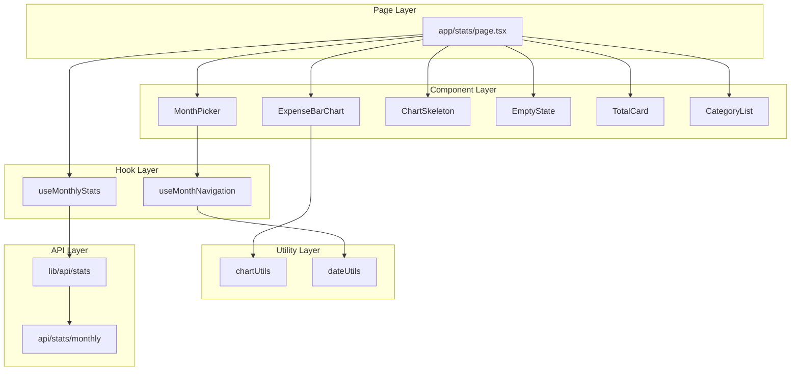

# Tài liệu Thiết kế Lớp / Chương trình - UC-03 (クラス設計書)

**Mã chức năng:** UC-03  
**Tên chức năng:** Xem biểu đồ thống kê  
**Phiên bản:** 1.0  
**Ngày tạo:** 25/02/2026

---

## 📥 Input (Tài liệu tham chiếu)

| Tài liệu | Nội dung trích xuất |
|----------|---------------------|
| `02-external-design/UC-03/01_System_Houshiki.md` | Kiến trúc, Data flow |
| `02-external-design/UC-03/02_Gamen_Sekkei.md` | Chart layout, MonthPicker |
| `02-external-design/UC-03/04_IF_Sekkei.md` | API GET /api/stats/monthly |

---

## 1. Cấu trúc Thư mục Mã nguồn (ソースコード構成)

```
app-project/
├── app/
│   ├── stats/
│   │   └── page.tsx                  # Route: /stats (màn hình thống kê)
│   └── api/
│       └── stats/
│           └── monthly/
│               └── route.ts          # API: GET /api/stats/monthly
├── src/
│   ├── components/
│   │   ├── MonthPicker/
│   │   │   ├── index.ts              # Re-export
│   │   │   └── MonthPicker.tsx       # Chọn tháng (◀ Tháng MM/YYYY ▶)
│   │   ├── ExpenseChart/
│   │   │   ├── index.ts              # Re-export
│   │   │   ├── ExpenseBarChart.tsx   # Recharts BarChart
│   │   │   ├── ChartSkeleton.tsx     # Loading skeleton
│   │   │   └── EmptyState.tsx        # Không có dữ liệu
│   │   └── StatsCard/
│   │       ├── index.ts              # Re-export
│   │       ├── TotalCard.tsx         # Card tổng chi tiêu
│   │       └── CategoryList.tsx      # Danh sách chi tiết
│   ├── hooks/
│   │   ├── useMonthlyStats.ts        # Fetch & cache thống kê
│   │   └── useMonthNavigation.ts     # Logic chuyển tháng
│   ├── lib/
│   │   ├── api/
│   │   │   └── stats.ts              # API client stats
│   │   └── utils/
│   │       └── chart.ts              # Chart data transform
│   └── types/
│       └── stats.ts                  # TypeScript types
```

---

## 2. Danh sách Lớp / Module (クラス一覧)

### 2.1 React Components

| ID Lớp | Tên Component | File Path | Mô tả |
|--------|---------------|-----------|-------|
| CMP-020 | `StatsPage` | `app/stats/page.tsx` | Page container |
| CMP-021 | `MonthPicker` | `src/components/MonthPicker/MonthPicker.tsx` | Chọn tháng |
| CMP-022 | `ExpenseBarChart` | `src/components/ExpenseChart/ExpenseBarChart.tsx` | Biểu đồ cột |
| CMP-023 | `ChartSkeleton` | `src/components/ExpenseChart/ChartSkeleton.tsx` | Loading state |
| CMP-024 | `EmptyState` | `src/components/ExpenseChart/EmptyState.tsx` | No data state |
| CMP-025 | `TotalCard` | `src/components/StatsCard/TotalCard.tsx` | Tổng chi tiêu |
| CMP-026 | `CategoryList` | `src/components/StatsCard/CategoryList.tsx` | Chi tiết danh mục |

### 2.2 Custom Hooks

| ID Lớp | Tên Hook | File Path | Mô tả |
|--------|----------|-----------|-------|
| HK-020 | `useMonthlyStats` | `src/hooks/useMonthlyStats.ts` | Fetch dữ liệu |
| HK-021 | `useMonthNavigation` | `src/hooks/useMonthNavigation.ts` | Điều hướng tháng |

### 2.3 API & Utilities

| ID Lớp | Tên Module | File Path | Mô tả |
|--------|------------|-----------|-------|
| API-003 | `statsRoute` | `app/api/stats/monthly/route.ts` | GET handler |
| LIB-020 | `statsApi` | `src/lib/api/stats.ts` | Client-side API |
| LIB-021 | `chartUtils` | `src/lib/utils/chart.ts` | Transform data |

---

## 3. Chi tiết Lớp (クラス詳細)

### [CMP-021] Component: `MonthPicker`

**File:** `src/components/MonthPicker/MonthPicker.tsx`

#### 3.1 Props (入力プロパティ)

| Tên Prop | Kiểu dữ liệu | Bắt buộc | Default | Mô tả |
|----------|--------------|:--------:|---------|-------|
| `value` | `Date` | ✅ | - | Tháng đang chọn |
| `onChange` | `(date: Date) => void` | ✅ | - | Callback khi đổi tháng |
| `minDate` | `Date` | ❌ | - | Tháng tối thiểu |
| `maxDate` | `Date` | ❌ | `new Date()` | Không cho chọn tương lai |

#### 3.2 Layout

```
┌─────────────────────────────────────┐
│   ◀   Tháng 02/2026   ▶            │
└─────────────────────────────────────┘
     ↑              ↑           ↑
  Previous      Display      Next
   Button       Month       Button
```

---

### [CMP-022] Component: `ExpenseBarChart`

**File:** `src/components/ExpenseChart/ExpenseBarChart.tsx`

#### 3.3 Props

| Tên Prop | Kiểu | Bắt buộc | Mô tả |
|----------|------|:--------:|-------|
| `data` | `ChartData[]` | ✅ | Dữ liệu biểu đồ |
| `height` | `number` | ❌ | Chiều cao (default: 250) |
| `showLabels` | `boolean` | ❌ | Hiển thị số trên đỉnh cột |

#### 3.4 ChartData Structure

```typescript
interface ChartData {
  name: string;       // "🛒 Sinh hoạt"
  value: number;      // 1500000
  color: string;      // "#10B981"
  displayValue: string; // "1.5tr"
}
```

#### 3.5 Recharts Configuration

```typescript
// Import từ recharts
import { 
  BarChart, Bar, XAxis, YAxis, 
  LabelList, ResponsiveContainer, Cell 
} from 'recharts';

// Component structure
<ResponsiveContainer width="100%" height={height}>
  <BarChart data={data}>
    <XAxis dataKey="name" />
    <YAxis hide />
    <Bar dataKey="value" radius={[8, 8, 0, 0]}>
      {data.map((entry, index) => (
        <Cell key={index} fill={entry.color} />
      ))}
      <LabelList dataKey="displayValue" position="top" />
    </Bar>
  </BarChart>
</ResponsiveContainer>
```

---

### [CMP-024] Component: `EmptyState`

**File:** `src/components/ExpenseChart/EmptyState.tsx`

#### 3.6 Props

| Tên Prop | Kiểu | Bắt buộc | Mô tả |
|----------|------|:--------:|-------|
| `onAddClick` | `() => void` | ❌ | Callback nút thêm |
| `message` | `string` | ❌ | Custom message |

#### 3.7 Layout (AF-03.1)

```
       📊
       
Chưa có dữ liệu chi tiêu

Hãy thêm chi tiêu đầu tiên
   của tháng này!

    [ + Thêm chi tiêu ]
```

---

### [HK-020] Hook: `useMonthlyStats`

**File:** `src/hooks/useMonthlyStats.ts`

#### 3.8 Parameters

| Tên | Kiểu | Mô tả |
|-----|------|-------|
| `month` | `string` | Tháng (YYYY-MM) |

#### 3.9 Return Value

| Tên | Kiểu | Mô tả |
|-----|------|-------|
| `data` | `MonthlyStats \| null` | Dữ liệu thống kê |
| `isLoading` | `boolean` | Đang tải |
| `error` | `Error \| null` | Lỗi nếu có |
| `refetch` | `() => void` | Tải lại |

---

### [HK-021] Hook: `useMonthNavigation`

**File:** `src/hooks/useMonthNavigation.ts`

#### 3.10 Parameters

| Tên | Kiểu | Default | Mô tả |
|-----|------|---------|-------|
| `initialMonth` | `Date` | `new Date()` | Tháng khởi tạo |

#### 3.11 Return Value

| Tên | Kiểu | Mô tả |
|-----|------|-------|
| `currentMonth` | `Date` | Tháng hiện tại |
| `monthString` | `string` | Format "YYYY-MM" |
| `displayMonth` | `string` | Format "Tháng MM/YYYY" |
| `goToPrevious` | `() => void` | Lùi 1 tháng |
| `goToNext` | `() => void` | Tiến 1 tháng |
| `canGoNext` | `boolean` | Có thể tiến không |

---

### [API-003] API Route: `GET /api/stats/monthly`

**File:** `app/api/stats/monthly/route.ts`

#### 3.12 Query Parameters

| Tên | Kiểu | Bắt buộc | Validation | Mô tả |
|-----|------|:--------:|------------|-------|
| `month` | `string` | ✅ | `/^\d{4}-\d{2}$/` | YYYY-MM |

#### 3.13 Response Structure

```typescript
interface MonthlyStatsResponse {
  success: boolean;
  data: {
    month: string;           // "2026-02"
    monthDisplay: string;    // "Tháng 02/2026"
    categories: CategoryStat[];
    total: number;
    totalFormatted: string;
  };
}

interface CategoryStat {
  code: string;              // "LIVING"
  name: string;              // "Sinh hoạt phí"
  icon: string;              // "🛒"
  color: string;             // "#10B981"
  total: number;             // 1500000
  totalFormatted: string;    // "1.500.000 đ"
  percentage: number;        // 30
}
```

---

## 4. Định nghĩa Types (型定義)

**File:** `src/types/stats.ts`

```typescript
// API Response
export interface MonthlyStatsResponse {
  success: boolean;
  data: MonthlyStats;
}

export interface MonthlyStats {
  month: string;
  monthDisplay: string;
  categories: CategoryStat[];
  total: number;
  totalFormatted: string;
}

export interface CategoryStat {
  code: string;
  name: string;
  icon: string;
  color: string;
  total: number;
  totalFormatted: string;
  percentage: number;
}

// Chart data
export interface ChartData {
  name: string;
  value: number;
  color: string;
  displayValue: string;
}
```

---

## 5. Sơ đồ Quan hệ Component (コンポーネント関係図)



---

## 6. Utility Functions

**File:** `src/lib/utils/chart.ts`

```typescript
import { CategoryStat, ChartData } from '@/types/stats';

/**
 * Transform CategoryStat[] → ChartData[] cho Recharts
 */
export function transformToChartData(categories: CategoryStat[]): ChartData[] {
  return categories.map(cat => ({
    name: `${cat.icon} ${getShortName(cat.name)}`,
    value: cat.total,
    color: cat.color,
    displayValue: formatShortCurrency(cat.total),
  }));
}

/**
 * Rút gọn tên danh mục
 * "Sinh hoạt phí" → "Sinh hoạt"
 */
function getShortName(name: string): string {
  return name.split(' ').slice(0, 2).join(' ');
}

/**
 * Format số tiền rút gọn cho label
 * 1500000 → "1.5tr"
 * 500000 → "500k"
 */
export function formatShortCurrency(amount: number): string {
  if (amount >= 1000000) {
    const millions = amount / 1000000;
    return millions % 1 === 0 
      ? `${millions}tr` 
      : `${millions.toFixed(1)}tr`;
  }
  if (amount >= 1000) {
    return `${Math.round(amount / 1000)}k`;
  }
  return amount.toString();
}
```

---

## 7. Màu sắc Danh mục (AC-03.2)

| Code | Tên | Icon | Color Hex | TailwindCSS |
|------|-----|------|-----------|-------------|
| `LIVING` | Sinh hoạt phí | 🛒 | `#10B981` | `emerald-500` |
| `EDUCATION` | Giáo dục | 📚 | `#3B82F6` | `blue-500` |
| `CEREMONY` | Hiếu hỉ | 💒 | `#F59E0B` | `amber-500` |
| `FAMILY_GIFT` | Biếu tặng | 🎁 | `#EC4899` | `pink-500` |
