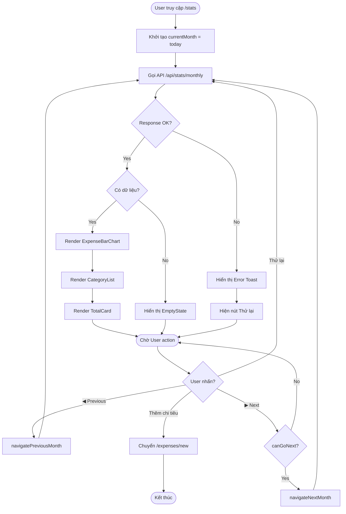

# Tài liệu Logic Xử lý & Giả mã - UC-03 (処理ロジック仕様書)

**Mã chức năng:** UC-03  
**Tên chức năng:** Xem biểu đồ thống kê  
**Phiên bản:** 1.0  
**Ngày tạo:** 25/02/2026

---

## 📥 Input (Tài liệu tham chiếu)

| Tài liệu | Nội dung trích xuất |
|----------|---------------------|
| `02-external-design/UC-03/03_Logic_Sekkei.md` | Business rules, lượt xem tháng |
| `02-external-design/UC-03/04_IF_Sekkei.md` | API contract |
| `03-internal-design/UC-03/01_Program_Sekkei.md` | Components, hooks list |

---

## 1. Danh sách Logic (処理ロジック一覧)

| Logic ID | Tên Logic | Hook/Module | Mô tả |
|----------|-----------|-------------|-------|
| LGC-020 | `navigatePreviousMonth` | `useMonthNavigation` | Lùi về tháng trước |
| LGC-021 | `navigateNextMonth` | `useMonthNavigation` | Tiến đến tháng sau |
| LGC-022 | `formatDisplayMonth` | `useMonthNavigation` | Format "Tháng MM/YYYY" |
| LGC-023 | `fetchMonthlyStats` | `useMonthlyStats` | Gọi API lấy dữ liệu |
| LGC-024 | `transformChartData` | `chartUtils` | Convert data → chart |
| LGC-025 | `calculateStatistics` | `api/stats/monthly` | Tính thống kê server |

---

## 2. Chi tiết Logic & Giả mã (疑似コード)

---

### [LGC-020] Logic: `navigatePreviousMonth`

**File:** `src/hooks/useMonthNavigation.ts`  
**Ref:** UC-03 § EV-03.1

#### Mô tả
Xử lý sự kiện nhấn nút "◀" để lùi về tháng trước.

#### Preconditions
| # | Điều kiện |
|---|-----------|
| 1 | User đang ở màn hình thống kê |

#### Giả mã (Pseudocode)

```
FUNCTION navigatePreviousMonth():
    // [Step 1] Lùi 1 tháng từ currentMonth
    newDate = date-fns.subMonths(currentMonth, 1)
    
    // [Step 2] Kiểm tra min bound (nếu có)
    IF minDate EXISTS AND newDate < minDate:
        RETURN  // Không cho lùi nữa
    END IF
    
    // [Step 3] Update state
    SET currentMonth = newDate
    
    // [Step 4] Trigger refetch data
    // (handled by useEffect watching currentMonth)
END FUNCTION
```

#### Postconditions
- `currentMonth` được cập nhật thành tháng trước
- API `/api/stats/monthly` được gọi với tháng mới

---

### [LGC-021] Logic: `navigateNextMonth`

**File:** `src/hooks/useMonthNavigation.ts`  
**Ref:** UC-03 § EV-03.2

#### Mô tả
Xử lý sự kiện nhấn nút "▶" để tiến đến tháng sau.

#### Business Rules
| Rule ID | Nội dung | Ref |
|---------|----------|-----|
| BR-03.1 | Không cho chọn tháng tương lai | AC-03.1 |

#### Giả mã (Pseudocode)

```
FUNCTION navigateNextMonth():
    // [Step 1] Tiến 1 tháng từ currentMonth
    newDate = date-fns.addMonths(currentMonth, 1)
    
    // [Step 2] Kiểm tra max bound (không cho vượt tháng hiện tại)
    today = new Date()
    currentMonthEnd = date-fns.endOfMonth(today)
    
    IF newDate > currentMonthEnd:
        RETURN  // BR-03.1: Không cho chọn tương lai
    END IF
    
    // [Step 3] Update state
    SET currentMonth = newDate
END FUNCTION
```

#### Derived Value: `canGoNext`

```
FUNCTION computeCanGoNext():
    today = new Date()
    nextMonth = date-fns.addMonths(currentMonth, 1)
    
    // So sánh năm-tháng
    RETURN date-fns.isSameMonth(currentMonth, today) == false 
           AND nextMonth <= today
END FUNCTION
```

---

### [LGC-022] Logic: `formatDisplayMonth`

**File:** `src/hooks/useMonthNavigation.ts`  
**Ref:** UC-03 § AC-03.3

#### Mô tả
Chuyển đổi Date object thành chuỗi hiển thị tiếng Việt.

#### Giả mã (Pseudocode)

```
FUNCTION formatDisplayMonth(date: Date): String
    // [Method 1] Sử dụng date-fns với locale vi
    IMPORT { format } FROM 'date-fns'
    IMPORT { vi } FROM 'date-fns/locale'
    
    RETURN format(date, "'Tháng' MM/yyyy", { locale: vi })
    // Output: "Tháng 02/2026"
END FUNCTION

FUNCTION formatMonthString(date: Date): String
    // Format cho API query
    RETURN date-fns.format(date, 'yyyy-MM')
    // Output: "2026-02"
END FUNCTION
```

---

### [LGC-023] Logic: `fetchMonthlyStats`

**File:** `src/hooks/useMonthlyStats.ts`  
**Ref:** UC-03 § IF-04.1

#### Mô tả
Fetch dữ liệu thống kê từ API và quản lý trạng thái loading/error.

#### Giả mã (Pseudocode)

```
FUNCTION useMonthlyStats(month: String):
    // [State]
    data = NULL
    isLoading = TRUE
    error = NULL
    
    // [Effect] Fetch khi month thay đổi
    useEffect(() => {
        ASYNC FUNCTION fetchData():
            TRY:
                SET isLoading = TRUE
                SET error = NULL
                
                // [Call API]
                response = AWAIT fetch(`/api/stats/monthly?month=${month}`)
                
                IF response.ok == FALSE:
                    THROW new Error("Không thể tải dữ liệu")
                END IF
                
                json = AWAIT response.json()
                
                IF json.success == TRUE:
                    SET data = json.data
                ELSE:
                    THROW new Error(json.error)
                END IF
                
            CATCH (err):
                SET error = err
                SET data = NULL
            FINALLY:
                SET isLoading = FALSE
            END TRY
        END FUNCTION
        
        fetchData()
    }, [month])  // Dependency: month
    
    // [Return]
    RETURN { data, isLoading, error, refetch }
END FUNCTION
```

#### Error Handling

| Error Code | Condition | UI Response |
|------------|-----------|-------------|
| `INVALID_MONTH` | Format sai | Hiển thị EmptyState |
| `SERVER_ERROR` | DB lỗi | Toast lỗi + Retry button |
| `NETWORK_ERROR` | Mất kết nối | Toast + Retry |

---

### [LGC-024] Logic: `transformChartData`

**File:** `src/lib/utils/chart.ts`  
**Ref:** UC-03 § AC-03.2

#### Mô tả
Chuyển đổi dữ liệu API response thành format Recharts BarChart.

#### Giả mã (Pseudocode)

```
FUNCTION transformToChartData(categories: CategoryStat[]): ChartData[]
    // [Input validation]
    IF categories IS EMPTY:
        RETURN []
    END IF
    
    result = []
    
    FOR EACH category IN categories:
        chartItem = {
            name: `${category.icon} ${truncateName(category.name)}`,
            value: category.total,
            color: category.color,
            displayValue: formatShortCurrency(category.total)
        }
        result.PUSH(chartItem)
    END FOR
    
    RETURN result
END FUNCTION

// Helper: Rút gọn tên dài
FUNCTION truncateName(name: String): String
    words = name.SPLIT(' ')
    IF words.LENGTH > 2:
        RETURN words.SLICE(0, 2).JOIN(' ')
    END IF
    RETURN name
END FUNCTION

// Helper: Format số tiền ngắn
FUNCTION formatShortCurrency(amount: Number): String
    IF amount >= 1_000_000:
        millions = amount / 1_000_000
        IF millions % 1 == 0:
            RETURN `${millions}tr`
        ELSE:
            RETURN `${millions.toFixed(1)}tr`
        END IF
    END IF
    
    IF amount >= 1_000:
        RETURN `${Math.round(amount / 1000)}k`
    END IF
    
    RETURN amount.toString()
END FUNCTION
```

#### Ví dụ Input/Output

**Input:**
```json
[
  { "icon": "🛒", "name": "Sinh hoạt phí", "total": 1500000, "color": "#10B981" },
  { "icon": "📚", "name": "Giáo dục", "total": 800000, "color": "#3B82F6" }
]
```

**Output:**
```json
[
  { "name": "🛒 Sinh hoạt", "value": 1500000, "color": "#10B981", "displayValue": "1.5tr" },
  { "name": "📚 Giáo dục", "value": 800000, "color": "#3B82F6", "displayValue": "800k" }
]
```

---

### [LGC-025] Logic: `calculateStatistics` (Server-side)

**File:** `app/api/stats/monthly/route.ts`  
**Ref:** UC-03 § IF-04.1

#### Mô tả
API handler tính toán thống kê chi tiêu theo tháng, group by danh mục.

#### Giả mã API Handler (Pseudocode)

```
FUNCTION GET(request: NextRequest):
    // ═══════════════════════════════════════════════
    // [1] Parse & Validate Input
    // ═══════════════════════════════════════════════
    searchParams = request.nextUrl.searchParams
    month = searchParams.GET('month')
    
    IF month IS NULL OR month IS EMPTY:
        RETURN NextResponse.json({
            success: FALSE,
            error: 'Tham số month là bắt buộc'
        }, { status: 400 })
    END IF
    
    // Validate format YYYY-MM
    monthRegex = /^\d{4}-(0[1-9]|1[0-2])$/
    IF monthRegex.TEST(month) == FALSE:
        RETURN NextResponse.json({
            success: FALSE,
            error: 'Định dạng tháng không hợp lệ. Yêu cầu: YYYY-MM'
        }, { status: 400 })
    END IF
    
    // ═══════════════════════════════════════════════
    // [2] Calculate Date Range
    // ═══════════════════════════════════════════════
    [year, monthNum] = month.SPLIT('-').MAP(Number)
    startDate = new Date(year, monthNum - 1, 1)            // First day
    endDate = date-fns.endOfMonth(startDate)               // Last day
    
    // ═══════════════════════════════════════════════
    // [3] Query Database - Group By Category
    // ═══════════════════════════════════════════════
    TRY:
        // Prisma query with aggregation
        categoryStats = AWAIT prisma.trn_expenses.groupBy({
            by: ['categoryCode'],
            _sum: { amount: true },
            where: {
                expenseDate: {
                    gte: startDate,
                    lte: endDate
                },
                isDeleted: false
            },
            orderBy: {
                _sum: { amount: 'desc' }
            }
        })
        
        // ═══════════════════════════════════════════════
        // [4] Fetch Category Master Data
        // ═══════════════════════════════════════════════
        categories = AWAIT prisma.mst_categories.findMany({
            where: { isActive: true }
        })
        categoryMap = new Map(categories.map(c => [c.code, c]))
        
        // ═══════════════════════════════════════════════
        // [5] Calculate Total
        // ═══════════════════════════════════════════════
        grandTotal = categoryStats.REDUCE(
            (sum, stat) => sum + (stat._sum.amount || 0),
            0
        )
        
        // ═══════════════════════════════════════════════
        // [6] Build Response
        // ═══════════════════════════════════════════════
        result = categoryStats.MAP(stat => {
            catMaster = categoryMap.GET(stat.categoryCode)
            amount = stat._sum.amount || 0
            percentage = grandTotal > 0 
                ? Math.round((amount / grandTotal) * 100)
                : 0
                
            RETURN {
                code: stat.categoryCode,
                name: catMaster?.name || stat.categoryCode,
                icon: catMaster?.icon || '📦',
                color: catMaster?.color || '#6B7280',
                total: amount,
                totalFormatted: formatCurrency(amount),
                percentage: percentage
            }
        })
        
        // ═══════════════════════════════════════════════
        // [7] Return Response
        // ═══════════════════════════════════════════════
        RETURN NextResponse.json({
            success: TRUE,
            data: {
                month: month,
                monthDisplay: `Tháng ${monthNum.toString().padStart(2, '0')}/${year}`,
                categories: result,
                total: grandTotal,
                totalFormatted: formatCurrency(grandTotal)
            }
        })
        
    CATCH (error):
        console.error('[API] GET /api/stats/monthly error:', error)
        RETURN NextResponse.json({
            success: FALSE,
            error: 'Đã xảy ra lỗi khi tải dữ liệu thống kê'
        }, { status: 500 })
    END TRY
END FUNCTION
```

---

## 3. Flowchart: Màn hình Thống kê



---

## 4. SQL Query Reference

#### Query: Group expenses by category for a month

```sql
SELECT 
    e.category_code,
    c.name AS category_name,
    c.icon AS category_icon,
    c.color AS category_color,
    SUM(e.amount) AS total_amount
FROM 
    trn_expenses e
LEFT JOIN 
    mst_categories c ON e.category_code = c.code
WHERE 
    e.expense_date >= '2026-02-01'
    AND e.expense_date <= '2026-02-28'
    AND e.is_deleted = 0
GROUP BY 
    e.category_code
ORDER BY 
    total_amount DESC;
```

#### Prisma Equivalent

```typescript
const stats = await prisma.trn_expenses.groupBy({
  by: ['categoryCode'],
  _sum: { amount: true },
  where: {
    expenseDate: {
      gte: new Date('2026-02-01'),
      lte: new Date('2026-02-28'),
    },
    isDeleted: false,
  },
  orderBy: {
    _sum: { amount: 'desc' },
  },
});
```

---

## 5. Ma trận Exception Handling

| ID | Exception | Trigger Condition | Handler | UI Response |
|----|-----------|-------------------|---------|-------------|
| EX-020 | `INVALID_MONTH_FORMAT` | month không match regex | API return 400 | Toast lỗi |
| EX-021 | `FUTURE_MONTH_REQUESTED` | month > current month | Client-side block | Disable nút ▶ |
| EX-022 | `DATABASE_CONNECTION_ERROR` | Prisma connection fail | Catch + log | Toast + Retry |
| EX-023 | `EMPTY_DATA` | Không có expenses | Check length | EmptyState |
| EX-024 | `NETWORK_TIMEOUT` | Fetch timeout > 10s | AbortController | Toast + Retry |

---

## 6. Zod Validation Schema

**File:** `src/lib/validations/stats.ts`

```typescript
import { z } from 'zod';

// Query params validation
export const monthQuerySchema = z.object({
  month: z
    .string()
    .regex(/^\d{4}-(0[1-9]|1[0-2])$/, {
      message: 'Định dạng tháng không hợp lệ. Yêu cầu: YYYY-MM',
    }),
});

// Response validation (optional, for type safety)
export const categoryStatSchema = z.object({
  code: z.string(),
  name: z.string(),
  icon: z.string(),
  color: z.string(),
  total: z.number(),
  totalFormatted: z.string(),
  percentage: z.number().min(0).max(100),
});

export const monthlyStatsResponseSchema = z.object({
  success: z.literal(true),
  data: z.object({
    month: z.string(),
    monthDisplay: z.string(),
    categories: z.array(categoryStatSchema),
    total: z.number(),
    totalFormatted: z.string(),
  }),
});
```

---

## 7. Test Cases (Smoke)

| TC ID | Scenario | Input | Expected |
|-------|----------|-------|----------|
| TC-020 | Load current month | month="2026-02" | Render chart |
| TC-021 | Empty month | month="2026-03" (no data) | EmptyState |
| TC-022 | Navigate previous | Click ◀ | Fetch 2026-01 |
| TC-023 | Block future | currentMonth=today, click ▶ | Button disabled |
| TC-024 | Invalid month | month="2026-13" | 400 error |
