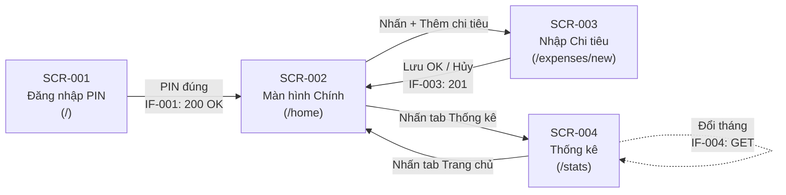

# ĐẶC TẢ KIỂM THỬ TÍCH HỢP (INTEGRATION TEST SPECIFICATION)

**Dự án:** Ứng dụng Quản lý Chi tiêu Gia đình  
**Mã tài liệu:** 13_IT_Shiyousho  
**Phiên bản:** 1.0  
**Ngày tạo:** 28/02/2026  
**Tác giả:** Test Architect (AI)

---

## 📥 Input (Nguồn chân lý)

| Tài liệu | Đường dẫn |
|----------|-----------|
| Yêu cầu Nghiệp vụ | `docs/01-requirements/srs_business_requirements.md` |
| Yêu cầu Chức năng | `docs/01-requirements/srs_function_requirements.md` |
| Yêu cầu Phi chức năng | `docs/01-requirements/srs_nonfunction_requirements.md` |
| Thiết kế Ngoài UC-01 | `docs/02-external-design/UC-01/*` |
| Thiết kế Ngoài UC-02 | `docs/02-external-design/UC-02/*` |
| Thiết kế Ngoài UC-03 | `docs/02-external-design/UC-03/*` |

> ⚠️ Tài liệu này **CHỈ** kiểm thử luồng tích hợp xuyên suốt giữa ≥ 2 chức năng/màn hình.  
> Các test case lẻ tẻ (nhập sai kiểu dữ liệu, UI đơn lẻ) thuộc phạm vi Unit Test, **KHÔNG** nằm ở đây.

---

## BẢN ĐỒ MÀN HÌNH & ĐIỀU HƯỚNG

**Danh sách API liên quan:**

| ID IF | Endpoint | Phương thức | Chức năng |
|-------|----------|-------------|-----------|
| IF-001 | `/api/auth/verify-pin` | POST | Xác thực mã PIN |
| IF-003 | `/api/expenses` | POST | Tạo khoản chi tiêu |
| IF-004 | `/api/stats/monthly?month=YYYY-MM` | GET | Lấy thống kê tháng |

---

## 1. MA TRẬN KỊCH BẢN TÍCH HỢP (SCENARIOS)

| Mã Kịch bản | Tên Luồng Nghiệp vụ (Scenario) | Các chức năng/màn hình liên kết | Phân loại | Mục đích kiểm tra |
|:---|:---|:---|:---|:---|
| IT-001 | Luồng toàn trình: Đăng nhập → Nhập chi tiêu → Xem thống kê | UC-01 → UC-02 → UC-03 (SCR-001 → SCR-002 → SCR-003 → SCR-002 → SCR-004) | Happy Path E2E | Xác nhận toàn bộ hành trình chính từ đầu đến cuối hoạt động liền mạch |
| IT-002 | Luồng rút gọn: Đăng nhập → Xem thống kê (bỏ qua nhập chi tiêu) | UC-01 → UC-03 (SCR-001 → SCR-002 → SCR-004) | Happy Path | Xác nhận có thể xem thống kê ngay sau đăng nhập mà không cần nhập chi tiêu |
| IT-003 | Luồng đứt gãy: Đăng nhập sai 3 lần → Bị khóa → Hết khóa → Đăng nhập thành công → Vào Home | UC-01 (AF-01.1, AF-01.2) → UC-01 (Main) (SCR-001 → SCR-001 → SCR-002) | Unhappy Path | Xác nhận cơ chế khóa tạm hoạt động đúng và sau khi hết khóa vẫn chuyển trang bình thường |
| IT-004 | Luồng bảo vệ: Truy cập trực tiếp URL nội bộ khi chưa đăng nhập | Không qua UC-01, truy cập trực tiếp SCR-002, SCR-003, SCR-004 | Unhappy Path | Xác nhận hệ thống chặn truy cập trái phép và ép chuyển hướng về SCR-001 |
| IT-005 | Luồng toàn vẹn dữ liệu: Nhập nhiều khoản chi tiêu → Thống kê cộng dồn chính xác | UC-02 (nhiều lần) → UC-03 (SCR-003 × N → SCR-004) | Data Integrity | Xác nhận dữ liệu nhập ở UC-02 được phản ánh đúng (tổng, phần trăm, biểu đồ) ở UC-03 |
| IT-006 | Luồng toàn vẹn dữ liệu: Nhập chi tiêu tháng này → Thống kê tháng trước không bị ảnh hưởng | UC-02 → UC-03 (đổi tháng) (SCR-003 → SCR-004 → MonthPicker) | Data Integrity | Xác nhận phân tách dữ liệu theo tháng/ không lẫn lộn giữa các tháng |
| IT-007 | Luồng hủy bỏ: Mở form nhập chi tiêu → Hủy → Thống kê không thay đổi | UC-02 (AF-02.3) → UC-03 (SCR-003 hủy → SCR-002 → SCR-004) | Unhappy Path | Xác nhận khi hủy form, không có dữ liệu bị ghi vào DB, thống kê giữ nguyên |
| IT-008 | Luồng điều hướng vòng: Home → Thống kê → Home → Nhập chi tiêu → Home → Thống kê | UC-01 → UC-03 → UC-02 → UC-03 (SCR-002 ↔ SCR-004, SCR-002 → SCR-003 → SCR-002 → SCR-004) | Happy Path | Xác nhận điều hướng qua lại nhiều lần không gây lỗi trạng thái, dữ liệu nhất quán |

---

## 2. CHI TIẾT TEST CASES (VÉT CẠN LUỒNG RẼ NHÁNH)

---

### Kịch bản: IT-001 - Luồng toàn trình: Đăng nhập → Nhập chi tiêu → Xem thống kê

> **Mục đích:** Kiểm tra hành trình chính xuyên suốt 3 chức năng UC-01 → UC-02 → UC-03.  
> **Tham chiếu:** BO-01 (Ghi nhận nhanh), BO-02 (Bảo vệ dữ liệu), BO-03 (Hỗ trợ quyết định)

| Mã Test Case | Điều kiện tiền quyết (Pre-conditions) | Hành trình Người dùng (Các bước thao tác UI & Gọi API chuyển trang) | Kết quả mong đợi (Trạng thái UI, DB, Phản hồi API) | Đánh giá (P/F) | Ngày đánh giá |
|:---|:---|:---|:---|:---|:---|
| TC-IT-001-01 | - DB sạch (không có expense nào trong tháng hiện tại) - `APP_PIN_HASH` đã cấu hình trong `.env` - Không có session trong localStorage | 1. Mở trình duyệt, truy cập `/` → Hệ thống hiển thị SCR-001 (màn nhập PIN) 2. Nhập PIN đúng 4 số (VD: 1-2-3-4) → Tự động gọi `POST /api/auth/verify-pin` 3. Hệ thống trả về 200 OK → Tự động chuyển hướng đến `/home` (SCR-002) 4. Tại SCR-002, nhấn nút "+" (Thêm chi tiêu) → Chuyển đến `/expenses/new` (SCR-003) 5. Chọn danh mục 🛒 "Sinh hoạt phí" 6. Nhập số tiền: `150000` → Hiển thị "150.000" 7. Giữ ngày mặc định (ngày hiện tại) 8. Nhập ghi chú: "Đi chợ buổi sáng" 9. Nhấn nút "Lưu" → Gọi `POST /api/expenses` 10. Hệ thống trả về 201 → Hiển thị toast "Đã lưu thành công" → Tự động quay về `/home` (SCR-002) 11. Tại SCR-002, nhấn tab "Thống kê" → Chuyển đến `/stats` (SCR-004) → Gọi `GET /api/stats/monthly?month=2026-02` | **UI:** - SCR-001 → SCR-002 chuyển trang < 1 giây (AC-01.3) - SCR-003 hiển thị 4 danh mục với icon (AC-02.1) - Toast "Đã lưu thành công" xuất hiện (AC-02.5) - SCR-004 hiển thị biểu đồ cột, cột 🛒 = 150.000 đ (AC-03.1, AC-03.3) - Tổng chi tiêu = "150.000 đ" (AC-03.4)  **DB:** - Bảng `app_sessions`: 1 record mới (is_active=true) - Bảng `login_attempts`: 1 record (success=true) - Bảng `trn_expenses`: 1 record (LIVING, 150000, ngày hiện tại)  **API:** - IF-001 trả 200 `{success: true, sessionId: "uuid"}` - IF-003 trả 201 `{success: true, message: "Đã lưu thành công"}` - IF-004 trả 200, `categories[0].total = 150000` | [ ] | |
| TC-IT-001-02 | - Kế tiếp từ TC-IT-001-01 (đã có 1 expense: LIVING 150000) - Vẫn đang ở SCR-004 | 1. Tại SCR-004, nhấn tab "Trang chủ" → Quay về `/home` (SCR-002) 2. Nhấn nút "+" → Chuyển đến SCR-003 3. Chọn danh mục 📚 "Giáo dục" 4. Nhập số tiền: `500000` 5. Nhấn "Lưu" → Gọi `POST /api/expenses` 6. Quay về SCR-002 → Nhấn tab "Thống kê" → SCR-004 → Gọi `GET /api/stats/monthly` | **UI:** - SCR-004: biểu đồ có 2 cột có giá trị > 0 (🛒 = 150k, 📚 = 500k) - Tổng chi tiêu = "650.000 đ" - Các cột 💒, 🎁 hiển thị nhưng giá trị = 0 (AC-03.1)  **DB:** - `trn_expenses`: 2 records  **API:** - IF-004: `total = 650000`, LIVING=150000, EDUCATION=500000 | [ ] | |

---

### Kịch bản: IT-002 - Luồng rút gọn: Đăng nhập → Xem thống kê

> **Mục đích:** Kiểm tra luồng UC-01 → UC-03 bỏ qua nhập liệu.  
> **Tham chiếu:** BO-02, BO-03

| Mã Test Case | Điều kiện tiền quyết (Pre-conditions) | Hành trình Người dùng (Các bước thao tác UI & Gọi API chuyển trang) | Kết quả mong đợi (Trạng thái UI, DB, Phản hồi API) | Đánh giá (P/F) | Ngày đánh giá |
|:---|:---|:---|:---|:---|:---|
| TC-IT-002-01 | - DB đã có dữ liệu chi tiêu tháng hiện tại (seed data: LIVING=1.500.000, EDUCATION=500.000, CEREMONY=1.000.000, FAMILY_GIFT=2.000.000) - Chưa đăng nhập (không có sessionId trong localStorage) | 1. Truy cập `/` → Hiển thị SCR-001 2. Nhập PIN đúng → `POST /api/auth/verify-pin` → 200 OK 3. Chuyển đến `/home` (SCR-002) 4. Nhấn tab "Thống kê" → Chuyển đến `/stats` (SCR-004) → Gọi `GET /api/stats/monthly?month=2026-02` | **UI:** - SCR-004 hiển thị biểu đồ cột đầy đủ 4 danh mục (AC-03.1) - Mỗi cột có màu khác nhau: xanh lá/xanh dương/vàng cam/hồng (AC-03.2) - Số tiền trên đỉnh cột: "1.5tr", "500k", "1tr", "2tr" (AC-03.3) - Tổng chi tiêu = "5.000.000 đ" (AC-03.4) - Danh sách chi tiết hiển thị 4 dòng  **API:** - IF-004: `total = 5000000`, 4 categories đều > 0 | [ ] | |
| TC-IT-002-02 | - DB không có dữ liệu chi tiêu nào (DB sạch) - Chưa đăng nhập | 1. Truy cập `/` → SCR-001 2. Nhập PIN đúng → 200 OK → Chuyển đến `/home` (SCR-002) 3. Nhấn tab "Thống kê" → `/stats` (SCR-004) → Gọi `GET /api/stats/monthly` | **UI:** - SCR-004 hiển thị trạng thái "Chưa có dữ liệu chi tiêu" (AF-03.1) - Không hiển thị biểu đồ  **API:** - IF-004: `total = 0`, tất cả categories `total = 0` | [ ] | |

---

### Kịch bản: IT-003 - Luồng đứt gãy: Đăng nhập sai → Khóa → Đăng nhập lại thành công

> **Mục đích:** Xác nhận cơ chế khóa tạm (AF-01.2) hoạt động đúng và không ảnh hưởng đến việc chuyển trang sau khi hết khóa.  
> **Tham chiếu:** AC-01.4, AC-01.5, NFR-SEC-03

| Mã Test Case | Điều kiện tiền quyết (Pre-conditions) | Hành trình Người dùng (Các bước thao tác UI & Gọi API chuyển trang) | Kết quả mong đợi (Trạng thái UI, DB, Phản hồi API) | Đánh giá (P/F) | Ngày đánh giá |
|:---|:---|:---|:---|:---|:---|
| TC-IT-003-01 | - Chưa đăng nhập - `localStorage.lockUntil` không tồn tại - attempts = 0 | 1. Truy cập `/` → SCR-001 2. Nhập PIN sai lần 1 (VD: 0-0-0-0) → `POST /api/auth/verify-pin` → 401 3. Hệ thống hiển thị "Mã PIN không đúng. Vui lòng thử lại." → Ô PIN bị xóa 4. Nhập PIN sai lần 2 (VD: 1-1-1-1) → 401 → Thông báo lỗi, xóa ô 5. Nhập PIN sai lần 3 (VD: 2-2-2-2) → 401 → Kích hoạt khóa tạm 6. Hệ thống hiển thị "Vui lòng đợi 30 giây" + đếm ngược, bàn phím bị vô hiệu hóa 7. Đợi hết 30 giây → Bàn phím được bật lại 8. Nhập PIN đúng → `POST /api/auth/verify-pin` → 200 OK 9. Chuyển hướng đến `/home` (SCR-002) | **UI:** - Bước 3, 4: Thông báo lỗi tiếng Việt (AC-01.4) - Bước 6: Bàn phím mờ (opacity-50), đếm ngược hiển thị "Vui lòng đợi XX giây" (AC-01.5) - Bước 7: Bàn phím sáng lại, đếm ngược biến mất - Bước 9: Chuyển trang thành công đến SCR-002 < 1 giây (AC-01.3)  **DB:** - `login_attempts`: 3 records (success=false) + 1 record (success=true) - `app_sessions`: 1 record mới khi đăng nhập thành công  **localStorage:** - Bước 6: `lockUntil` được set - Bước 7: `lockUntil` được xóa - Bước 9: `sessionId` được set | [ ] | |
| TC-IT-003-02 | - Kế tiếp từ TC-IT-003-01 (đã đăng nhập thành công, đang ở SCR-002) | 1. Tại SCR-002, nhấn nút "+" → Chuyển đến SCR-003 2. Xác nhận form nhập chi tiêu hoạt động bình thường (chọn danh mục, nhập số tiền) 3. Nhấn "Hủy" → Quay về SCR-002 4. Nhấn tab "Thống kê" → Chuyển đến SCR-004 | **UI:** - SCR-003 hiển thị đầy đủ 4 danh mục - Điều hướng SCR-003 → SCR-002 → SCR-004 mượt mà - Không bị redirect về SCR-001  **Session:** - `sessionId` trong localStorage vẫn còn hợp lệ | [ ] | |

---

### Kịch bản: IT-004 - Luồng bảo vệ: Truy cập trực tiếp URL khi chưa đăng nhập

> **Mục đích:** Xác nhận hệ thống bảo vệ các trang nội bộ, ép chuyển hướng về trang đăng nhập.  
> **Tham chiếu:** BO-02, NFR-SEC-01

| Mã Test Case | Điều kiện tiền quyết (Pre-conditions) | Hành trình Người dùng (Các bước thao tác UI & Gọi API chuyển trang) | Kết quả mong đợi (Trạng thái UI, DB, Phản hồi API) | Đánh giá (P/F) | Ngày đánh giá |
|:---|:---|:---|:---|:---|:---|
| TC-IT-004-01 | - Chưa đăng nhập (không có `sessionId` trong localStorage) - Không có session hợp lệ | 1. Mở trình duyệt, nhập trực tiếp URL `/home` → Enter | **UI:** - Hệ thống chuyển hướng (redirect) về `/` (SCR-001) - Hiển thị màn hình nhập PIN - Không hiển thị nội dung của SCR-002 | [ ] | |
| TC-IT-004-02 | - Chưa đăng nhập | 1. Nhập trực tiếp URL `/expenses/new` → Enter | **UI:** - Hệ thống chuyển hướng về `/` (SCR-001) - Không hiển thị form nhập chi tiêu | [ ] | |
| TC-IT-004-03 | - Chưa đăng nhập | 1. Nhập trực tiếp URL `/stats` → Enter | **UI:** - Hệ thống chuyển hướng về `/` (SCR-001) - Không hiển thị biểu đồ thống kê | [ ] | |
| TC-IT-004-04 | - Đã đăng nhập, có `sessionId` trong localStorage - Session đã hết hạn (expires_at < now) | 1. Đang ở SCR-002, nhấn nút "+" → Chuyển đến SCR-003 2. Nhấn "Lưu" → Gọi `POST /api/expenses` 3. API trả về 401 (session hết hạn) | **UI:** - Hệ thống chuyển hướng về `/` (SCR-001) - Xóa `sessionId` khỏi localStorage  **API:** - IF-003 trả về 401 `{success: false, message: "Phiên đăng nhập đã hết hạn"}` | [ ] | |

---

### Kịch bản: IT-005 - Luồng toàn vẹn dữ liệu: Nhập nhiều khoản → Thống kê cộng dồn chính xác

> **Mục đích:** Xác nhận dữ liệu nhập ở UC-02 (nhiều lần, nhiều danh mục) được tổng hợp chính xác tại UC-03.  
> **Tham chiếu:** BO-01, BO-03, AC-03.1~AC-03.4

| Mã Test Case | Điều kiện tiền quyết (Pre-conditions) | Hành trình Người dùng (Các bước thao tác UI & Gọi API chuyển trang) | Kết quả mong đợi (Trạng thái UI, DB, Phản hồi API) | Đánh giá (P/F) | Ngày đánh giá |
|:---|:---|:---|:---|:---|:---|
| TC-IT-005-01 | - Đã đăng nhập, đang ở SCR-002 - DB sạch (không có expense tháng hiện tại) | 1. Nhấn "+" → SCR-003 → Chọn 🛒 LIVING, nhập 100.000, Lưu → 201 → Toast → SCR-002 2. Nhấn "+" → SCR-003 → Chọn 🛒 LIVING, nhập 250.000, ghi chú "Mua thịt", Lưu → 201 → SCR-002 3. Nhấn "+" → SCR-003 → Chọn 📚 EDUCATION, nhập 500.000, Lưu → 201 → SCR-002 4. Nhấn "+" → SCR-003 → Chọn 💒 CEREMONY, nhập 1.000.000, ghi chú "Đám cưới", Lưu → 201 → SCR-002 5. Nhấn "+" → SCR-003 → Chọn 🎁 FAMILY_GIFT, nhập 2.000.000, Lưu → 201 → SCR-002 6. Nhấn tab "Thống kê" → SCR-004 → Gọi `GET /api/stats/monthly` | **UI (SCR-004):** - 🛒 Sinh hoạt phí = **350.000 đ** (100k + 250k cộng dồn) - 📚 Giáo dục = **500.000 đ** - 💒 Hiếu hỉ = **1.000.000 đ** - 🎁 Biếu tặng = **2.000.000 đ** - Tổng = **3.850.000 đ** (AC-03.4) - 4 cột biểu đồ, mỗi cột màu khác nhau (AC-03.2) - Số tiền hiển thị trên đỉnh cột (AC-03.3)  **DB:** - `trn_expenses`: 5 records - LIVING: 2 records (100000, 250000)  **API (IF-004):** - `total = 3850000` - LIVING: `total = 350000, percentage ≈ 9.09` - EDUCATION: `total = 500000, percentage ≈ 12.99` - CEREMONY: `total = 1000000, percentage ≈ 25.97` - FAMILY_GIFT: `total = 2000000, percentage ≈ 51.95` | [ ] | |
| TC-IT-005-02 | - Kế tiếp TC-IT-005-01 (đã có 5 expenses, tổng = 3.850.000) | 1. Tại SCR-004, nhấn tab "Trang chủ" → SCR-002 2. Nhấn "+" → SCR-003 → Chọn 🛒 LIVING, nhập 150.000, Lưu → 201 → SCR-002 3. Nhấn tab "Thống kê" → SCR-004 | **UI (SCR-004):** - 🛒 Sinh hoạt phí = **500.000 đ** (350k + 150k) - Tổng = **4.000.000 đ** (3.850k + 150k) - Biểu đồ cập nhật, tỷ lệ cột thay đổi  **DB:** - `trn_expenses`: 6 records | [ ] | |

---

### Kịch bản: IT-006 - Luồng toàn vẹn dữ liệu: Phân tách dữ liệu theo tháng

> **Mục đích:** Xác nhận dữ liệu nhập tháng này không ảnh hưởng thống kê tháng trước, chuyển tháng hiển thị đúng.  
> **Tham chiếu:** AC-03.5, NFR-TECH-01 (date-fns)

| Mã Test Case | Điều kiện tiền quyết (Pre-conditions) | Hành trình Người dùng (Các bước thao tác UI & Gọi API chuyển trang) | Kết quả mong đợi (Trạng thái UI, DB, Phản hồi API) | Đánh giá (P/F) | Ngày đánh giá |
|:---|:---|:---|:---|:---|:---|
| TC-IT-006-01 | - Đã đăng nhập - DB có seed data:   + Tháng 01/2026: LIVING = 200.000   + Tháng 02/2026: Chưa có dữ liệu | 1. Tại SCR-002, nhấn "+" → SCR-003 2. Chọn 🛒 LIVING, nhập 300.000, giữ ngày hiện tại (02/2026), Lưu → 201 → SCR-002 3. Nhấn tab "Thống kê" → SCR-004 (hiển thị tháng 02/2026) 4. Xác nhận: 🛒 LIVING = 300.000 đ, Tổng = 300.000 đ 5. Nhấn nút "◀" (tháng trước) → Gọi `GET /api/stats/monthly?month=2026-01` | **UI (SCR-004, Bước 4 - Tháng 02/2026):** - Tiêu đề: "Tháng 02/2026" - 🛒 = 300.000 đ, Tổng = 300.000 đ  **UI (SCR-004, Bước 5 - Tháng 01/2026):** - Tiêu đề: "Tháng 01/2026" - 🛒 = 200.000 đ (KHÔNG bị ảnh hưởng bởi expense vừa nhập ở tháng 02) - Tổng = 200.000 đ - Các danh mục khác = 0 đ  **API:** - IF-004 (month=2026-02): LIVING=300000, total=300000 - IF-004 (month=2026-01): LIVING=200000, total=200000 | [ ] | |
| TC-IT-006-02 | - Kế tiếp TC-IT-006-01 - Đang xem SCR-004 ở tháng 01/2026 | 1. Nhấn nút "▶" (tháng sau) → Gọi `GET /api/stats/monthly?month=2026-02` 2. Xác nhận hiển thị đúng tháng 02/2026 3. Nhấn nút "▶" lần nữa | **UI (Bước 2):** - Tiêu đề: "Tháng 02/2026" - 🛒 = 300.000 đ, Tổng = 300.000 đ (giống bước 4 ở TC trước)  **UI (Bước 3):** - Nút "▶" bị disabled (tháng hiện tại, không cho chọn tương lai) - Không gọi API | [ ] | |

---

### Kịch bản: IT-007 - Luồng hủy bỏ: Hủy nhập chi tiêu → Dữ liệu không bị thay đổi

> **Mục đích:** Xác nhận thao tác hủy ở UC-02 (AF-02.3) không ghi dữ liệu vào DB, thống kê UC-03 giữ nguyên.  
> **Tham chiếu:** AF-02.3

| Mã Test Case | Điều kiện tiền quyết (Pre-conditions) | Hành trình Người dùng (Các bước thao tác UI & Gọi API chuyển trang) | Kết quả mong đợi (Trạng thái UI, DB, Phản hồi API) | Đánh giá (P/F) | Ngày đánh giá |
|:---|:---|:---|:---|:---|:---|
| TC-IT-007-01 | - Đã đăng nhập, đang ở SCR-002 - DB có 1 expense: LIVING = 150.000 (tháng hiện tại) - Ghi nhận tổng hiện tại: 150.000 đ | 1. Nhấn tab "Thống kê" → SCR-004 → Xác nhận Tổng = 150.000 đ 2. Nhấn tab "Trang chủ" → SCR-002 3. Nhấn "+" → SCR-003 4. Chọn danh mục 📚 EDUCATION, nhập số tiền 500.000, nhập ghi chú "Học phí" 5. Nhấn nút "Hủy" (KHÔNG nhấn "Lưu") → Quay về SCR-002 6. Nhấn tab "Thống kê" → SCR-004 → Gọi `GET /api/stats/monthly` | **UI (Bước 1):** Tổng = 150.000 đ  **UI (Bước 5):** Quay về SCR-002, không có toast "Đã lưu"  **UI (Bước 6):** Tổng vẫn = 150.000 đ (KHÔNG thay đổi) - EDUCATION = 0 đ (không bị ghi)  **DB:** `trn_expenses` vẫn chỉ có 1 record (LIVING 150000) - KHÔNG có record EDUCATION nào  **API:** IF-003 KHÔNG được gọi (vì nhấn Hủy) IF-004: `total = 150000`, EDUCATION.total = 0 | [ ] | |
| TC-IT-007-02 | - Đã đăng nhập, đang ở SCR-002 - DB sạch (không có expense) | 1. Nhấn "+" → SCR-003 2. Chọn 💒 CEREMONY, nhập 1.000.000 3. Nhấn nút "Quay lại" (← trên header) → Quay về SCR-002 4. Nhấn tab "Thống kê" → SCR-004 | **UI (Bước 4):** Hiển thị "Chưa có dữ liệu chi tiêu" (AF-03.1)  **DB:** `trn_expenses` = 0 records  **API:** IF-003 KHÔNG được gọi | [ ] | |

---

### Kịch bản: IT-008 - Luồng điều hướng vòng: Qua lại giữa các màn hình nhiều lần

> **Mục đích:** Xác nhận việc điều hướng qua lại giữa Home, Thống kê, Nhập chi tiêu nhiều lần không gây trạng thái bất nhất.  
> **Tham chiếu:** Tất cả UC, BO-01~BO-03

| Mã Test Case | Điều kiện tiền quyết (Pre-conditions) | Hành trình Người dùng (Các bước thao tác UI & Gọi API chuyển trang) | Kết quả mong đợi (Trạng thái UI, DB, Phản hồi API) | Đánh giá (P/F) | Ngày đánh giá |
|:---|:---|:---|:---|:---|:---|
| TC-IT-008-01 | - Đã đăng nhập, đang ở SCR-002 - DB sạch | 1. Nhấn tab "Thống kê" → SCR-004 → Hiển thị "Chưa có dữ liệu" 2. Nhấn tab "Trang chủ" → SCR-002 3. Nhấn "+" → SCR-003 → Chọn 🛒 LIVING, nhập 200.000, Lưu → 201 → SCR-002 4. Nhấn tab "Thống kê" → SCR-004 → 🛒 = 200.000, Tổng = 200.000 5. Nhấn tab "Trang chủ" → SCR-002 6. Nhấn "+" → SCR-003 → Chọn 🎁 FAMILY_GIFT, nhập 1.000.000, Lưu → 201 → SCR-002 7. Nhấn tab "Thống kê" → SCR-004 | **UI (Bước 1):** "Chưa có dữ liệu" ✅  **UI (Bước 4):** 🛒 = 200.000, Tổng = 200.000 ✅  **UI (Bước 7):**  - 🛒 = 200.000 - 🎁 = 1.000.000 - Tổng = 1.200.000 - Biểu đồ hiển thị đúng cả 4 cột (2 có giá trị, 2 = 0)  **Quan trọng:** - Không bị redirect về SCR-001 - Không bị trùng lặp dữ liệu - Mỗi lần vào SCR-004, dữ liệu luôn cập nhật mới nhất  **DB:** `trn_expenses` = 2 records | [ ] | |
| TC-IT-008-02 | - Kế tiếp TC-IT-008-01 (đang ở SCR-004, có 2 expenses) | 1. Nhấn "◀" → Xem tháng 01/2026 → Gọi IF-004(month=2026-01) 2. Nhấn "▶" → Xem tháng 02/2026 → Gọi IF-004(month=2026-02) 3. Nhấn tab "Trang chủ" → SCR-002 4. Nhấn "+" → SCR-003 → Chọn 📚 EDUCATION, nhập 300.000, Lưu → SCR-002 5. Nhấn tab "Thống kê" → SCR-004 (tháng 02/2026) 6. Nhấn "◀" → Tháng 01/2026 | **UI (Bước 1):** Tháng 01/2026 → "Chưa có dữ liệu" (hoặc total=0)  **UI (Bước 2):** Tháng 02/2026 → 🛒=200k, 🎁=1tr, Tổng=1.200.000  **UI (Bước 5):** Tháng 02/2026 → 🛒=200k, 📚=300k, 🎁=1tr, Tổng=1.500.000  **UI (Bước 6):** Tháng 01/2026 → Không thay đổi (total=0 hoặc dữ liệu seed)  **Quan trọng:** Dữ liệu expense mới (📚 300k) chỉ xuất hiện ở tháng 02/2026 | [ ] | |

---

## 3. MA TRẬN TỔNG HỢP: TEST CASE ↔ ACCEPTANCE CRITERIA

| AC / NFR | TC-IT-001-01 | TC-IT-001-02 | TC-IT-002-01 | TC-IT-002-02 | TC-IT-003-01 | TC-IT-003-02 | TC-IT-004-01~04 | TC-IT-005-01 | TC-IT-005-02 | TC-IT-006-01 | TC-IT-006-02 | TC-IT-007-01 | TC-IT-007-02 | TC-IT-008-01 | TC-IT-008-02 |
|:---|:---:|:---:|:---:|:---:|:---:|:---:|:---:|:---:|:---:|:---:|:---:|:---:|:---:|:---:|:---:|
| AC-01.3 (Chuyển trang < 1s) | ✅ | | | | ✅ | | | | | | | | | | |
| AC-01.4 (Thông báo lỗi VN) | | | | | ✅ | | | | | | | | | | |
| AC-01.5 (Khóa 30s) | | | | | ✅ | | | | | | | | | | |
| AC-02.1 (4 danh mục) | ✅ | ✅ | | | | ✅ | | ✅ | | | | | | ✅ | |
| AC-02.5 (Toast thành công) | ✅ | ✅ | | | | | | ✅ | ✅ | ✅ | | | | ✅ | ✅ |
| AC-03.1 (Biểu đồ tất cả DM) | ✅ | ✅ | ✅ | | | | | ✅ | ✅ | ✅ | ✅ | | | ✅ | ✅ |
| AC-03.2 (Cột màu khác nhau) | | | ✅ | | | | | ✅ | | | | | | ✅ | |
| AC-03.3 (Số tiền đỉnh cột) | ✅ | | ✅ | | | | | ✅ | | | | | | | |
| AC-03.4 (Tổng chi tiêu) | ✅ | ✅ | ✅ | | | | | ✅ | ✅ | ✅ | ✅ | ✅ | | ✅ | ✅ |
| AC-03.5 (Chọn tháng) | | | | | | | | | | ✅ | ✅ | | | | ✅ |
| AF-02.3 (Hủy) | | | | | | | | | | | | ✅ | ✅ | | |
| AF-03.1 (Không có DL) | | | | ✅ | | | | | | | | | ✅ | ✅ | |
| BO-02 (Bảo vệ DL) | | | | | | | ✅ | | | | | | | | |
| NFR-SEC-03 (Khóa tạm) | | | | | ✅ | | | | | | | | | | |

---

## 4. MÔI TRƯỜNG KIỂM THỬ

| Mục | Chi tiết |
|-----|---------|
| **URL** | `http://localhost:3000` |
| **Trình duyệt** | Chrome (Mobile emulation 375px) + Safari (iOS) |
| **Database** | SQLite (development) |
| **Dữ liệu** | Reset DB trước mỗi kịch bản (trừ khi test case là kế tiếp) |
| **PIN mã test** | Sử dụng PIN đúng = "1234" (hash trong APP_PIN_HASH) |
| **Biến môi trường** | `.env` với `APP_PIN_HASH` hợp lệ |

---

## 5. QUY ƯỚC ĐÁNH GIÁ

| Ký hiệu | Ý nghĩa |
|----------|---------|
| **P** | Pass - Đạt yêu cầu |
| **F** | Fail - Không đạt |
| [ ] | Chưa kiểm tra |

---

> ✅ **Đã phân tích toàn bộ Yêu cầu & Thiết kế Ngoài để tạo xong Kịch bản Kiểm thử Tích hợp. Vui lòng review.**
